
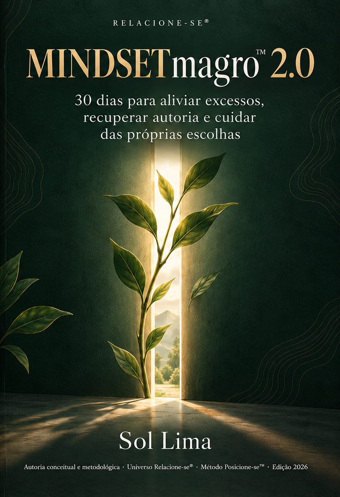

# Antes da travessia

## MINDSETmagro™ 2.0

### 30 dias para aliviar excessos, recuperar autoria e cuidar das próprias escolhas

Menos excesso. Mais autoria. Uma escolha de cada vez.

Sol Lima | Autoria conceitual e metodológica. Universo Relacione-se® | Método Posicione-se™. Edição 2026.

## Autoria, edição e compromisso com a verdade

© 2026 Sol Lima. Texto e organização autoral do MINDSETmagro. As referências científicas conservam seus créditos. Marcas são reproduzidas conforme a identificação fornecida pela autora; esta edição não atesta situação registral.

Esta edição apresenta uma metodologia autoral informada por evidências sobre componentes. O protocolo completo não foi clinicamente validado e não oferece garantia de resultado. Livro, Caderno e experiência digital devem permanecer sincronizados a partir de uma fonte canônica única.

As cenas cotidianas apresentadas como exemplos são situações ilustrativas. Memórias atribuídas à autora vêm das fontes históricas identificadas. Nenhum exemplo permite diagnosticar o leitor, familiares ou parceiros.

## Nota da autora: o corpo foi a porta, não a casa inteira

O MINDSETmagro tem uma figura na sua origem: minha Mãe-Véia. O gesto de ajustar o vestido na cintura me fez olhar para corpo, identidade e insistência em existir. Na minha linguagem, ela era uma égua indomável. Não uma santa, nem um modelo de corpo a ser copiado. Podia ser fina e excessiva, resistente e contraditória. Foi dessa imagem que nasceu uma pergunta que ficou maior do que a balança.

Essa é a minha leitura de uma memória, não uma explicação médica sobre envelhecimento ou doença. Não transformo a magreza dela em virtude nem o sofrimento em fórmula para emagrecer. O que levo adiante é a pergunta: o que continuamos afirmando com nossos gestos, inclusive quando a vida nos atravessa?

Uma expectativa que ninguém combinou. Uma comparação que chega antes do café. Uma resposta automática que parece personalidade de tanto ser repetida. Um cuidado sempre adiado porque alguém, alguma coisa, alguma urgência passou na frente. O excesso nem sempre está no prato. Às vezes está no compromisso de ser tudo, dar conta de tudo e ainda parecer descansada. Convenhamos: até agenda de ministro precisa de intervalo.

Foi por isso que ampliei o sentido deste trabalho. Quero que você tenha instrumentos para observar o próprio funcionamento e transformar uma descoberta em atitude. Não basta fechar o livro dizendo que fez sentido. O que fez sentido precisa conversar com o que você faz na terça-feira, quando o encanto da frase passou.

Nesta edição, preservo o que pertence à minha história e reviso explicações antigas que prometiam mais do que podiam sustentar. Uma lembrança pode ensinar sem virar prova científica. Uma metáfora pode iluminar sem fingir que é anatomia. Reconhecer limites também é posicionamento.

Você encontrará corpo, alimentação, movimento e autocuidado. Encontrará igualmente pensamento, influência, identidade, vínculo e limites. Nenhum desses assuntos transforma seu valor em nota. A proposta é diminuir o excesso que ocupa o lugar da sua escolha. — Sol Lima

## Uma mente que não carrega tudo

MINDSETmagro não é uma mente vazia. É uma mente que aprende a escolher o que merece ser carregado. Não é ter menos emoção. É ouvi-la sem entregar a ela toda decisão. Não é comer com medo. É escolher com informação, contexto e cuidado. Não é fabricar outra pessoa. É abrir espaço para se reconhecer e agir com mais autoria.

MAGRO é uma metáfora de economia do excesso. Não designa corpo ideal, inteligência, disciplina superior ou ausência de sofrimento. Pessoas de qualquer tamanho podem viver sobrecarregadas; pessoas de qualquer tamanho merecem cuidado. Peso corporal pode ser um resultado acompanhado individualmente, mas não é o placar moral da jornada.

O objetivo prático é aprender a perceber uma situação, nomear o que acontece, ganhar distância, discernir, escolher uma ação possível, experimentar, observar o resultado e revisar. Esse ciclo vem do Método Posicione-se. O MINDSETmagro dá a ele ritmo cotidiano próprio, sem substituir Reposicione-se, Fuga Identitária, Magnetus ou Antídoto.

## O MINDSETmagro em 60 segundos

Se você guardar apenas um mapa antes de começar, guarde este: **observe uma situação, separe fato de história, faça uma próxima escolha pequena e veja o que aconteceu.** O restante do protocolo acrescenta ferramentas somente quando o problema pede.

Comece com três recursos essenciais: **Diário Vivo**, para registrar uma cena sem transformar registro em vigilância; **Fato × História × Incógnita**, para diferenciar o observado do interpretado e do desconhecido; e **Próxima Escolha**, para transformar clareza em uma ação que dependa de você. As demais ferramentas entram por necessidade, não por coleção.

Uma prática pode ajudar e ainda assim não resolver a condição inteira. Uma barreira pode pedir recurso, apoio, direito, ajuste de ambiente ou profissional - não mais força de vontade. O método serve à sua vida; sua vida não precisa servir ao método.

<!-- MINDSETmagro 2.1 integration -->
## O mapa metodológico desta edição

O MINDSETmagro™ aplica o **Método Posicione-se™** em uma jornada cotidiana. O método oferece os fundamentos; este protocolo oferece uma dose possível de prática. Você não precisa decorar os nomes para usar o Caderno.

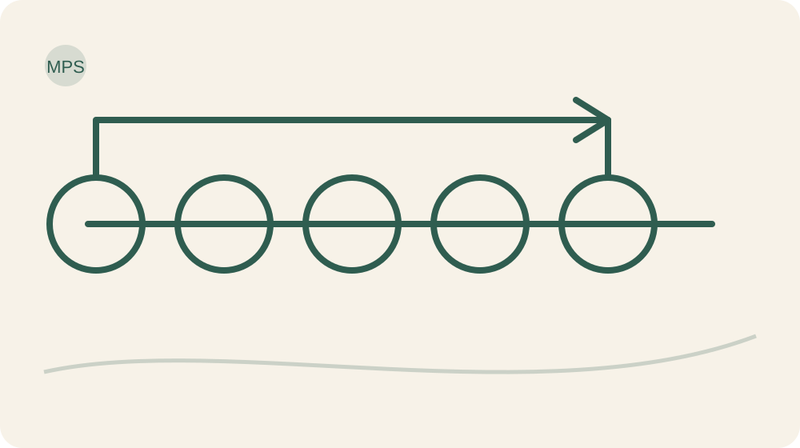

- **Soberania Interna:** perceber e investigar Solo e Raiz antes de obedecer ao automático.
- **Limite Sagrado:** reconhecer o Tronco, a responsabilidade própria e o que não está sob seu controle.
- **Acordo Consciente:** organizar Galhos, pedidos, recursos, expectativas e renegociação.
- **Ação com Visão de Futuro:** observar Frutos, fazer Poda quando necessário, subir ao Mirante e revisar a direção.

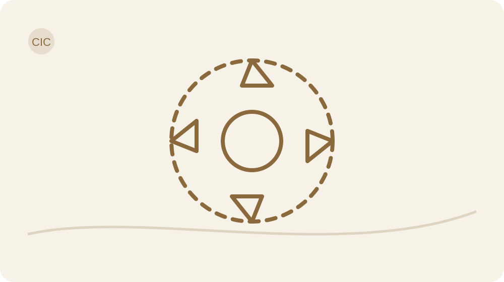

A Árvore do Discernimento™ não é diagnóstico nem decoração: ela ajuda a localizar o que investigar. **Fruto** é resultado em contexto; **Poda** é interrupção específica; **Nova Semente** é a prática que ocupa o espaço aberto.

<!-- end MINDSETmagro 2.1 integration -->

## Cuidado que permite continuar

Este é um percurso educativo para adultos. Não é psicoterapia, tratamento de obesidade, prescrição alimentar ou programa individual de exercícios. Você não precisa mudar medicamentos, fazer jejum, cortar grupos alimentares ou tomar suplementos para participar. Não modifique tratamento por uma interpretação feita durante os exercícios.

Corpo e alimentação são trilhas opcionais. Você pode trabalhar escolhas, ambiente e descanso sem registrar peso, medidas, calorias ou fotografias. Se monitorar alimentação aumenta vergonha, restrição, perda de controle ou necessidade de compensar, suspenda esses registros e procure acompanhamento adequado. Não transforme o caderno numa fiscalização que viaja dentro da bolsa.

Pause práticas que provoquem sofrimento intenso ou persistente, agitação incomum, piora marcante do sono, lembranças invasivas ou dificuldade de voltar às atividades. Um psicólogo ou profissional de saúde pode ajudar a adaptar o percurso. Sensações corporais novas, persistentes ou preocupantes pedem avaliação, não explicação automática por estresse.

Se houver risco imediato à sua segurança, procure atendimento de urgência local. O app e a LÚCIDA não são serviços de emergência. Em contexto de violência, a prioridade é proteção e apoio; um exercício de limite não exige confrontar alguém perigoso.

Alimentação, movimento e sono dependem de condições, recursos e necessidades individuais. Gestação, condições clínicas, uso de medicamentos, dor ou histórico de transtorno alimentar podem exigir adaptações profissionais. Pedir ajuda não suspende sua autoria; amplia os recursos com que você pode exercê-la.

## Conhecer a própria saúde é parte do cuidado

Dificuldade para mudar peso, energia, humor, sono, apetite, concentração ou disposição pode envolver muitos fatores. Sono irregular, estresse persistente, sofrimento emocional, uso de medicamentos, dor, alterações da tireoide, diabetes ou resistência à insulina quando clinicamente pertinentes, anemias/deficiências, condições hormonais, menopausa ou perimenopausa, SOP, apneia, TDAH, outras condições neurológicas/psiquiátricas, contexto financeiro, acesso a alimentos, violência, luto, sobrecarga, deficiência e limitações físicas podem participar do quadro. **A presença de um sintoma não identifica sua causa.**

Este livro não pede uma bateria universal de exames. Uma avaliação adequada depende de história, sintomas, idade, sexo, ciclo de vida, medicamentos, histórico familiar, exame clínico e julgamento profissional. Você pode usar o Caderno para chegar à consulta com perguntas melhores, não com um diagnóstico pronto.

### Guia de preparação para uma consulta

Se for útil, registre: quando os sintomas começaram; mudanças de energia, humor, sono e apetite; relação com comida; episódios de compulsão, restrição ou compensação, se houver; medicamentos, suplementos e substâncias; dor; ciclo menstrual/menopausa quando pertinente; exames anteriores e datas; histórico pessoal/familiar relevante; barreiras de acesso e transporte; apoios disponíveis; e as perguntas que deseja fazer.

## Pare, adapte ou procure apoio quando for necessário

Interrompa a prática e procure orientação adequada quando houver sofrimento intenso ou persistente, desesperança ou perda importante de funcionamento, pensamento de autoagressão, risco de violência, perda ou ganho de peso involuntário importante, desmaio, dor no peito, falta de ar, restrição alimentar intensa, compulsão frequente, purgação/compensação, uso perigoso de medicamento/suplemento, piora acentuada do sono, agitação incomum ou sintomas novos e preocupantes. Em emergência, use os serviços locais verificados para o país em que o produto estiver sendo oferecido.

Nenhum exercício deste livro exige confrontar uma pessoa perigosa, abandonar tratamento, provar disciplina, expor intimidade ou continuar uma prática que esteja piorando seu estado. Pausar também pode ser posicionamento.

## Como usar sem transformar cuidado em obrigação

Reserve um espaço possível para ler e uma oportunidade real para testar. Não há quantidade universal de minutos que faça o método funcionar. A leitura está dividida em blocos: descubra o ponto central, responda à prática, leve uma ação à vida e volte ao Fruto. Aprofundamentos podem esperar.

Cada dia tem um objetivo, uma prática central e uma missão. A ação mínima é uma versão menor e segura para dias difíceis. É permitido registrar que não realizou a missão, o obstáculo encontrado e o próximo passo possível. Honestidade produz informação; um preenchimento bonito feito para agradar o aplicativo, não.

No app, a proposta inicial é liberar o próximo dia depois de concluir o registro e completar 24 horas desde a abertura significativa do anterior. Esse intervalo é decisão de produto, não prazo cerebral. O livro pode ser consultado livremente. Ler adiante e praticar adiante são coisas diferentes: dê à experiência tempo para encontrar a vida.

O Caderno Vivo reúne o que você já respondeu. Não é necessário copiar a resposta outra vez. No papel, use os espaços correspondentes. No HTML de referência, o salvamento depende do consentimento para armazenamento neste navegador; exporte seus registros se quiser conservar uma cópia. No app integrado, a persistência depende de acesso autorizado e confirmação do servidor.

Salvar não significa concluir; concluir não significa dominar. Voltar a uma pergunta é permitido. Se você pausar uma semana, encontre onde parou e qual habilidade precisa retomar. O Dia 1 não é uma penitência para quem teve uma vida acontecendo.

## Três rotas para um dia real

<!-- V03 -->
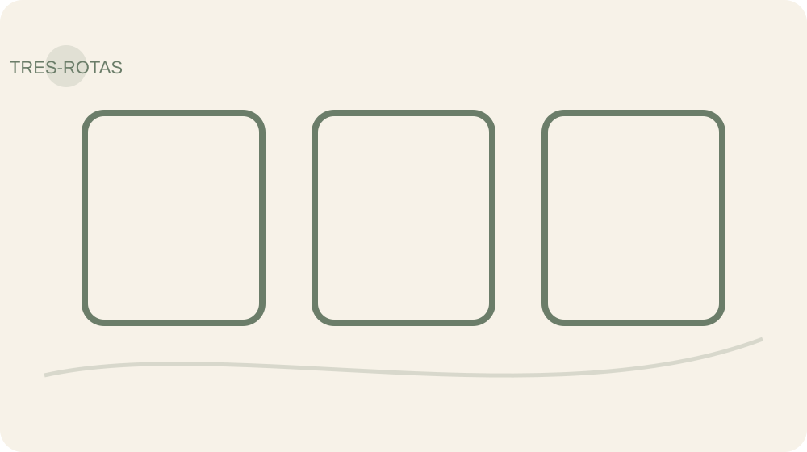

**Rota Mínima** — quando o dia estiver apertado: leia o objetivo, responda uma pergunta central, faça uma ação mínima ou registre por que ela não coube e anote um Fruto/obstáculo.

**Rota Completa** — quando houver espaço: faça a leitura principal, o exercício do Caderno, uma experiência segura fora das páginas e a revisão do Fruto.

**Rota Aprofundada** — quando o problema realmente pedir: acrescente a ferramenta opcional, revise uma hipótese ou converse com apoio/LÚCIDA dentro dos limites do produto.

Nenhuma rota mede comprometimento ou valor. A mínima não é versão inferior; é uma forma de preservar continuidade sem transformar autocuidado em mais uma carga.

## O efeito cumulativo tem limite de carga

No começo, aprender exige atenção. Com prática, algumas habilidades podem se integrar à rotina, outras continuam úteis apenas em situações específicas. Instalação, neste livro, significa colocar uma prática em condições de ser repetida. Não significa programação definitiva do cérebro.

Mantenha diariamente uma escolha pequena e um registro breve quando útil. Use P.A.R.A. diante de impulso; Fato × História × Incógnita diante de uma conclusão importante; Sala de Controle profunda quando houver uma decisão que mereça investigação. Não execute todos os painéis para escolher a cor de uma toalha.

As revisões ao fim das travessias recebem prioridade sobre acrescentar novas tarefas. Elas verificam o que está ajudando e o que precisa sair. Nenhuma lista acumula 29 tarefas obrigatórias no Dia 30. Se a ferramenta aumenta mais peso do que clareza, reduza a dose, mude a aplicação ou peça ajuda.

Pesquisas sobre hábitos mostram grande variação entre pessoas e comportamentos. Trinta dias organizam um começo. Continuidade requer oportunidades de repetir, apoio e revisão das condições.

## Seu ponto de partida não é uma sentença

Escolha uma situação concreta das últimas semanas. Descreva o que você faz, em que contexto e o que acontece depois. Em vez de “minha vida está um caos”, tente “abro mensagens enquanto tento terminar uma tarefa e volto sem saber onde parei”.

Registre um aspecto que gostaria de tornar mais leve e uma ação que depende de você. Registre também um obstáculo de contexto: falta de tempo protegido, recursos, acessibilidade, segurança ou apoio não se resolve fingindo que é falta de vontade.

As escalas abaixo são anotações pessoais de percepção, sem validade diagnóstica. Você poderá revisitá-las nos Dias 28–30. Uma diferença de nota não prova efeito do protocolo; seu contexto também muda.

**Que situação quero compreender melhor?**

**Que comportamento observável gostaria de experimentar?**

**Que recurso, limite ou apoio preciso considerar?**

**Clareza percebida hoje (opcional; 0 nenhuma, 10 muita)**

**Como tenho conseguido cuidar de mim?**

**Meu compromisso possível com esta jornada é...**

## Termo de compromisso com o cuidado - opcional

Eu entendo que este percurso não promete transformar meu corpo, minha mente ou minha vida em 30 dias. Comprometo-me a observar com honestidade, respeitar meus limites, não alterar tratamentos por conta própria, buscar ajuda quando necessário, adaptar ou interromper práticas que produzam sofrimento e não usar o protocolo para me punir ou controlar outras pessoas. Posso pausar, retomar, deixar campos em branco e mudar de ideia.

**Nome ou pseudônimo (opcional)**

**Data**

**Que situação desejo compreender melhor?**

**Que apoio posso considerar?**

**Qual limite pessoal de segurança quero lembrar?**

**Profissional ou rede de apoio que desejo registrar (opcional)**

**Assinatura simbólica (opcional)**

A assinatura não é contrato de resultado, renúncia de direitos nem autorização para coleta de dados.

## LÚCIDA: uma boa pergunta antes de uma boa resposta

Você não precisa entregar seu discernimento a uma inteligência artificial para participar. Quando disponível e autorizada, LÚCIDA ajuda a organizar o que você já produziu, perguntar o que falta, separar observação de interpretação e procurar alternativas.

Comece gerando sua própria resposta. Depois pergunte: qual parte é fato? O que permanece desconhecido? Que hipótese alternativa cabe aqui? Que escolha segura posso testar? A IA não determina intenção de terceiros, não atribui valor pessoal e não oferece diagnóstico.

Compartilhe apenas os registros que escolher. Campos de saúde e narrativas íntimas não devem ir automaticamente para a conversa. A ponte de perguntas deste material pode ser usada sem IA; ela não representa análise de um modelo em tempo real.

## O mapa das seis travessias

<!-- V02 -->
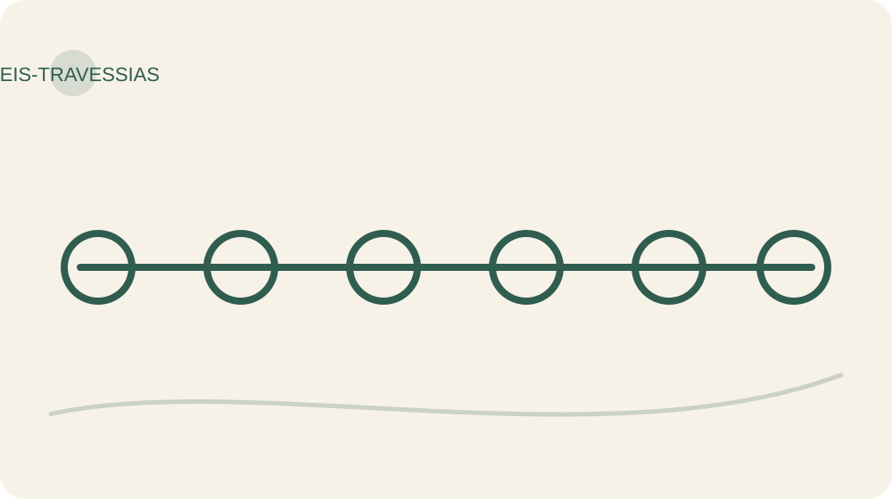

Dia 01 · O que você está carregando? — Descongestionar.

Dia 02 · Nem toda aba precisa ficar aberta — Descongestionar.

Dia 03 · Pausa não é desaparecimento — Descongestionar.

Dia 04 · Dê um endereço à preocupação — Descongestionar.

Dia 05 · Seu ambiente também escolhe — Descongestionar.

Dia 06 · O fato não chegou contando história — Discernir.

Dia 07 · Uma conclusão precisa prestar contas — Discernir.

Dia 08 · Sempre? Nunca? Vamos conferir — Discernir.

Dia 09 · De quem é essa voz? — Discernir.

Dia 10 · Três cenas, uma hipótese — Discernir.

Dia 11 · Você não cabe no personagem — Voltar A Si.

Dia 12 · Valor aparece quando custa — Voltar A Si.

Dia 13 · Como quero viver neste corpo? — Voltar A Si.

Dia 14 · Identidade precisa de testemunhas reais — Voltar A Si.

Dia 15 · Pertencer sem se abandonar — Voltar A Si.

Dia 16 · Sua parte não é tudo — Reposicionar.

Dia 17 · Um limite precisa de uma frase — Reposicionar.

Dia 18 · O espaço que a Poda abre — Reposicionar.

Dia 19 · O futuro precisa de uma cena — Reposicionar.

Dia 20 · Desça da Árvore e teste — Reposicionar.

Dia 21 · Seu corpo não é uma prestação atrasada — Habitar.

Dia 22 · O prato traduzido, sem tribunal — Habitar.

Dia 23 · Movimento que cabe na vida — Habitar.

Dia 24 · Descansar também é cuidado — Habitar.

Dia 25 · Próxima escolha, não punição — Habitar.

Dia 26 · Consistência não é perfeição — Sustentar.

Dia 27 · Quando a rotina sair do eixo — Sustentar.

Dia 28 · Auditoria dos Frutos — Sustentar.

Dia 29 · Uma carta com data e compromisso — Sustentar.

Dia 30 · Uma escolha viva precisa de cuidado — Sustentar.

# Travessia I — Descongestionar

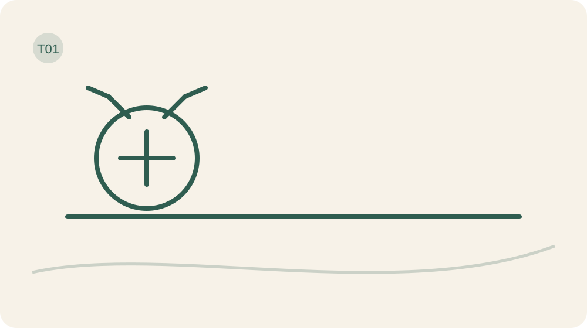

**◌ Abrir espaço sem transformar a mente em inimiga.**

> **Salvaguarda desta travessia:** Comece leve: nesta travessia, o risco é transformar observação em vigilância. Se registrar aumentar cobrança, reduza o campo e volte à ação mínima.

# Dia 1 — O que você está carregando?

> **Mapa Posicione-se™ — Dia 1:** Percepção · **Soberania Interna** · Árvore: **Solo** · Ciclo: **Perceber**.

> **Escolha sua rota de hoje**
> **Mínima:** objetivo + 1 pergunta + ação mínima + Fruto/obstáculo.  
> **Completa:** leitura + Caderno + experiência segura + revisão.  
> **Aprofundada:** ferramenta opcional ou apoio, somente se acrescentar clareza.

**Objetivo do Dia:** Localizar um excesso concreto sem transformar uma situação em identidade.

**Ferramenta principal:** Diário Vivo.  
**Apoio opcional:** Sala de Controle rápida.

## A bagagem que ninguém pesou

Você pode chegar aqui com a impressão de que precisa mudar tudo: corpo, rotina, pensamentos, casa, relações. Antes que sua segunda-feira vire uma empresa de reformas, pare. Hoje não vamos consertar a vida inteira. Vamos descobrir o que você está carregando e escolher uma alça dessa mala.

MINDSETmagro começa com economia de excesso. Uma preocupação pode pedir providência; uma emoção pode trazer informação; uma responsabilidade pode ser realmente sua. Não vamos chamar tudo isso de entulho. O excesso que interessa é aquele que ocupa espaço sem ajudar você a viver com mais cuidado e coerência.

## Uma cena possível

Imagine esta situação, criada como exemplo: você senta para resolver uma conta e abre uma mensagem. A mensagem lembra uma conversa; a conversa lembra uma obrigação. Meia hora depois, a conta continua aberta e você conclui: “Sou uma bagunça”. Repare no salto. Houve uma sequência de ações num contexto. Sua identidade inteira não foi submetida à perícia.

Se o Caderno registrar apenas “sou uma bagunça”, não teremos onde agir. Se registrar “interrompi a conta para responder mensagens três vezes”, aparece um ponto concreto de mudança. Ainda faltará entender o motivo. Hoje basta enxergar a cena.

## Pense comigo: qual excesso tem endereço?

“Estou sobrecarregada” é uma experiência legítima, mas ainda é um mapa sem ruas. Escolha uma situação recente e comum, não a lembrança mais dolorosa da sua vida. Onde você estava? O que tentou fazer? O que acabou fazendo? Qual foi a consequência visível?

Diferencie o que pesa do que pode ser mudado agora. Cuidar de alguém pode exigir muito e continuar importante. Falta de dinheiro, doença e trabalho precário não desaparecem com pensamento positivo. Sua esfera de escolha existe dentro de condições reais. Registrar uma limitação é honestidade, não falta de comprometimento.

## Diário Vivo, não tribunal portátil

O Diário Vivo acompanhará a travessia como um lugar de observação. Use uma cena por vez. Pode escrever “não consegui identificar” ou “não fiz”. Não precisa narrar a vida inteira, vigiar cada pensamento ou entregar intimidades para provar dedicação. O registro pertence a você.

Antes de tentar melhorar a cena, deixe uma fotografia escrita do ponto de partida: “Hoje, quando aconteceu X, respondi Y e observei Z”. Isso será sua referência. Ao final, compararemos episódios e condições, sem inventar uma nota de valor pessoal. Peso, medidas e fotos não são necessários para começar.

## Ciência sem jaleco

Pesquisas sobre monitoramento de metas indicam que registrar ações e revisar o progresso pode ajudar. Isso não exige fiscalização permanente nem exposição pública. O Diário Vivo é uma aplicação autoral dessa ideia; o protocolo completo não foi validado por esses estudos.

## Seu Caderno Vivo

Escreva com as palavras que você usaria numa conversa honesta. Os campos abaixo pertencem ao seu registro deste Dia; não é preciso copiar as respostas em outro lugar. Você pode deixar os campos opcionais em branco e voltar depois.

**Qual cena recente mostra o excesso que quero observar?**

**O que tentei, o que fiz e o que aconteceu?**

**Que condição ou recurso preciso considerar?**

## Uma experiência fora destas páginas

Escolha uma ocasião habitual de hoje para perceber o excesso selecionado. Não provoque um problema só para preencher o exercício. Quando a ocasião aparecer, nomeie em silêncio o que está acontecendo e anote uma frase depois. Sua missão termina nesse registro; nenhuma transformação dramática é exigida.

## O Fruto de hoje

Volte à cena, não à avaliação de quem você é. Conseguiu perceber a interrupção, a pressa ou a sobrecarga? Qual detalhe ficou visível? Se a ocasião não aconteceu, registre isso e indique quando poderá observar com segurança. Ausência de oportunidade também é informação útil.

**O que aconteceu? Se não realizou: qual foi o obstáculo e qual será a próxima escolha segura?**

## Se acontecer, eu tenho uma resposta

Exemplo: se eu terminar uma tarefa me chamando de incapaz, então descreverei uma ação concreta antes de julgar meu dia. Escolha uma resposta que dependa de você. Não use “vou parar de sentir” como plano: sentimento não recebe memorando.

**Meu gatilho observável e minha resposta possível**

### Fechamento editorial do Dia
**Contraexemplo:** Transformar uma situação temporária em traço permanente de identidade, por exemplo: “sou sempre assim” ao invés de notar um comportamento específico.
**Critério de progresso:** Consegue descrever um excesso concreto em termos de situação, tempo e ação, sem usar rótulos pessoais.
**Fecho do método:** Ao perceber o que pesa sem se definir por isso, você fortalece sua soberania e nutre o solo para escolhas mais livres.
**Observe o Fruto:** Registro breve: situação, comportamento excedente, contexto (quando, onde, com quem) e pequena evidência concreta que mostra ser circunstancial.

## O que fica e o que pode esperar

Ação mínima: escrever apenas “o excesso que notei hoje foi…”. Instalar, neste livro, significa deixar uma prática disponível para repetir e revisar; não gravar uma mudança definitiva no cérebro.

Por enquanto, mantenha somente uma anotação breve. Não acumule tarefas extras por entusiasmo e depois use o cansaço como prova de fracasso.

Amanhã, essa primeira cena vai nos ajudar a retirar pendências da cabeça e dar a elas um lugar de consulta.

# Dia 2 — Nem toda aba precisa ficar aberta

> **Mapa Posicione-se™ — Dia 2:** Percepção · **Soberania Interna** · Árvore: **Solo** · Ciclo: **Nomear**.

> **Escolha sua rota de hoje**
> **Mínima:** objetivo + 1 pergunta + ação mínima + Fruto/obstáculo.  
> **Completa:** leitura + Caderno + experiência segura + revisão.  
> **Aprofundada:** ferramenta opcional ou apoio, somente se acrescentar clareza.

**Objetivo do Dia:** Externalizar uma pendência e dar a ela um próximo endereço ou momento de revisão.

**Ferramenta principal:** Estacionamento Mental.  
**Apoio opcional:** Poda Ambiental.

## Sua cabeça não é estacionamento sem saída

Ontem você observou uma cena. Hoje vamos olhar para as pendências que continuam chamando mesmo quando você tenta fazer outra coisa. Há uma diferença entre lembrar que algo existe e precisar resolver tudo no instante em que a lembrança aparece. Sua mente não precisa virar recepcionista de vinte demandas simultâneas.

O Estacionamento Mental é uma ferramenta simples: retirar uma pendência do circuito de repetição e colocá-la num registro consultável. Estacionar não é abandonar. Um carro sem endereço e sem previsão de retirada só mudou de congestionamento.

## A lista que também cansa

Neste exemplo, uma pessoa escreve “casa, trabalho, mãe, consulta, futuro”. A lista ficou curta, mas cada palavra contém um universo. Ao abrir o registro, ela sente o mesmo aperto. Então troca “consulta” por “localizar o telefone da clínica”; troca “casa” por “decidir quem pode dividir a compra desta semana”.

Ela não resolveu todos os problemas. Criou entradas pelas quais consegue começar. Já “futuro” exige outra pergunta: que preocupação concreta está escondida nessa palavra? Se ainda não souber, pode deixar registrado “preciso entender”, com um momento para voltar. Não precisamos fingir precisão onde ela ainda não existe.

## Dar destino é diferente de produzir uma lista bonita

Escolha no máximo três pendências. Para cada uma, decida: existe uma ação minha agora, preciso de informação, dependo de outra pessoa ou posso deixar sem ação neste momento? Depois acrescente um verbo e um contexto àquela que vai receber atenção. “Organizar tudo” não cabe na agenda. “Separar os documentos que já tenho após o café” cabe melhor.

Se houver prazo ou urgência real, trate como tal. O Estacionamento não serve para adiar risco, atendimento necessário ou um dever que vence hoje. Também não transforma responsabilidade alheia em serviço seu. Pode ser preciso pedir, negociar ou reconhecer que o próximo movimento pertence a outra pessoa.

## Uma saída para a aba que insiste

Quando a pendência reaparecer, consulte o registro antes de reabrir toda a discussão interna. Você pode dizer: “Isso está anotado; minha próxima ação será naquele momento”. Se o momento chegou e a tarefa não coube, revise o plano. Adiar conscientemente exige nova data possível; empurrar sem olhar mantém o acúmulo.

Não anote toda ideia que atravessar a cabeça. A ferramenta existe para reduzir carga, não para transformar viver em arquivar. Preserve ideias úteis e obrigações concretas. Pensamentos passageiros podem passar sem ganhar uma pasta, uma etiqueta e um departamento.

O registro também pode mostrar que a lista excede os recursos disponíveis. Nesse caso, o trabalho é priorizar e negociar, não escrever mais rápido. Algumas pendências precisarão esperar de forma explícita.

## Ciência sem jaleco

Anotações e lembretes podem reduzir a necessidade de manter tudo na memória ao mesmo tempo. A pesquisa sobre externalização cognitiva não valida especificamente o Estacionamento Mental nem demonstra que escrever elimina ansiedade. Usaremos a ferramenta como um teste organizador e revisável.

## Seu Caderno Vivo

Registre somente as pendências que merecem ser lembradas. No campo de destino, use um verbo concreto e identifique o que depende de informação ou de outra pessoa. No campo de retorno, escolha uma ocasião viável; o registro será consultado, não apenas acumulado.

**Quais três pendências merecem um lugar de consulta?**

**Qual delas depende de mim e qual ação específica cabe?**

**Quando vou consultar este registro novamente?**

## Uma experiência fora destas páginas

Use seu Estacionamento uma vez durante uma tarefa comum. Ao surgir uma pendência não urgente, anote poucas palavras e retorne à tarefa escolhida. No horário de revisão, abra a nota e execute, renegocie ou descarte conscientemente um item. O teste inclui voltar à lista; escrever e nunca olhar deixa o circuito incompleto.

## O Fruto de hoje

Observe se houve retorno à tarefa e se o item ganhou destino. Não é necessário sentir a cabeça vazia para considerar o teste realizado. Se escrever aumentou o volume de demandas, reduza para um único item. Registre o obstáculo sem criar uma nova lista de defeitos.

**O que aconteceu? Se não realizou: qual foi o obstáculo e qual será a próxima escolha segura?**

## Se acontecer, eu tenho uma resposta

Se uma pendência não urgente interromper minha tarefa, então anotarei uma frase e voltarei ao que escolhi fazer. Se for urgente, então decidirei conscientemente a prioridade em vez de fingir que posso atender tudo junto.

**Meu gatilho observável e minha resposta possível**

### Fechamento editorial do Dia
**Contraexemplo:** Acreditar que lembrar de tudo o tempo todo é sinal de responsabilidade, mantendo todas as pendências mentalmente abertas.
**Critério de progresso:** Consegue transferir pelo menos uma pendência para um local externo e verificar esse local no momento combinado.
**Fecho do método:** Ao nomear e estacionar pendências, você reafirma sua soberania interna sobre onde cultivará atenção.
**Observe o Fruto:** Registro: pendência externalizada, local escolhido e data de revisão; observe se a ansiedade diminui no dia a dia.

## O que fica e o que pode esperar

Ação mínima: estacionar uma pendência e indicar quando consultá-la. Hoje você não precisa resolver todas as pendências estacionadas.

O registro breve de ontem permanece. O Estacionamento entra sob gatilho: quando algo importante precisa ser lembrado, mas não resolvido naquele instante.

Amanhã, vamos criar uma pausa entre a chegada de um impulso e a resposta. A lista organiza pendências; a pausa ajuda a escolher como responder.

# Dia 3 — Pausa não é desaparecimento

> **Mapa Posicione-se™ — Dia 3:** Percepção · **Soberania Interna** · Árvore: **Raiz** · Ciclo: **Distanciar**.

> **Escolha sua rota de hoje**
> **Mínima:** objetivo + 1 pergunta + ação mínima + Fruto/obstáculo.  
> **Completa:** leitura + Caderno + experiência segura + revisão.  
> **Aprofundada:** ferramenta opcional ou apoio, somente se acrescentar clareza.

**Objetivo do Dia:** Criar uma pausa curta entre impulso e resposta sem usar calma como obrigação.

**Ferramenta principal:** P.A.R.A..  
**Apoio opcional:** Sala de Controle rápida.

## O intervalo também é uma escolha

Você percebe a mensagem, sente a vontade de responder e já está digitando. Quando vê, enviou um parágrafo que precisaria de advogado, intérprete e café. Hoje vamos experimentar um pequeno intervalo. Não para esconder a emoção, mas para não transformar todo impulso em instrução.

Ontem demos lugar às pendências. Agora damos lugar à resposta. Não é obrigatório ficar calma para fazer uma escolha mais cuidadosa. Em situações simples, você pode sentir irritação e ainda decidir que aquela conversa merece uma frase clara, não uma guerra por aplicativo.

## P.A.R.A.: quatro movimentos possíveis

PARE. Interrompa por um instante a ação automática, se houver segurança para isso. Tire o dedo de enviar, deixe o objeto sobre a mesa ou avise que precisa pensar. ATIVE O CORPO. Aqui isso significa voltar ao contato com o presente: perceber o apoio da cadeira, olhar ao redor ou fazer um movimento confortável. Não é uma técnica para comandar hormônios.

RASTREIE. Nomeie o que chegou: “há irritação e vontade de responder imediatamente”. Procure a situação que disparou a resposta, sem escavar sua história inteira. AJA PELO VALOR. Escolha uma ação pequena que sustente algo importante, como clareza, respeito ou proteção. Pausar sem voltar a escolher pode virar desaparecimento; o último movimento importa.

## Um ensaio sem heroísmo

Exemplo cotidiano: alguém pede uma tarefa extra quando você já está ocupada. Você costuma dizer sim antes de consultar a agenda. No ensaio de hoje, percebe o contato dos pés ou outro apoio confortável, nota o impulso de agradar e responde: “Vou conferir meus horários e te digo até o fim da tarde”.

Ainda não recusou, ainda não aceitou. Criou uma condição para decidir. Quando o horário combinado chegar, precisa retornar com uma resposta possível. A pausa protege a escolha apenas se não virar uma promessa indefinida que transfere a desorganização para o outro.

## Presença sem obrigação de fechar os olhos

Você pode manter os olhos abertos e prestar atenção a um objeto neutro. Respiração profunda, contagem e exploração corporal não são exigidas. Se focar no corpo aumentar angústia, desorientação ou desconforto, interrompa e use uma referência externa confortável, ou simplesmente pule o exercício.

Esta prática breve não trata crises e não exige permanecer numa situação ameaçadora. Quando houver risco, priorize segurança e apoio. O objetivo é ensaiar uma escolha cotidiana, não testar resistência ao sofrimento. Sentir mais tensão durante o exercício não significa que você precisa insistir até “vencer a mente”.

No fim, confira se a pausa ajudou a escolher ou apenas adiou uma resposta necessária. Se você prometeu retornar, esse retorno faz parte da experiência. Presença inclui cumprir o próximo passo combinado.

## Ciência sem jaleco

Algumas práticas guiadas estudadas em aplicativos ajudam a observar pensamentos com mais distância, mas os resultados variam. Isso não demonstra eficácia específica do P.A.R.A. A sigla é uma organização pedagógica autoral e não descreve uma sequência de regiões cerebrais.

## Seu Caderno Vivo

Escolha uma situação simples para o ensaio. Nomeie o impulso sem censurá-lo e procure uma resposta que expresse o valor escolhido. Você pode registrar depois do acontecimento; não precisa interromper uma conversa para preencher os campos ou executar a sigla perfeitamente.

**Em qual situação simples quero experimentar a pausa?**

**Qual impulso apareceu e que valor quero sustentar?**

**Que resposta pequena seria possível?**

## Uma experiência fora destas páginas

Experimente o P.A.R.A. uma vez, numa conversa ou tarefa de baixo risco. Não precisa pronunciar a sigla nem executar uma coreografia. Note a oportunidade, encontre um apoio confortável, nomeie o impulso e escolha a resposta. Se não lembrar na hora, reconstrua a cena depois e ensaie uma frase para a próxima ocasião.

## O Fruto de hoje

O Fruto é a resposta observada: você aguardou, consultou a agenda, pediu informação ou respondeu como antes? Inclua o contexto. Uma pausa pequena não garante a reação do outro. Se houve desconforto, anote qual parte precisa ser adaptada ou retirada.

**O que aconteceu? Se não realizou: qual foi o obstáculo e qual será a próxima escolha segura?**

## Se acontecer, eu tenho uma resposta

Se eu perceber vontade de aceitar uma tarefa imediatamente, então direi que preciso conferir minha disponibilidade antes de confirmar. Substitua esse exemplo por um gatilho real seu; preserve uma resposta curta, concreta e segura.

**Meu gatilho observável e minha resposta possível**

### Fechamento editorial do Dia
**Contraexemplo:** Achar que pausar significa sumir ou negar emoções; evitar conflitos para não sentir desconforto.
**Critério de progresso:** Perceber um espaço breve entre impulso e ação e escolher responder em vez de reagir automaticamente.
**Fecho do método:** Essa pausa fortalece sua soberania ao criar distância segura entre impulso e comportamento, nutrindo a raiz da autonomia.
**Observe o Fruto:** Anotar quando a pausa permitiu outra escolha e o contexto (hora, gatilho, resposta escolhida) para ver padrões e limites efetivos.

## O que fica e o que pode esperar

Ação mínima: notar “estou com vontade de…” antes de agir, mesmo que a escolha seguinte ainda não mude. Perceber é treino, não absolvição automática das consequências.

Mantenha a anotação de uma cena. Use o Estacionamento quando houver pendência e o P.A.R.A. quando surgir impulso; nenhum dos dois exige ficar de plantão o dia inteiro.

Amanhã vamos distinguir preocupação que pede providência de repetição que só retorna ao mesmo lugar. A pausa de hoje abrirá espaço para essa pergunta.

# Dia 4 — Dê um endereço à preocupação

> **Mapa Posicione-se™ — Dia 4:** Percepção · **Soberania Interna** · Árvore: **Solo** · Ciclo: **Distanciar**.

> **Escolha sua rota de hoje**
> **Mínima:** objetivo + 1 pergunta + ação mínima + Fruto/obstáculo.  
> **Completa:** leitura + Caderno + experiência segura + revisão.  
> **Aprofundada:** ferramenta opcional ou apoio, somente se acrescentar clareza.

**Objetivo do Dia:** Diferenciar preocupação que pede ação de repetição mental que pede limite e retorno.

**Ferramenta principal:** Janela do Caos.  
**Apoio opcional:** Estacionamento Mental.

## Pensar de novo nem sempre é pensar melhor

Há pensamentos que voltam trazendo informação nova. Outros voltam com a mesma mala, o mesmo assunto e nenhuma proposta de saída. Depois de perceber um impulso, como fizemos ontem, vale perguntar: estou investigando alguma coisa ou estou apenas repetindo uma cena?

Pensar muito não é prova de profundidade. Às vezes é esforço sem direção, e isso pode cansar. A proposta de hoje não é expulsar pensamentos. É perceber se a conversa interna produz uma pergunta respondível, uma ação possível ou apenas mais uma volta.

## A pergunta que muda o trabalho

Escolha uma preocupação de intensidade administrável. Pergunte: existe algo específico que posso fazer com os recursos de hoje? Se sim, transforme a resposta numa pequena providência. Se depende de informação, identifique onde buscá-la. Se exige certeza sobre o futuro ou a intenção de outra pessoa, reconheça esse limite.

“E se tudo der errado?” não tem uma resposta completa. “Qual documento preciso separar para a reunião?” pode ter. Nem toda incerteza vira tarefa. Algumas terão de continuar abertas enquanto você cuida da parte que conhece. Não saber ainda não significa que você deve continuar pensando até esgotar o assunto — ou a si mesma.

## Janela do Caos, com porta de saída

A Janela do Caos é um recurso opcional e temporário: reserve um período breve, por exemplo cinco minutos, para consultar uma preocupação anotada. Escolha um horário que não invada descanso ou cuidado necessário. Abra o registro, nomeie a pergunta e decida se há providência, informação a buscar ou incerteza a reconhecer.

Ao encerrar, escreva uma frase de destino e passe a uma atividade concreta. Não use a janela para listar todos os cenários terríveis ou reviver detalhes dolorosos. Se o exercício intensificar sofrimento ou prolongar a repetição, retire-o. Você não precisa de mais uma reunião improdutiva dentro da própria cabeça.

## O ensaio da resposta possível

Exemplo: uma pessoa aguarda retorno sobre uma candidatura e passa a tarde relendo a mensagem enviada. Na janela, identifica que não existe informação nova. Pode conferir se o prazo informado terminou e, se apropriado, planejar um contato. Antes disso, reler a mensagem não faz a resposta chegar.

Ela encerra escrevendo: “Ainda não sei. Meu próximo contato será na data combinada”. Depois retoma uma atividade do presente. Isso não promete acabar com a preocupação. Apenas separa a providência possível do esforço de controlar algo que continua fora do alcance.

Uma preocupação com risco concreto não deve ser estacionada por conveniência. Se houver uma providência de segurança ou cuidado que precisa ocorrer agora, ela tem prioridade sobre a janela e sobre o preenchimento do Caderno.

## Ciência sem jaleco

Há tratamentos psicológicos que ajudam a trabalhar preocupação e ruminação persistentes. A evidência desses tratamentos não pode ser transferida automaticamente para esta janela breve. Se a repetição causa sofrimento persistente, prejudica sono ou funcionamento, buscar ajuda profissional é uma providência de cuidado, não uma derrota.

## Seu Caderno Vivo

Use uma preocupação administrável, sem buscar a lembrança mais dolorosa. Distingua providência, informação e incerteza. O campo de encerramento serve para dar um destino à rodada, inclusive quando a resposta for reconhecer um limite e procurar apoio em vez de continuar analisando.

**Qual preocupação consigo formular como uma pergunta específica?**

**Há ação, informação a buscar ou incerteza a reconhecer?**

**Qual frase de encerramento e qual atividade seguinte escolho?**

## Uma experiência fora destas páginas

Faça um único teste de organização da preocupação. Você pode usar a janela breve ou apenas uma pergunta no momento em que notar repetição. Defina o destino do assunto e retorne a uma atividade possível. Seu teste é encerrar a rodada; não precisa eliminar o retorno do pensamento para completar a missão.

## O Fruto de hoje

Registre se apareceu uma providência nova ou se você reconheceu ausência de informação. Se o pensamento voltou, isso não invalida o registro. Observe se conseguiu retomar alguma atividade. Caso tenha ficado mais presa à análise, registre esse efeito e suspenda a ferramenta.

**O que aconteceu? Se não realizou: qual foi o obstáculo e qual será a próxima escolha segura?**

## Se acontecer, eu tenho uma resposta

Se eu reler uma preocupação sem encontrar informação nova, então consultarei a decisão registrada e retornarei à atividade escolhida. Se houver informação nova relevante, então revisarei o plano. Flexibilidade também inclui reabrir o que realmente mudou.

**Meu gatilho observável e minha resposta possível**

### Fechamento editorial do Dia
**Contraexemplo:** Confundir preocupação útil com ruminação interminável e tentar resolver repetição mental com mais planejamento ou autocensura.
**Critério de progresso:** Notar quando a mente pede ação concreta versus quando repete cenários; usar pausa curta antes de agir ou anotar para estacionar a preocupação.
**Fecho do método:** Ao delimitar onde a preocupação pertence, você fortalece sua soberania interna e nutre o solo do seu distanciamento.
**Observe o Fruto:** Registre episódios: ação tomada, preocupação estacionada e como se sentiu; observe padrões de redução na repetição mental diante do mesmo obstáculo.

## O que fica e o que pode esperar

Ação mínima: perguntar “qual informação ou ação nova surgiu desta rodada?”. Se nenhuma surgiu, você pode encerrar por agora.

O Estacionamento guarda a pendência; o P.A.R.A. ajuda a notar o impulso. A Janela é opcional, temporária e substitui uma rodada de análise — não acrescenta vigilância permanente.

Amanhã olharemos para o ambiente. Há ocasiões em que o próximo passo é mexer na disposição das coisas, não discutir mais consigo.

# Dia 5 — Seu ambiente também escolhe

> **Mapa Posicione-se™ — Dia 5:** Estrutura · **Acordo Consciente** · Árvore: **Galhos** · Ciclo: **Escolher**.

> **Escolha sua rota de hoje**
> **Mínima:** objetivo + 1 pergunta + ação mínima + Fruto/obstáculo.  
> **Completa:** leitura + Caderno + experiência segura + revisão.  
> **Aprofundada:** ferramenta opcional ou apoio, somente se acrescentar clareza.

**Objetivo do Dia:** Ajustar uma condição do ambiente para tornar uma escolha mais possível.

**Ferramenta principal:** Poda Ambiental.  
**Apoio opcional:** Arquitetura da Escolha.

## O ambiente também entra na conversa

Até aqui, você observou, anotou, pausou e deu destino a uma preocupação. Hoje vamos olhar para fora. Uma notificação acende, um objeto some, um compromisso fica invisível e a tarefa se torna mais difícil antes mesmo de começar. Nem todo obstáculo é uma crença profunda esperando análise. Às vezes, é o carregador no lugar errado.

Isso não explica toda dificuldade, mas abre uma pergunta útil: que parte do ambiente está convidando a ação automática, e que pequena mudança poderia favorecer a ação escolhida? Vamos mexer em uma condição, não reformar a casa inteira.

## A escolha que começa antes da escolha

Exemplo: uma pessoa quer ler algumas páginas depois do trabalho. O livro fica guardado e o telefone permanece sobre a almofada. Antes de concluir “não tenho disciplina”, ela testa deixar o livro visível e guardar o telefone por um período compatível com suas responsabilidades.

Talvez leia. Talvez descubra que precisa primeiro descansar ou resolver outra necessidade. O experimento não serve para provar uma teoria bonita. Serve para descobrir se aquela alteração ajuda naquela rotina. Se não ajudar, teremos um resultado para revisar, não uma nova acusação de preguiça.

## Poda Ambiental: retirar e substituir

Escolha uma fonte de atrito ou um convite repetido. Pode ser uma notificação não essencial, uma tarefa sem material acessível ou uma decisão que precisa ser refeita todos os dias. Retire um obstáculo e dê lugar à alternativa. Silenciar um aviso pode ajudar mais se você também definir quando consultará o aplicativo.

Preserve canais necessários de trabalho, cuidado e emergência. Em espaços compartilhados, combine alterações antes de mexer no que pertence aos outros. Autoria não é licença para governar a casa inteira. Sua mudança precisa respeitar recursos, acessibilidade, segurança e a vida de quem divide o ambiente.

## O que cabe levar adiante

Chegamos ao fechamento da primeira travessia. Recuperar não significa reler tudo. Tente lembrar: qual ferramenta ajudou em uma cena concreta? Qual exigiu esforço demais? Qual ainda não teve ocasião de uso? O que precisa de adaptação?

Selecione um apoio diário leve, como o registro de uma frase, e uma ferramenta sob gatilho. As demais ficam disponíveis. Acumular habilidades é diferente de empilhar tarefas. Se você passou a fiscalizar tudo o que pensa, o protocolo ficou pesado demais. Reduza a dose e preserve a vida fora destas páginas.

Quando a mudança envolve acesso digital, preserve o que você precisa consultar por responsabilidade real. Uma rotina de cuidado pode exigir disponibilidade. O experimento é reduzir uma entrada dispensável, não imitar uma rotina que pertence a outra pessoa.

## Ciência sem jaleco

O modelo COM-B organiza perguntas sobre capacidade, oportunidade e motivação. É um mapa para investigar condições da ação, não prova de eficácia do MINDSETmagro. Aqui, usamos a dimensão das oportunidades para não atribuir toda dificuldade à força de vontade.

## Seu Caderno Vivo

Descreva o ambiente como ele existe, incluindo recursos e responsabilidades compartilhadas. A alteração deve ser pequena, segura e reversível. Na revisão, indique o que vale manter e o que deve diminuir; a travessia seguinte não exige carregar todas as práticas anteriores.

**Qual condição favorece a ação automática?**

**Qual alteração pequena e reversível farei?**

**O que ajudou nesta travessia e o que vou reduzir?**

## Uma experiência fora destas páginas

Mude uma condição segura do ambiente antes de uma tarefa habitual e observe uma oportunidade de uso. Pode preparar o material, ajustar um aviso ou combinar uma interrupção. Não precisa comprar nada. Depois compare a experiência com a cena inicial do Dia 1, reconhecendo que os dias também podem ter condições diferentes.

## O Fruto de hoje

Descreva a alteração e o que ocorreu em seguida. A ação ficou mais acessível? Apareceu um obstáculo que você não via? Evite concluir que uma única tentativa explica seu comportamento inteiro. Se não conseguiu alterar o ambiente, registre a dependência real e uma alternativa menor.

**O que aconteceu? Se não realizou: qual foi o obstáculo e qual será a próxima escolha segura?**

## Se acontecer, eu tenho uma resposta

Se eu perceber que a tarefa começa com a procura de um objeto, então deixarei esse objeto num local combinado após o uso. Se compartilhar o espaço, então combinarei primeiro uma solução que respeite as outras pessoas.

**Meu gatilho observável e minha resposta possível**

### Fechamento editorial do Dia
**Contraexemplo:** Achar que mudar o ambiente exige perfeição ou controle total; isso leva à frustração e a esperar o cenário ideal antes de agir.
**Critério de progresso:** Você nota decisões mais fáceis em situações alvo: menos hesitação ou menos tentativas de evitar a escolha proposta.
**Fecho do método:** Ao ajustar o ambiente, você honra o Acordo Consciente e facilita escolhas nos Galhos deste ciclo de Escolher.
**Observe o Fruto:** Registre quando o ambiente foi modificado, o contexto e se a escolha desejada ficou mais acessível; descreva obstáculos remanescentes.

## O que fica e o que pode esperar

Ação mínima: tornar um material necessário mais acessível, ou identificar a pessoa com quem precisa combinar essa mudança. O primeiro Fruto pode ser um acordo.

Mantenha somente o registro breve e a ferramenta que mostrou utilidade. P.A.R.A., Estacionamento e Janela não viram uma lista diária obrigatória. A revisão retorna ao final de cada travessia.

Amanhã começa Discernir. Vamos examinar não apenas o que ocupa sua atenção, mas as histórias que sua mente conta sobre o que aconteceu.

# Travessia II — Discernir

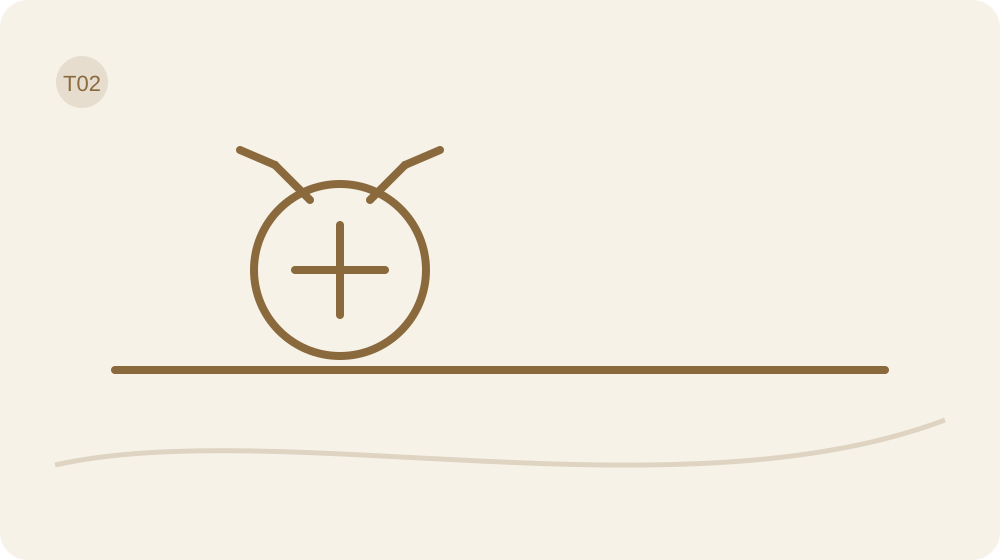

**◇ Separar o que aconteceu da história que contamos sobre o que aconteceu.**

> **Salvaguarda desta travessia:** Discernir não é desconfiar de tudo. Use as perguntas para ganhar precisão e depois volte à vida.

# Dia 6 — O fato não chegou contando história

> **Mapa Posicione-se™ — Dia 6:** Discernimento · **Soberania Interna** · Árvore: **Solo** · Ciclo: **Nomear**.

> **Escolha sua rota de hoje**
> **Mínima:** objetivo + 1 pergunta + ação mínima + Fruto/obstáculo.  
> **Completa:** leitura + Caderno + experiência segura + revisão.  
> **Aprofundada:** ferramenta opcional ou apoio, somente se acrescentar clareza.

**Objetivo do Dia:** Separar fato, interpretação e incógnita numa situação concreta.

**Ferramenta principal:** Fato × História × Incógnita.  
**Apoio opcional:** Sala de Controle.

## O acontecimento e a legenda

Uma mensagem ficou sem resposta. Esse é o começo. “A pessoa não se importa comigo” já é uma explicação. Pode estar certa, pode estar errada, pode conter uma parte da realidade. O problema aparece quando a explicação entra vestida de acontecimento e ninguém confere o documento.

Na primeira travessia, você abriu espaço entre estímulo e resposta. Agora vamos usar esse espaço para discernir. Não vamos desacreditar sua percepção. Vamos dar a cada informação o lugar adequado, para que uma escolha importante não dependa apenas da primeira legenda que apareceu.

## Três lugares, nenhuma sentença antecipada

FATO: o que foi observado ou pode ser descrito com alguma precisão? “Enviei ontem e ainda não recebi resposta” é diferente de “fui desprezada”. HISTÓRIA: qual significado você acrescentou? “Talvez esteja me evitando” é uma hipótese, não um registro direto da intenção alheia. INCÓGNITA: o que ainda falta saber? Pode ser disponibilidade, contexto, acordo de prazo ou algo que ninguém informou.

Você não precisa transformar toda lembrança em gravação perfeita. Pode escrever “lembro assim” quando houver incerteza. Separar essas camadas não apaga o impacto de uma experiência. A dor pode ser real enquanto a explicação permanece incompleta.

## Uma cena com mais de uma leitura

Exemplo didático: uma colega passa sem cumprimentar. Você pensa que ela está irritada. O fato disponível é o encontro sem cumprimento percebido. Talvez ela não tenha visto, talvez esteja ocupada, talvez haja um conflito. Criar alternativas não significa escolher a mais agradável. Significa admitir que a cena, sozinha, não resolve todas as hipóteses.

Uma resposta proporcional pode ser cumprimentar normalmente numa próxima ocasião ou perguntar sobre um assunto concreto. Se existe um histórico claro de desrespeito, inclua esse histórico como evidência. O exercício não manda esquecer padrões nem oferecer acesso ilimitado para “ter certeza”.

## Emoção entra como informação

A Sala de Controle começa hoje com três painéis: Fato, Narrativa e Incógnita. É uma metáfora para organizar observações, não uma sala escondida no cérebro. Você pode reconhecer a emoção ao lado dos painéis: “senti tristeza ao interpretar o silêncio dessa forma”.

Pense comigo: sentir tristeza prova que a pessoa quis ferir? Não. Significa que algo importou para você. Isso merece cuidado e pode orientar uma pergunta. Mas emoção, intenção atribuída e evidência não são a mesma categoria. A distinção permite acolher o que sente sem entregar automaticamente a conclusão ao sentimento.

Há fatos que exigem proteção antes de qualquer conversa esclarecedora. Uma ameaça explícita, por exemplo, não precisa esperar que você confirme a intenção do outro. O exercício serve para evitar inferências desnecessárias; não serve para transformar evidência de risco em dúvida permanente. A resposta pode ser segura e proporcional mesmo quando parte da história continua desconhecida.

## Seu Caderno Vivo

Preencha cada campo com uma camada diferente da mesma situação. No fato, evite verbos que atribuem intenção. Na história, dê nome à sua hipótese. Na incógnita, identifique o que realmente falta saber para a decisão, sem exigir conhecer tudo sobre outra pessoa.

**O que observei ou lembro, indicando o que é incerto?**

**Que interpretação acrescentei?**

**O que ainda não sei e realmente preciso saber?**

## Uma experiência fora destas páginas

Escolha uma situação recente de baixo risco e separe as três camadas antes de responder. Depois faça uma ação proporcional: perguntar algo específico, aguardar um prazo razoável ou seguir um acordo conhecido. Não procure uma conversa perigosa só para testar discernimento. Você pode praticar com uma tarefa ou um pequeno desencontro cotidiano.

## O Fruto de hoje

O Fruto não é descobrir obrigatoriamente a intenção de alguém. É registrar se sua resposta mudou quando você distinguiu observação e interpretação. Se permaneceu a mesma, explique por quê. Uma hipótese pode continuar plausível depois da revisão; ela só precisa manter seu grau real de certeza.

**O que aconteceu? Se não realizou: qual foi o obstáculo e qual será a próxima escolha segura?**

## Se acontecer, eu tenho uma resposta

Se eu escrever uma intenção alheia como fato, então reformularei: “estou interpretando que…” e identificarei o que foi observado. Se houver risco conhecido, então priorizarei proteção sem esperar uma confissão de intenção para agir.

**Meu gatilho observável e minha resposta possível**

### Fechamento editorial do Dia
**Contraexemplo:** Transformar um comentário neutro em crítica pessoal e agir como se já soubesse a intenção alheia.
**Critério de progresso:** Ao revisar um episódio, consegue listar separadamente o que viu, sua interpretação e o que não sabe sem se culpar.
**Fecho do método:** Nomear fatos, histórias e incógnitas fortalece sua soberania interna e cria solo firme para escolhas conscientes.
**Observe o Fruto:** Registre o fato observado, sua interpretação e a dúvida remanescente, com contexto que possa explicar possíveis vieses.

## O que fica e o que pode esperar

Ação mínima: acrescentar “minha interpretação é” antes de uma conclusão. Isso não torna a conclusão falsa; torna visível a operação que você está fazendo.

Use a pausa do Dia 3 quando o impulso chegar antes da distinção. O registro de hoje já conta como sua anotação diária; não precisa preencher um segundo diário.

Amanhã sua hipótese vai passar pelo Filtro da Sensatez. Vamos perguntar o que a sustenta e o que poderia fazê-la mudar.

# Dia 7 — Uma conclusão precisa prestar contas

> **Mapa Posicione-se™ — Dia 7:** Discernimento · **Soberania Interna** · Árvore: **Mirante** · Ciclo: **Discernir**.

> **Escolha sua rota de hoje**
> **Mínima:** objetivo + 1 pergunta + ação mínima + Fruto/obstáculo.  
> **Completa:** leitura + Caderno + experiência segura + revisão.  
> **Aprofundada:** ferramenta opcional ou apoio, somente se acrescentar clareza.

**Objetivo do Dia:** Testar uma conclusão contra evidências, alternativas e consequências.

**Ferramenta principal:** Filtro da Sensatez.  
**Apoio opcional:** Árvore do Discernimento.

## Convicção também precisa mostrar serviço

Ontem separamos acontecimento e interpretação. Hoje sua interpretação pode apresentar as razões. Ter certeza é uma sensação; demonstrar por que uma conclusão merece confiança exige outro trabalho. Pense comigo: se toda informação confirma sua ideia, inclusive a que a contradiz, ainda estamos investigando?

O Filtro da Sensatez vem do Método Posicione-se. Aqui ele tem uma função prática: ajudar você a escolher uma resposta proporcional numa situação do dia. Não vamos fazer uma tese para decidir onde guardar as chaves. A profundidade precisa acompanhar o custo da escolha.

## O filtro na dose certa

Para uma decisão simples e reversível, use três perguntas: o que sustenta minha leitura, o que a enfraquece e qual ação cabe agora? Para situações de maior impacto, amplie: que regra escondida estou supondo; que acordos existem; quem responde por qual parte; que recursos, poder e riscos estão presentes?

A versão profunda do Filtro também examina emoção, simetria, consequências e possibilidade de revisão. Ela não é uma obrigação para cada detalhe cotidiano. Se a análise cresce enquanto a ação desaparece, lembre o comando: desça da Árvore e vá viver. Uma investigação precisa saber quando já há informação suficiente para o passo possível.

## Quando a contraprova não é desculpa

Exemplo: você pensa “não consigo cumprir nenhum combinado”. Encontra dois atrasos recentes. Essa é uma evidência relevante, mas “nenhum” exige olhar além desses episódios. Você também cumpriu outro compromisso? Os atrasos ocorreram no mesmo horário, com a mesma dependência ou com prazos inviáveis?

Reconhecer uma exceção não apaga os atrasos. Ajuda a trocar uma condenação geral por uma hipótese útil: talvez você esteja aceitando prazos incompatíveis com a rotina. A nova hipótese permite testar um prazo melhor. Se o atraso continuar, será preciso revisar novamente, incluindo fatores que a primeira leitura não alcançou.

## A régua e a conta

Experimente inverter os papéis. Você avaliaria outra pessoa com a mesma regra? Se não, existe uma diferença concreta que justifique a mudança? Simetria não significa ignorar poder, dependência ou responsabilidade. Uma criança e um adulto não têm os mesmos recursos; uma relação desigual pede atenção a essa realidade.

Depois olhe para o custo: sua decisão resolve o incômodo agora e produz qual consequência depois? A saída mais confortável no instante pode cobrar caro; a mais difícil também pode ser desnecessária. Sensatez não é escolher sofrimento. É examinar a conta antes de assumir uma posição.

Você também pode concluir que não tem competência ou informação para decidir sozinha. Pedir orientação técnica é uma forma de discernimento. O Filtro não substitui análise médica, jurídica ou outra avaliação especializada. Ele pode ajudar a formular melhor a pergunta e a distinguir uma preferência pessoal de um fato que precisa ser verificado antes de uma decisão importante.

## Seu Caderno Vivo

Trabalhe com uma conclusão específica. Evidência a favor e informação contrária merecem campos honestos, mesmo quando não aparecem em quantidades iguais. No critério de revisão, diga que dado mudaria sua confiança. Se não souber, deixe essa dificuldade visível para investigar depois.

**Qual conclusão específica quero examinar?**

**O que sustenta e o que enfraquece essa conclusão?**

**Que informação me faria mudar de ideia?**

**Qual resposta proporcional e revisável me cabe?**

## Uma experiência fora destas páginas

Use o Filtro numa decisão pequena que precisa tomar hoje. Escreva uma evidência a favor, uma informação contrária ou ausente e uma resposta possível. Execute apenas essa resposta. Não use a ferramenta para vencer uma discussão ou exigir que outra pessoa preencha seu formulário de discernimento.

## O Fruto de hoje

Descreva o que você fez depois da revisão. Sua conclusão ficou mais precisa, menos absoluta ou permaneceu sustentada? Qual informação continua faltando? O Fruto também pode ser uma decisão de buscar orientação qualificada antes de agir em assunto que ultrapassa seus recursos.

**O que aconteceu? Se não realizou: qual foi o obstáculo e qual será a próxima escolha segura?**

## Se acontecer, eu tenho uma resposta

Se eu perceber que estou descartando toda contraprova, então perguntarei qual dado realmente aceitaria como motivo para revisar. Se a resposta for “nenhum”, então reconhecerei que estou defendendo uma posição antes de investigá-la.

**Meu gatilho observável e minha resposta possível**

### Fechamento editorial do Dia
**Contraexemplo:** Concluir rapidamente sem checar outras explicações, vendo a primeira ideia como única solução possível.
**Critério de progresso:** Ao confrontar uma conclusão, a pessoa busca evidências, lista alternativas e antecipa consequências antes de agir.
**Fecho do método:** Pratique pausar e testar suas conclusões para fortalecer sua soberania interna no Mirante do discernir.
**Observe o Fruto:** Registre evidências que apoiam ou refutam a conclusão, alternativas consideradas e quais consequências pesaram na decisão.

## O que fica e o que pode esperar

Ação mínima: localizar uma informação que sua primeira conclusão deixou de fora. Não precisa inverter a opinião para provar abertura.

Fato, História e Incógnita continuam sendo a entrada do Filtro. Use a dose breve nas situações comuns; preserve a versão profunda para decisões de maior custo ou risco.

Amanhã vamos olhar para as palavras que tornam uma dificuldade maior e mais permanente do que os próprios fatos permitem.

# Dia 8 — Sempre? Nunca? Vamos conferir

> **Mapa Posicione-se™ — Dia 8:** Discernimento · **Soberania Interna** · Árvore: **Raiz** · Ciclo: **Discernir**.

> **Escolha sua rota de hoje**
> **Mínima:** objetivo + 1 pergunta + ação mínima + Fruto/obstáculo.  
> **Completa:** leitura + Caderno + experiência segura + revisão.  
> **Aprofundada:** ferramenta opcional ou apoio, somente se acrescentar clareza.

**Objetivo do Dia:** Trocar generalizações por linguagem mais precisa e testável.

**Ferramenta principal:** Metamodelo de linguagem.  
**Apoio opcional:** Fato × História × Incógnita.

## O tamanho da palavra muda o tamanho do problema

“Nunca consigo.” Nunca em qual situação? Conseguir o quê? Com quais recursos? Antes que a pergunta pareça implicância, repare: uma frase desse tamanho fecha saídas que talvez ainda existam. Se o problema é tudo, sempre e em qualquer lugar, por onde você começa?

Ontem examinamos conclusões. Hoje vamos trabalhar a linguagem que as sustenta. Não é trocar frases negativas por elogios automáticos. “Sou maravilhosa em tudo” tem o mesmo problema de precisão, só trocou de figurino. Queremos uma frase que ajude a localizar uma ação real.

## Perguntas que abrem espaço

Escolha uma frase sua, não uma frase para corrigir alguém. Procure uma generalização, como “sempre”, uma omissão, como “não dá”, ou uma suposição, como “vão me julgar”. Faça uma pergunta por vez: quem, quando, em que contexto, segundo qual evidência? Depois procure uma exceção honesta, se existir.

“Não consigo me organizar” pode virar “quando recebo tarefas sem prazo definido, adio decidir por onde começo”. A nova frase não precisa soar bonita. Ela precisa mostrar situação, comportamento e condição. Se você não tem informação, deixe uma pergunta em aberto em vez de inventar uma explicação convincente.

## Da sentença para o ensaio

Neste exemplo, uma pessoa diz: “Todo mundo me acha egoísta quando descanso”. Ao investigar, lembra de um comentário de uma pessoa. O comentário pode ser doloroso e merecer limite. Mas “todo mundo” adicionava uma plateia que não estava comprovada.

Ela reformula: “Uma pessoa criticou meu descanso; eu temi que os outros concordassem”. Agora pode avaliar o comentário, a carga que assume e o acordo existente. Talvez precise negociar tarefas; talvez precise proteger descanso. A precisão não escolhe automaticamente a resposta. Ela retira personagens imaginados da votação.

## Precisão não é interrogatório

Use as perguntas com gentileza. Ninguém precisa explicar cada palavra enquanto está sofrendo. Primeiro reconheça a experiência; depois escolha a pergunta que realmente ajuda. “Isso doeu; quem disse exatamente?” pode abrir uma conversa. Uma sequência de perguntas disparadas como acusação fecha qualquer espaço.

Há situações em que “sempre” expressa exaustão, não uma estatística. Você pode reconhecer o cansaço e ainda investigar episódios quando houver condição. A linguagem não explica sozinha o sofrimento, e reformular não resolve falta de recurso, doença, violência ou trabalho excessivo. Uma frase precisa pode justamente revelar que você necessita de apoio concreto.

Às vezes a frase precisa será “não consigo fazer isso com os recursos atuais”. Não a reescreva como deficiência moral. A próxima pergunta será sobre apoio, adaptação ou limite, sem obrigação de transformar impossibilidade real em força de vontade.

Na evolução autoral do MINDSETmagro, chamo atenção para a desonestidade mental: o desencontro entre o que dizemos reconhecer e a resposta que continuamos protegendo. Use essa expressão como pergunta sobre si, nunca como diagnóstico ou acusação. Antes de concluir autoengano, investigue medo, recursos e risco. Uma pessoa pode saber o que precisa mudar e ainda não ter condições de fazê-lo.

## Ciência sem jaleco

Perguntas de precisão podem ser usadas como recurso de reflexão. A PNL não será apresentada como fundamento científico validado deste protocolo. Usar um repertório de perguntas não autoriza promessas de reprogramação, diagnóstico de perfil sensorial ou tratamento de condições clínicas.

## Seu Caderno Vivo

Copie a frase como ela costuma aparecer, sem melhorá-la de saída. Faça uma pergunta de cada vez e observe o que ela revela. Sua reformulação pode continuar descrevendo uma situação difícil; o objetivo é ganhar precisão e ação possível, não fabricar entusiasmo.

**Qual frase vaga ou absoluta aparece no meu dia?**

**Qual única pergunta ajudaria a torná-la mais precisa?**

**Como descrevo agora situação, ação e condição?**

## Uma experiência fora destas páginas

Perceba uma frase automática durante uma tarefa cotidiana. Escreva a versão original, faça uma pergunta de precisão e formule uma ação possível a partir da resposta. Depois teste a ação, como pedir um prazo ou separar uma etapa. Não precisa policiar toda sua fala; uma frase basta.

## O Fruto de hoje

Compare a possibilidade de agir antes e depois da reformulação. Ficou mais claro o que depende de você? Apareceu um recurso que falta? Se a frase já descrevia corretamente a situação, mantenha o que é verdadeiro e trabalhe a resposta possível, sem obrigação de torná-la otimista.

**O que aconteceu? Se não realizou: qual foi o obstáculo e qual será a próxima escolha segura?**

## Se acontecer, eu tenho uma resposta

Se eu disser “não dá”, então perguntarei “qual parte não cabe e o que precisaria mudar?”. Se faltar recurso real, então nomearei esse recurso e considerarei pedir apoio, adiar ou reduzir a tarefa.

**Meu gatilho observável e minha resposta possível**

### Fechamento editorial do Dia
**Contraexemplo:** Trocar situações complexas por “sempre” ou “nunca”, impedindo testar hipóteses sobre comportamento e escolhas.
**Critério de progresso:** Ao identificar frases absolutas e reformulá‑las em perguntas testáveis ou observáveis antes de agir.
**Fecho do método:** Praticar precisão verbal fortalece sua soberania, enraizando decisões mais claras no ciclo de discernir.
**Observe o Fruto:** Registre exemplos concretos de linguagem mudada e o resultado prático imediato, especialmente quando uma ação diferente foi escolhida.

## O que fica e o que pode esperar

Ação mínima: trocar uma conclusão sobre quem você é por uma descrição de uma situação. “Hoje adiei esta tarefa” oferece mais trabalho possível do que “sou um fracasso”.

Use a precisão como microtécnica dentro do Filtro, não como nova obrigação. Registre somente a frase que tiver utilidade prática.

Amanhã vamos investigar outra camada da linguagem: quais regras você repete porque escolheu e quais apenas chegaram acompanhadas de autoridade.

# Dia 9 — De quem é essa voz?

> **Mapa Posicione-se™ — Dia 9:** Autoria · **Soberania Interna** · Árvore: **Raiz** · Ciclo: **Nomear**.

> **Escolha sua rota de hoje**
> **Mínima:** objetivo + 1 pergunta + ação mínima + Fruto/obstáculo.  
> **Completa:** leitura + Caderno + experiência segura + revisão.  
> **Aprofundada:** ferramenta opcional ou apoio, somente se acrescentar clareza.

**Objetivo do Dia:** Rastrear a origem possível de uma voz interna sem tratar origem como destino.

**Ferramenta principal:** Rastreio de Influência.  
**Apoio opcional:** Filtro da Sensatez.

## Nem toda voz conhecida é uma escolha sua

Você pode reconhecer imediatamente uma regra: “gente boa não recusa”, “descansar é perder tempo”, “se não postar, não aconteceu”. A familiaridade faz a frase parecer sua. Mas repetir uma regra muitas vezes não responde se ela ainda serve à vida que você quer sustentar.

Ontem tornamos uma frase mais precisa. Hoje perguntaremos de onde ela pode ter vindo e por que continua com acesso às suas decisões. Influência não é um defeito. Aprendemos com pessoas, grupos e experiências. O trabalho é poder examinar o que aprendemos e assumir o que escolhemos manter.

## Origem conhecida, origem possível, origem desconhecida

Escolha uma regra que aparece numa decisão concreta. Ela foi ensinada explicitamente, aprendida pela repetição, absorvida nas redes, encenada para pertencer ou conscientemente escolhida? Mais de uma resposta pode caber. “Não sei de onde veio” também é uma resposta completa. Não invente uma cena de infância para fechar a explicação.

Saber a origem não torna a regra automaticamente boa ou ruim. Algo herdado pode ser valioso; algo popular pode ser adequado; uma escolha pessoal pode precisar de revisão. O critério continua sendo evidência, contexto, valor e consequência. Autoria inclui receber uma influência e dizer, com consciência: quero continuar com isso.

## O feed não é uma reunião de consenso

Exemplo: depois de ver várias rotinas impecáveis, uma pessoa conclui que qualquer manhã diferente é um fracasso. Mas ela está comparando seu dia inteiro com recortes publicados. Não conhece todos os recursos, dificuldades ou bastidores daqueles conteúdos.

Em vez de adivinhar a intenção de quem publica, ela observa o próprio uso: sai dessas visitas com uma ação útil ou apenas com mais cobrança? Pode manter um conteúdo que ensina algo concreto, silenciar outro por um período e testar como fica sua rotina. Não é preciso declarar guerra à internet para escolher melhor uma entrada.

## Autoria sem isolamento

A pergunta “isso é meu?” não exige que você crie tudo sozinha. Procure a diferença entre concordar depois de pensar e concordar para não perder lugar. Pergunte também qual custo existe para discordar. Dependência financeira, risco e hierarquia mudam o que é seguro fazer.

Não confronte uma pessoa apenas para provar independência. Você pode revisar uma regra em silêncio, buscar apoio e planejar uma conversa com condições melhores. Se a regra é útil, mantenha. Se precisa de ajuste, torne o ajuste específico. Mudar toda a identidade porque descobriu uma influência seria continuar sendo conduzida por ela, só que na direção oposta.

## Ciência sem jaleco

Pesquisas sobre autodeterminação sugerem que ter razões próprias e sentir-se capaz pode apoiar mudanças. Isso não significa ausência de ajuda ou influência. Nosso exercício busca uma escolha compreendida e possível, sem afirmar que independência total seja condição para viver bem.

## Seu Caderno Vivo

Diferencie lembrança, suposição e desconhecimento ao escrever a origem. Você não precisa identificar uma pessoa responsável pela regra. O campo final pede uma escolha justificada: manter também é uma decisão válida, desde que você consiga explicar a função daquela influência na situação.

**Qual regra influencia uma decisão minha?**

**Sua origem é conhecida, provável ou desconhecida? O que sei de fato?**

**O que escolho manter, adaptar ou reduzir, e por quê?**

## Uma experiência fora destas páginas

Escolha uma entrada de influência que possa modificar com segurança: um conteúdo, um aviso, uma rotina de consulta ou uma regra que usa consigo. Faça uma mudança pequena e reversível por uma ocasião. Observe o comportamento que aparece depois. Não julgue uma pessoa inteira com base nesse experimento.

## O Fruto de hoje

Registre o que mudou no seu uso do tempo, na decisão ou na cobrança que percebeu. Não atribua automaticamente qualquer melhora à alteração feita; outras condições podem participar. Se a influência foi útil, registre o que deseja preservar e em quais limites.

**O que aconteceu? Se não realizou: qual foi o obstáculo e qual será a próxima escolha segura?**

## Se acontecer, eu tenho uma resposta

Se uma comparação virar ordem imediata para mudar minha vida, então perguntarei qual informação concreta falta antes de obedecer. Se o conteúdo oferecer uma ação útil e compatível com meus valores, então poderei escolhê-la conscientemente.

**Meu gatilho observável e minha resposta possível**

### Fechamento editorial do Dia
**Contraexemplo:** Atribuir automaticamente a voz interna a falhas pessoais, como se fosse verdade absoluta ou condenação permanente.
**Critério de progresso:** Consegue identificar pelo menos uma possível origem (ex.: família, escola, mídia) ao ouvir uma voz crítica, sem aceitar-a como fato final.
**Fecho do método:** Nomear a origem da voz fortalece sua soberania interna, enraizando escolhas sem confusão entre origem e destino.
**Observe o Fruto:** Registre a voz identificada, a origem sugerida e o contexto em que surgiu; note se houve mudança na reação ou tomada de decisão.

## O que fica e o que pode esperar

Ação mínima: identificar uma regra e dizer “aprendi isso; hoje posso examinar”. Examinar não obriga a rejeitar.

Use o Filtro quando a regra tiver custo importante. O Estacionamento pode guardar questões maiores para um momento adequado, evitando transformar cada influência em investigação urgente.

Amanhã reuniremos três cenas para procurar uma estrutura possível. A palavra é hipótese: descobrir uma repetição não autoriza diagnosticar você nem os outros.

# Dia 10 — Três cenas, uma hipótese

> **Mapa Posicione-se™ — Dia 10:** Discernimento · **Soberania Interna** · Árvore: **Raiz + Mirante** · Ciclo: **Discernir**.

> **Escolha sua rota de hoje**
> **Mínima:** objetivo + 1 pergunta + ação mínima + Fruto/obstáculo.  
> **Completa:** leitura + Caderno + experiência segura + revisão.  
> **Aprofundada:** ferramenta opcional ou apoio, somente se acrescentar clareza.

**Objetivo do Dia:** Comparar três cenas e formular uma hipótese revisável sobre um padrão.

**Ferramenta principal:** Três Cenas + Sala de Controle.  
**Apoio opcional:** Banco de Evidências.

## Repetição merece pergunta, não carimbo

Uma cena mostra um episódio. Três cenas podem ajudar a perceber uma estrutura, mas ainda não revelam uma causa definitiva. Hoje vamos reunir o que você já registrou para procurar um ponto de intervenção. Não é caça a defeito. É investigação com espaço para surpresa.

Você aprendeu a separar fato, história e incógnita; examinou evidências, palavras e influências. Agora essas peças vão trabalhar juntas. Não precisa produzir uma conclusão grandiosa. “Aceito tarefas antes de consultar meus horários” já oferece uma oportunidade concreta de reposicionamento.

## Três Cenas, Uma Estrutura

Escolha até três situações comuns dos seus registros. Em cada uma, identifique o que aconteceu, como interpretou, o que fez e o que veio depois. Procure uma semelhança verificável: mesmo tipo de pedido, mesmo horário, ausência do mesmo recurso, mesma resposta. Procure também uma diferença.

Se só tiver uma ou duas cenas, use o que existe e registre a limitação. Não crie lembranças para completar a tabela. Formule: “Nessas situações, parece que…”. Depois indique uma cena que não combina com a hipótese, se houver. A exceção pode mostrar uma condição de apoio que vale repetir.

## A Sala de Controle completa

<!-- V04 -->
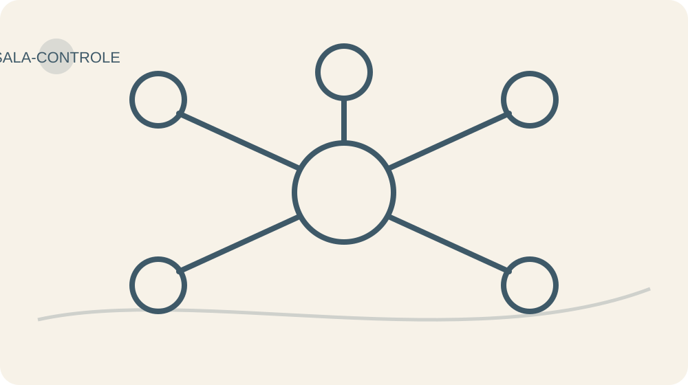

A Sala é nossa metáfora pedagógica de metacognição e escolha. CORPO: o que percebo, se quiser observar? FATO: o que aconteceu? NARRATIVA: o que acrescentei? ORIGEM: essa regra é conhecida, possível ou desconhecida? EMOÇÃO: o que sinto? IMPULSO: o que quero fazer agora?

VALOR: que princípio quero sustentar? ESCOLHA: qual resposta depende de mim? FUTURO: que consequência pode aparecer agora e depois? FRUTO: o que aconteceu após a ação? Os painéis não são dez tarefas diárias. No modo rápido, use Fato, Escolha e Fruto. No profundo, consulte os demais quando realmente ajudarem.

## Uma hipótese que pode cair

Exemplo: em três ocasiões uma pessoa adiou uma tarefa quando recebeu instruções vagas. Ela imagina que a falta de clareza participa do adiamento. Em outra ocasião, começou logo porque recebeu um exemplo pronto. Resolve pedir um exemplo antes de iniciar uma tarefa semelhante.

Se começar com mais facilidade, a hipótese ganha algum apoio naquele contexto. Se continuar adiando, investigará outros fatores. Não conclui que “a causa era apenas essa”. Uma ferramenta útil mantém a porta aberta para correção; uma sentença sobre personalidade costuma fechar a porta e guardar a chave.

Depois de preencher, feche a Sala. Você não precisa observar cada pensamento enquanto vive a situação. Uma ferramenta metacognitiva se torna pesada quando exige fiscalização contínua. Use os painéis para uma escolha relevante e deixe que a experiência aconteça. O Fruto será observado depois, incluindo os acontecimentos que não combinarem com sua expectativa. É justamente essa abertura que torna o registro útil para a próxima revisão.

## Seu Caderno Vivo

Comece pelas cenas que já existem no Caderno. Na Sala rápida, use Fato, Escolha e o registro de Fruto ao final do Dia. Se precisar investigar mais, abra os demais painéis. O corpo é opcional; nenhum painel exige revelar uma intimidade para produzir uma escolha.

**Quais cenas comparo: fato, resposta e consequência?**

**Que hipótese limitada surgiu? Qual diferença ou exceção existe?**

**Se desejar: o que percebo fisicamente?**

**O que aconteceu?**

**O que minha mente acrescentou?**

**O que sei sobre a origem da regra?**

**O que sinto e o que isso informa?**

**O que quero fazer imediatamente?**

**Que princípio quero sustentar?**

**Qual resposta depende de mim?**

**Que consequência pode aparecer a curto, médio e longo prazo?**

## Uma experiência fora destas páginas

Escolha uma situação futura semelhante e altere uma única resposta: pedir esclarecimento, consultar o horário ou preparar um recurso. Use a Sala no modo que couber. O teste não precisa acontecer imediatamente; se não houver oportunidade, registre a ocasião prevista e o primeiro passo possível.

## O Fruto de hoje

Compare a resposta testada com a hipótese, sem forçar concordância. O que aconteceu depois? Que condição foi diferente? Se não houve tentativa, o obstáculo e uma próxima escolha segura são suficientes para encerrar o registro. Conclusão provisória é mais honesta do que certeza fabricada.

**O que aconteceu? Se não realizou: qual foi o obstáculo e qual será a próxima escolha segura?**

## Se acontecer, eu tenho uma resposta

Se eu reconhecer a condição presente nas cenas anteriores, então testarei a resposta escolhida uma vez. Se o contexto for diferente ou inseguro, então adaptarei a ação em vez de obedecer ao plano mecanicamente.

**Meu gatilho observável e minha resposta possível**

### Fechamento editorial do Dia
**Contraexemplo:** Assumir que padrões são traços fixos; interpretar três cenas isoladas como prova definitiva de caráter ou destino.
**Critério de progresso:** Consegue articular uma hipótese específica e revisável sobre um padrão, citando evidências das três cenas.
**Fecho do método:** Ao comparar cenas e testar hipóteses, você fortalece a soberania interna e observa a raiz que orienta escolhas no mirante do discernir.
**Observe o Fruto:** Registre a hipótese formulada, as evidências que a sustentam, exceções encontradas e qual obstáculo impediu observações mais claras.

## O que fica e o que pode esperar

Ação mínima: comparar duas cenas e apontar uma semelhança concreta. Não precisa encontrar uma raiz profunda.

Na revisão desta travessia, mantenha uma pergunta do Filtro que tenha sido útil. A Sala completa fica sob demanda. Guarde espaço para agir, descansar e conviver.

Amanhã começa Voltar a Si. Vamos examinar os papéis que você exerce sem transformar nenhum deles na medida inteira de quem você é.

# Travessia III — Voltar A Si

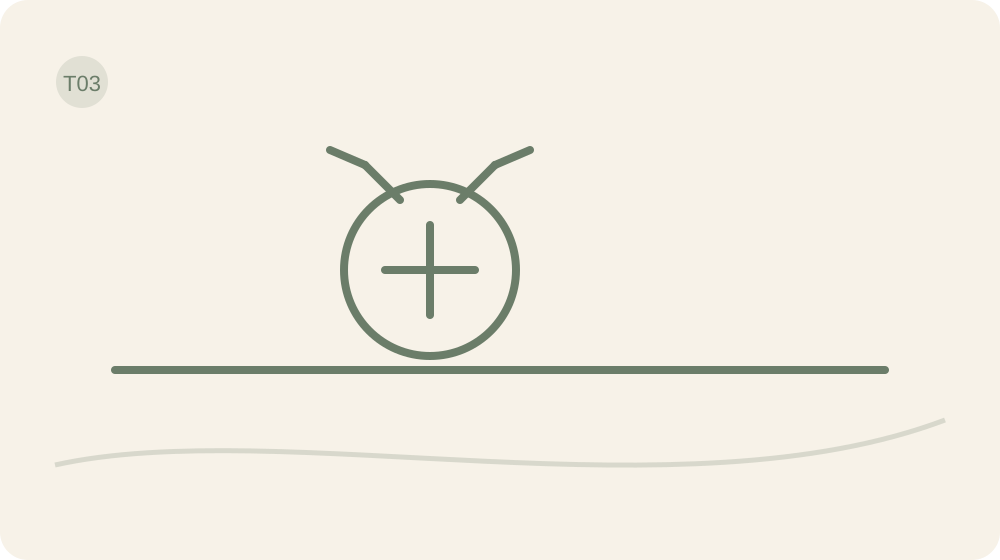

**△ Recuperar referência interna sem precisar congelar a identidade.**

> **Salvaguarda desta travessia:** Identidade é viva. Não use este bloco para se rotular, diagnosticar ou decidir que um papel explica você inteira.

# Dia 11 — Você não cabe no personagem

> **Mapa Posicione-se™ — Dia 11:** Autoria · **Soberania Interna** · Árvore: **Raiz** · Ciclo: **Perceber**.

> **Escolha sua rota de hoje**
> **Mínima:** objetivo + 1 pergunta + ação mínima + Fruto/obstáculo.  
> **Completa:** leitura + Caderno + experiência segura + revisão.  
> **Aprofundada:** ferramenta opcional ou apoio, somente se acrescentar clareza.

**Objetivo do Dia:** Distinguir papel, preferência e personagem para recuperar escolha.

**Ferramenta principal:** Antifuga Identitária.  
**Apoio opcional:** Fato × História × Incógnita.

## Quem aparece quando o papel descansa?

Você pode cuidar, trabalhar, organizar, acolher e resolver. Cada papel mostra uma parte da sua vida. O problema começa quando uma função vira condição de existência: se não sou útil agora, parece que não tenho lugar. Hoje vamos olhar para essa passagem com cuidado.

Na travessia anterior, você investigou conclusões. Agora vai investigar as exigências que coloca sobre si para continuar pertencendo. Não precisamos descobrir uma essência intocável escondida debaixo de todas as camadas. Precisamos reconhecer onde existe escolha e onde você está representando uma disponibilidade que não consegue sustentar.

## Papel, preferência e personagem

Um papel pode ser legítimo e importante: mãe, profissional, amiga, cuidadora. Ele inclui responsabilidades reais e acordos. Uma preferência é algo que você gosta, valoriza ou deseja, podendo mudar. Chamaremos de personagem, aqui, uma atuação que você mantém principalmente para atender expectativas, escondendo necessidades e limites relevantes. É linguagem pedagógica, não diagnóstico.

A mesma ação pode cumprir funções diferentes. Ajudar alguém pode expressar generosidade, obrigação acordada, medo de desapontar ou várias coisas juntas. Não conclua a função apenas olhando o comportamento. Pergunte o que estava em jogo, que alternativas existiam e qual custo você percebeu.

## A pessoa que concorda com tudo

Exemplo: numa escolha de programa entre amigos, uma pessoa sempre responde “qualquer coisa”. Às vezes realmente não tem preferência. Outras vezes quer um lugar tranquilo, mas teme ser considerada difícil. Depois chega exausta e ressentida, enquanto o grupo sequer conhece sua preferência.

Ela testa uma frase pequena: “Hoje prefiro um lugar mais tranquilo; vocês topam?”. O grupo pode concordar ou não. Expressar uma preferência não garante recebê-la, mas muda a qualidade da participação. Agora existe informação para negociar. Ela não precisa transformar um jantar em declaração de independência nacional.

## Antifuga em tamanho cotidiano

A contribuição de Fuga Identitária entra aqui como pergunta de autoria, não como resumo de outro livro. O que estou fazendo por escolha? O que assumi por acordo? O que desempenho para evitar um julgamento imaginado? O que ainda não posso mudar com segurança?

Você pode reconhecer uma necessidade sem resolvê-la imediatamente. Dependências e riscos exigem planejamento, recursos e apoio. Autoria não é romper todos os vínculos nem dizer tudo sem considerar consequências. Também inclui decidir quando, como e com quem uma preferência pode aparecer. Flexibilidade não é desaparecer; é encontrar uma forma possível de continuar presente.

Não é preciso escolher entre ser inteiramente espontânea e representar uma função. Há convenções úteis em ambientes diferentes. O ponto é reconhecer o custo da atuação e preservar espaço para necessidades legítimas, sem exigir que todos os seus lados apareçam em qualquer ocasião.

## Ciência sem jaleco

Uma revisão integrativa publicada em 2026 descreve clareza do autoconceito como o grau em que as crenças sobre si estão relativamente claras, coerentes e estáveis. A literatura associa esse construto a vários aspectos de ajuste, mas grande parte das evidências é de autorrelato e a direção causal ainda é limitada. Aqui, isso serve como vizinhança científica para investigar autoria; não transforma “fuga identitária” em diagnóstico nem prova que identidade deva ficar rígida.

Pesquisas encontram relações entre hábitos e a maneira como as pessoas se percebem, mas associação não estabelece uma identidade fixa nem prova uma causa única. Aqui, examinamos episódios e escolhas; um dia ou um papel não resume quem você é.

## Seu Caderno Vivo

Separe o papel que você exerce das exigências que acrescentou a ele. Indique uma necessidade atual e uma maneira segura de reconhecê-la. Não é obrigatório conversar com alguém hoje; em situações de dependência ou risco, planejar apoio pode ser a escolha adequada.

**Qual papel ocupo e quais responsabilidades reais ele inclui?**

**Qual preferência ou necessidade fica escondida?**

**Como posso expressar uma parte disso com segurança?**

## Uma experiência fora destas páginas

Escolha uma preferência pequena numa situação de baixo risco e dê a ela uma frase concreta. Pode ser horário, local, forma de executar uma tarefa ou necessidade de esclarecimento. Se não houver segurança para expressá-la, registre-a para si e identifique que apoio tornaria uma decisão possível. Não confronte por obrigação.

## O Fruto de hoje

Registre o que conseguiu expressar, a resposta observada e como lidou com ela. Não adivinhe intenções. Se a preferência não foi atendida, veja se houve negociação respeitosa. O resultado não define seu valor nem torna errado ter uma necessidade.

**O que aconteceu? Se não realizou: qual foi o obstáculo e qual será a próxima escolha segura?**

## Se acontecer, eu tenho uma resposta

Se eu responder “tanto faz” quando houver uma preferência clara, então considerarei dizê-la em uma frase, desde que a situação seja segura. Se realmente tanto fizer, então posso manter essa resposta sem transformar espontaneidade em suspeita.

**Meu gatilho observável e minha resposta possível**

### Fechamento editorial do Dia
**Contraexemplo:** Achar que ser fiel a um rótulo (ex.: “sempre ansioso”) é inevitável e que não há espaço para escolher comportamentos diferentes.
**Critério de progresso:** Perceber momentos em que você opta pelo papel automático e relatar alternativa escolhida em vez de reagir por hábito.
**Fecho do método:** Reconhecer personagem, preferência e papel recupera a escolha e fortalece a raiz da soberania interna.
**Observe o Fruto:** Registrar ocasiões em que separou papel de preferência e qual ação diferente escolheu; note contexto e pequena evidência de impacto.

## O que fica e o que pode esperar

Ação mínima: escrever uma preferência que existe hoje. Não precisa justificar por que merece tê-la.

Use Fato × História para distinguir uma reação observada do medo de rejeição. O P.A.R.A. pode ajudar antes de concordar automaticamente, sem criar mais um formulário.

Amanhã vamos transformar um valor em comportamento. Ter uma preferência mostra presença; sustentar um princípio exige escolher como agir quando há custo.

# Dia 12 — Valor aparece quando custa

> **Mapa Posicione-se™ — Dia 12:** Autoria · **Limite Sagrado** · Árvore: **Tronco** · Ciclo: **Escolher**.

> **Escolha sua rota de hoje**
> **Mínima:** objetivo + 1 pergunta + ação mínima + Fruto/obstáculo.  
> **Completa:** leitura + Caderno + experiência segura + revisão.  
> **Aprofundada:** ferramenta opcional ou apoio, somente se acrescentar clareza.

**Objetivo do Dia:** Traduzir um valor declarado em um comportamento observável e proporcional.

**Ferramenta principal:** Valor em Ação.  
**Apoio opcional:** SE → ENTÃO.

## Valor no discurso é fácil de decorar

Respeito, cuidado, honestidade, liberdade. As palavras cabem bonitas numa parede. O trabalho começa quando duas delas parecem puxar você em direções diferentes. Cuidar de alguém pode exigir presença; cuidar de si pode exigir descanso. Que decisão respeita as condições reais sem abandonar nenhum lado por princípio?

Ontem você deu lugar a uma preferência. Hoje escolherá um valor e uma forma concreta de praticá-lo. Valor não é uma emoção que precisa aparecer antes da ação. É uma direção que você deseja sustentar, com responsabilidade e disposição para revisar a maneira de expressá-la.

## Da palavra ao verbo

Escolha um valor que importe para uma situação atual. Pergunte: se alguém observasse minha ação, o que veria? “Cuidado” pode virar preparar um recurso necessário, pedir ajuda, comparecer a um compromisso possível ou respeitar uma orientação profissional. “Honestidade” pode virar informar que um prazo não cabe, em vez de prometer e desaparecer.

Não existe uma ação universal que demonstre cada valor. O contexto participa. Dizer tudo o que pensa pode ferir sem necessidade; omitir informação relevante pode impedir um acordo. Investigue direitos, deveres, recursos e consequências. O Método Posicione-se pede coerência com empatia, não uma autorização para usar sinceridade como martelo.

## O custo que precisa ser nomeado

Exemplo: uma pessoa valoriza colaboração e aceita revisar um trabalho. Ao consultar a agenda, percebe que só consegue oferecer quinze minutos. Pode prometer uma revisão completa e falhar ou informar a ajuda que consegue dar. A segunda resposta talvez produza frustração, mas permite um acordo mais claro.

Ela não escolheu entre ser boa e ser egoísta. Escolheu como participar dentro de um limite. Quem pediu poderá buscar outra ajuda. A responsabilidade dela é informar com clareza e cumprir o que combinou, não garantir que ninguém fique contrariado.

## Desconforto não é prova de virtude

Algumas escolhas coerentes são desconfortáveis. Outras são simples e até prazerosas. Não use sofrimento como certificado de valor. Um custo só faz sentido quando conversa com a finalidade e com suas condições. Há custos que você não deve aceitar, sobretudo quando ameaçam segurança ou direitos.

Pergunte também: este valor foi escolhido ou estou tentando merecer aprovação? A origem não decide tudo, como vimos no Dia 9. Você pode manter um valor aprendido e mudar a forma de praticá-lo. Generosidade pode continuar presente sem disponibilidade ilimitada. Responsabilidade pode continuar presente sem culpa por tudo que acontece.

A honestidade emocional pede reconhecer o que sente, diz e escolhe, inclusive quando essas partes não combinam. Você pode dizer que uma situação está boa e perceber ressentimento. Isso não prova mentira deliberada; pode indicar dificuldade de reconhecer ou expressar uma necessidade. O passo útil é nomear o desencontro e investigar uma resposta segura, sem obrigar exposição.

## Ciência sem jaleco

Abordagens psicológicas trabalham a possibilidade de agir conforme valores mesmo com pensamentos e emoções difíceis. A evidência de tratamentos completos não valida este exercício isolado. Aqui, a proposta é educativa: escolher uma ação possível, observar e revisar sem prometer efeito clínico.

## Seu Caderno Vivo

Escolha um valor por vez e traduza-o num verbo observável. Inclua o limite antes da ação: assim você pode perceber quando a tentativa de coerência começa a pedir um custo inviável. Uma ação menor pode expressar o mesmo valor de forma mais sustentável.

**Qual valor quero sustentar nesta situação e por quê?**

**Que ação observável expressa esse valor agora?**

**Qual custo é aceitável e qual limite preciso preservar?**

## Uma experiência fora destas páginas

Pratique uma ação pequena ligada ao valor escolhido. Dê a ela começo e fim: informar uma limitação, cumprir uma parte combinada ou pedir um recurso. Antes de agir, confira se a ação respeita o território de outra pessoa. Depois observe o resultado sem exigir uma reação de aprovação.

## O Fruto de hoje

O Fruto é o que você fez e o que aconteceu, não o elogio recebido. Se a ação pareceu coerente, descreva por quê. Se percebeu que o valor virou cobrança excessiva, ajuste a forma de praticá-lo. Identificar um custo inviável é motivo legítimo para revisão.

**O que aconteceu? Se não realizou: qual foi o obstáculo e qual será a próxima escolha segura?**

## Se acontecer, eu tenho uma resposta

Se eu perceber que estou prometendo além dos meus recursos para demonstrar cuidado, então direi qual ajuda consigo oferecer. Se a necessidade exigir mais do que posso fazer, então considerarei apoio adicional em vez de assumir sozinha.

**Meu gatilho observável e minha resposta possível**

### Fechamento editorial do Dia
**Contraexemplo:** Dizer que valoriza equilíbrio, mas ceder sempre que surge desconforto para evitar conflito, confundindo boa intenção com ausência de limites.
**Critério de progresso:** Passar de declarar valores para agir em situações concretas, mantendo comportamento proporcional ao custo emocional ou prático.
**Fecho do método:** Escolher com autoresponsabilidade fortalece o tronco do limite sagrado: valor vira ação sustentável.
**Observe o Fruto:** Anotar ocasiões em que aplicou o valor, o custo enfrentado e a consequência imediata no contexto e nas relações.

## O que fica e o que pode esperar

Ação mínima: completar “hoje, respeito aparece quando eu…”. Escolha um verbo e uma situação, não uma qualidade abstrata.

Mantenha o registro de um episódio e use a Sala de Controle quando houver conflito de valores. A prática de ontem pode continuar apenas quando surgir oportunidade segura.

Amanhã esse cuidado chegará à relação com o corpo. O MMI será ampliado para perguntar como você quer viver nele, além de como deseja parecer.

# Dia 13 — Como quero viver neste corpo?

> **Mapa Posicione-se™ — Dia 13:** Autoria · **Limite Sagrado** · Árvore: **Tronco** · Ciclo: **Escolher**.

<!-- V05 -->
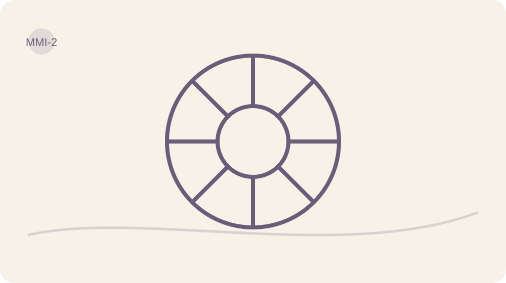

> **Escolha sua rota de hoje**
> **Mínima:** objetivo + 1 pergunta + ação mínima + Fruto/obstáculo.  
> **Completa:** leitura + Caderno + experiência segura + revisão.  
> **Aprofundada:** ferramenta opcional ou apoio, somente se acrescentar clareza.

> **Cuidado:** corpo, alimentação e movimento não são provas de valor. Adapte, pule ou procure orientação quando necessário.

**Objetivo do Dia:** Ampliar o MMI para corpo vivido, função, conforto e cuidado, com aparência opcional.

**Ferramenta principal:** MMI 2.0.  
**Apoio opcional:** Banco de Evidências.

## Seu corpo não é uma imagem esperando aprovação

O Manequim Mental Ideal faz parte da história do MINDSETmagro. Hoje ele ganha uma pergunta maior: como quero viver dentro deste corpo? Aparência pode importar para você. Não é preciso fingir que não importa. Mas ela não precisa ocupar todos os cômodos da casa.

Conforto, descanso, mobilidade possível, prazer, energia percebida, roupa e cuidado também entram na conversa. Nenhum deles vira obrigação de desempenho. Seu corpo merece cuidado inclusive quando dói, limita, depende de apoio ou não corresponde à imagem que você gostaria de ver.

## Mãe-Véia, minha musa paradoxal

O MINDSETmagro nasceu da minha leitura de Mãe-Véia. Lembro do alfinete que ajustava o vestido e da frase: “Estou nessa magreza”. O gesto de marcar a cintura era, para mim, como uma assinatura no próprio corpo. Essa origem é maior que uma conversa com a balança.

Eu a chamo, simbolicamente, de “égua indomável”. Não era uma santa da leveza: era fina, intensa, excessiva e contraditória. A mesma mulher podia acolher e controlar, amar e disputar espaço. Minha inspiração está nesse paradoxo, não numa proposta de copiar sua cintura ou transformar suas dificuldades em virtude.

Na história que registrei sobre três gerações, também aparece minha mãe e uma relação diferente com o espelho e a balança. Eu a descrevi sob uma autoexigência que parecia nunca permitir satisfação. A justaposição me ensinou a fazer perguntas, não a escolher uma vencedora: minha avó podia afirmar a própria finura e ainda carregar excessos; minha mãe podia desejar mudar o corpo e precisar de mais cuidado, não de mais cobrança. Eu estava entre essas referências, tentando compreender como me olhar. Nenhuma delas cabe numa explicação única, e não preciso repetir todos os seus modos de existir para reconhecer minha história.

Preservo a lembrança como leitura autoral. O gesto não demonstra preservação integral de identidade, domínio sobre doença ou poder da autoimagem para superar diagnóstico. A pergunta que ele deixa aqui é outra: como você ocupa seu corpo e que cuidado deseja sustentar, sem precisar desaparecer para caber num ideal?

## O MMI deixa de ser uma cobrança única

Construa o MMI em três partes. Primeiro, uma experiência desejada: vestir algo com conforto, participar de uma atividade possível, descansar melhor ou ter uma rotina de cuidado. Segundo, condições e apoios: tempo, acessibilidade, orientação, recursos e limites. Terceiro, uma ação de manutenção compatível com sua vida.

Se quiser incluir aparência, peso, manequim ou medidas, mantenha esses itens opcionais e separados do valor pessoal. Não estabelecemos meta universal de quilos nem prazo corporal. Se números, fotos ou comparação aumentarem sofrimento ou vigilância, retire-os. Você pode construir um MMI completo sem balança e sem fita métrica.

## Função não vira outra competição

Ampliar o olhar para função não significa exigir força, mobilidade ou produtividade de todos os corpos. Para alguém, cuidado pode ser encontrar uma posição confortável, organizar apoio ou acessar tratamento. Para outra pessoa, pode ser retomar uma atividade com orientação adequada. Não há ranking de corpos merecedores.

Escolha uma cena concreta, não um corpo abstrato sem rotina. Como seria uma manhã com o cuidado desejado? Que recurso precisaria existir? Qual parte depende de você e qual requer ajuda? O objetivo é transformar uma imagem em uma escolha possível, não prometer que visualizar muda o corpo por si só.

O MMI pode mudar quando sua vida muda. Rever uma imagem desejada não apaga a intenção anterior; mostra que você continua considerando condições atuais. Uma meta que deixou de servir não precisa ser mantida apenas porque já foi escrita.

## Ciência sem jaleco

Um ensaio com mulheres jovens estudou escrita sobre funcionalidade corporal e encontrou apoio a uma relação mais ampla com a imagem corporal. A amostra tem limites e não valida o MMI. Peso também depende de múltiplos fatores: não mede caráter nem dedicação.

## Seu Caderno Vivo

Todos os registros corporais são opcionais. Preencha apenas o que amplia cuidado. Você pode descrever experiências sem usar números, medidas ou fotos. Os campos não são uma avaliação clínica; necessidades de tratamento ou metas corporais individualizadas devem ser discutidas com profissionais adequados.

**Se desejar: como quero viver neste corpo, além da aparência?**

**Opcional: que desejo de aparência ou roupa quero registrar, sem cobrança de prazo?**

**Que condições, limites e apoios preciso considerar?**

**Que ação de cuidado possível sustentaria essa experiência?**

**Que conforto corporal desejo apoiar?**

**Que experiência de força é relevante, se alguma?**

**Como percebo minha energia e que cuidado desejo?**

**Que experiência de descanso ou sono desejo cuidar?**

**Que mobilidade ou adaptação seria importante?**

**Opcional: que aspecto de vitalidade ou sexualidade desejo cuidar?**

**Que relação com roupa e postura quero desenvolver?**

**Opcional: desejo registrar peso, sem meta ou prazo imposto?**

**Opcional: desejo registrar medidas ou manequim?**

**Que comportamento de manutenção cabe nas condições atuais?**

## Uma experiência fora destas páginas

Se optar pela trilha corporal, escolha uma ação pequena de cuidado coerente com seu MMI, respeitando orientações que já recebeu. Pode organizar um recurso ou pedir apoio. Se preferir não trabalhar corpo agora, faça a mesma pergunta sobre conforto na rotina: que condição pode tornar uma tarefa mais habitável? Essa alternativa completa a missão.

## O Fruto de hoje

Registre a ação ou o obstáculo encontrado. O Fruto de hoje não é uma alteração de peso, aparência ou disposição obrigatória. É perceber se o cuidado escolhido coube, que apoio faltou e o que precisa de ajuste. Você pode registrar que decidiu não seguir a trilha corporal.

**O que aconteceu? Se não realizou: qual foi o obstáculo e qual será a próxima escolha segura?**

## Se acontecer, eu tenho uma resposta

Se meu MMI virar uma lista de defeitos, então voltarei à pergunta sobre cuidado e retirarei o item que está alimentando comparação. Se houver uma necessidade clínica, então buscarei orientação adequada em vez de usar o protocolo como prescrição.

**Meu gatilho observável e minha resposta possível**

### Fechamento editorial do Dia
**Contraexemplo:** Achar que cuidar do corpo exige punição, controle rígido ou foco apenas na aparência, em vez de buscar conforto, função e cuidado com responsabilidade sem culpa.
**Critério de progresso:** Consegue descrever preferências corporais práticas — conforto, mobilidade e cuidado — e escolher ações simples que respeitem limites pessoais.
**Fecho do método:** Escolher a vida que queremos neste corpo fortalece o tronco do limite sagrado e sustenta decisões com autoria.
**Observe o Fruto:** Registre uma situação concreta em que priorizou conforto ou função, o que fez diferente e qual efeito prático percebeu, mesmo pequeno.

## O que fica e o que pode esperar

Ação mínima: escolher uma condição de conforto que mereça atenção. Você pode apenas nomeá-la, sem expor detalhes íntimos.

O MMI é consultado quando orientar uma escolha e nas revisões futuras. Não precisa ser medido ou visualizado diariamente. O valor escolhido ontem pode ajudar a definir cuidado.

Amanhã vamos registrar evidências de ações reais. Uma identidade praticada precisa caber na vida que existe, inclusive nos dias limitados.

# Dia 14 — Identidade precisa de testemunhas reais

> **Mapa Posicione-se™ — Dia 14:** Autoria · **Soberania Interna** · Árvore: **Raiz** · Ciclo: **Observar**.

> **Escolha sua rota de hoje**
> **Mínima:** objetivo + 1 pergunta + ação mínima + Fruto/obstáculo.  
> **Completa:** leitura + Caderno + experiência segura + revisão.  
> **Aprofundada:** ferramenta opcional ou apoio, somente se acrescentar clareza.

**Objetivo do Dia:** Construir identidade a partir de ações situadas, não de rótulos absolutos.

**Ferramenta principal:** Banco de Evidências da Identidade.  
**Apoio opcional:** MMI 2.0.

## Quem você diz ser precisa poder mudar

“Eu sou assim” pode funcionar como uma explicação rápida ou como uma porta trancada. Se todo episódio difícil confirma o rótulo e toda exceção é descartada como sorte, a investigação já chega com o resultado pronto. Hoje vamos devolver espaço aos acontecimentos.

Ontem você escolheu uma forma possível de cuidado. Agora vai procurar uma evidência concreta de uma ação que deseja desenvolver. Não precisa fabricar uma nova identidade e defendê-la a qualquer custo. Basta reconhecer: em determinada situação, com certas condições, consegui praticar algo que importa.

## Banco de Evidências da Identidade

O nome é autoral, e a proposta é simples: guardar pequenos registros de comportamento, contexto e apoio. “Sou disciplinada” é amplo. “Preparei o material antes da tarefa e comecei no horário combinado” mostra uma ação. “Consegui porque alguém dividiu uma responsabilidade comigo” preserva o papel do apoio.

Registre também limites. Uma ação realizada não prova que você repetirá sempre; uma ação não realizada não apaga todas as anteriores. O Banco não serve para somar pontos de merecimento. Serve para localizar condições sob as quais uma escolha se tornou possível e poderá ser ensaiada novamente.

## O registro que o rótulo deixava de fora

Exemplo: uma pessoa se define como alguém que abandona tudo. Ao consultar o Caderno, encontra um pedido de esclarecimento que fez, um compromisso renegociado e uma pequena alteração no ambiente. Nenhum deles resolveu a vida, mas todos contradizem a ideia de completa passividade.

Ela formula uma descrição provisória: “Consigo agir melhor quando reduzo a tarefa e explicito o prazo”. Essa frase ainda precisará responder a novas experiências. Não vira um slogan para negar dificuldades. Vira uma hipótese prática sobre o que ajuda a começar e continuar.

## Respeito ao erro não é licença para repetir

Quando uma escolha não funciona, descreva o episódio sem insulto. O que você fez? Que consequência apareceu? Há algo a reparar? Que condição precisa mudar? Responder com respeito não apaga responsabilidade. Ajuda a manter o foco na ação que ainda pode ser feita.

“Eu falhei neste combinado” é diferente de “sou uma falha”. A primeira frase pode levar a um pedido de desculpas e um novo acordo. A segunda costuma encerrar a conversa sobre o comportamento numa condenação pessoal. Não precisamos escolher entre fingir que nada aconteceu e humilhar quem precisa corrigir a rota.

Uma testemunha real não precisa ser uma plateia. O próprio registro de um acontecimento verificável basta. Compartilhar é opcional; nenhuma postagem, foto ou aprovação externa será exigida como confirmação da sua participação.

Observe também a distância entre o compromisso declarado e a ação. Honestidade não exige inventar uma boa intenção para toda escolha, mas também não autoriza presumir má-fé. Descreva o desencontro, reconheça sua parte e considere as condições que impediram ou favoreceram o comportamento. O Banco deve ajudar a corrigir a rota, não a defender uma imagem impecável.

## Ciência sem jaleco

Há relações observadas entre identidade e hábitos, mas isso não prova que declarar uma identidade produza automaticamente um comportamento. O Banco trabalha ações e condições, mantendo descrições revisáveis. Uma dificuldade de hoje não deve ser transformada em definição permanente de quem você é.

## Seu Caderno Vivo

Use episódios reais que já apareceram no Caderno. Registre apoio e contexto junto com a ação, para não atribuir tudo a uma qualidade pessoal. Sua descrição deve continuar revisável. Se houver reparo necessário, nomeie a parte concreta em vez de compensar com autoacusação.

**Qual ação concreta mostra uma capacidade que desejo desenvolver?**

**Que apoio, recurso ou condição tornou essa ação possível?**

**Como descrevo essa capacidade de modo provisório, sem sempre ou nunca?**

**Há um ajuste ou reparo que preciso fazer?**

## Uma experiência fora destas páginas

Encontre no Caderno uma evidência real e use uma das condições que ajudaram para uma nova ação pequena. Se não encontrar uma ação concluída, procure um pedido de apoio, uma percepção ou uma tentativa interrompida e descreva seu alcance com honestidade. Não aumente o episódio para que pareça uma vitória.

## O Fruto de hoje

Escreva o que foi realizado e qual condição participou. Se não conseguiu repetir, registre a diferença de contexto. O Banco precisa guardar a realidade, não apenas cenas que sustentam uma narrativa positiva. A capacidade em desenvolvimento continua aberta à prática e à revisão.

**O que aconteceu? Se não realizou: qual foi o obstáculo e qual será a próxima escolha segura?**

## Se acontecer, eu tenho uma resposta

Se um erro me levar a um rótulo definitivo, então descreverei a ação, a consequência e uma possibilidade de reparo. Se eu estiver usando uma frase positiva para ignorar um problema, então voltarei ao fato observado.

**Meu gatilho observável e minha resposta possível**

### Fechamento editorial do Dia
**Contraexemplo:** Acreditar que identidade se define por rótulos fixos (ex.: 'sou incapaz') em vez de por ações observáveis em contextos reais.
**Critério de progresso:** Registrar episódios recentes em que escolheu ou agiu alinhado à identidade desejada, com detalhes de contexto e resultado.
**Fecho do método:** Conecte ações observadas à sua autoridade interna: pequenas provas formam sua identidade enraizada.
**Observe o Fruto:** Lista breve de evidências contextuais (data, situação, ação, testemunha) mostrando padrões coletivos que sustentam sua identidade.

## O que fica e o que pode esperar

Ação mínima: registrar um verbo no passado com contexto: “pedi”, “observei”, “renegociei”, “comecei”. Uma palavra bonita sobre identidade não substitui esse registro.

Continue com uma anotação breve. O Banco usa os registros que já existem; não exige escrever uma segunda versão de cada Dia nem colecionar provas o tempo inteiro.

Amanhã vamos levar essa autoria para o pertencimento. Você pode receber apoio e participar de vínculos sem precisar entregar a eles a definição inteira de quem é.

# Dia 15 — Pertencer sem se abandonar

> **Mapa Posicione-se™ — Dia 15:** Autoria · **Acordo Consciente** · Árvore: **Galhos** · Ciclo: **Escolher**.

> **Escolha sua rota de hoje**
> **Mínima:** objetivo + 1 pergunta + ação mínima + Fruto/obstáculo.  
> **Completa:** leitura + Caderno + experiência segura + revisão.  
> **Aprofundada:** ferramenta opcional ou apoio, somente se acrescentar clareza.

**Objetivo do Dia:** Praticar pertencimento e pedido sem transformar validação externa em autorização para existir.

**Ferramenta principal:** Pedido + pertencimento.  
**Apoio opcional:** Filtro da Sensatez.

## Ter lugar não deveria exigir desaparecimento

Você não precisa fazer tudo sozinha para provar autoria. Apoio pode ampliar possibilidades. O problema não é precisar de gente; é acreditar que, para continuar perto, você deve concordar com tudo, esconder necessidades ou se tornar permanentemente útil.

Nesta travessia você reconheceu papéis, escolheu um valor, ampliou o MMI e registrou ações reais. Hoje vai olhar para a forma como participa dos vínculos. Pertencer e preservar autoria não são opostos obrigatórios. A pergunta é qual relação, acordo e dose de presença tornam essa combinação possível.

## Pedido não é contrato secreto

Escolha um apoio concreto. “Preciso que você me entenda” pode expressar uma necessidade importante, mas ainda deixa a ação indefinida. “Você consegue me ouvir por dez minutos, sem sugerir soluções agora?” informa o tipo de ajuda. A outra pessoa pode aceitar, negociar ou não estar disponível.

Um pedido respeitoso admite resposta. Um acordo precisa ser entendido pelos envolvidos. Se você espera um comportamento que nunca foi combinado, talvez precise torná-lo explícito antes de concluir desinteresse. Isso não vale para apagar deveres claros ou justificar desrespeito; vale para retirar expectativas ocultas de situações que permitem conversa.

## Apoio que cabe aos dois

Exemplo: uma pessoa quer reservar um período para uma atividade importante e precisa dividir uma tarefa doméstica. Em vez de esperar que alguém adivinhe, propõe um horário e pergunta qual parte pode ser compartilhada. O outro informa uma limitação. Eles ajustam o plano.

Talvez não cheguem ao acordo desejado. Ainda assim, a conversa produz informação sobre recursos e disponibilidade. Se a resposta vier com ameaça ou coerção, o problema deixa de ser apenas formulação do pedido. Segurança e apoio adequado passam à frente do exercício. Nenhuma frase perfeita garante um vínculo respeitoso.

## Gratidão com os olhos abertos

Se fizer sentido, reconheça uma ajuda recebida dizendo o que a pessoa fez e como isso participou do seu dia. Gratidão aqui é um gesto opcional de reconhecimento, não obrigação de encontrar beleza em sofrimento. Você pode agradecer um apoio e continuar discordando de outra atitude.

Também pode reconhecer a ausência de apoio sem se chamar de ingrata. Não use gratidão para cancelar dor, dispensar reparação ou manter acesso que prejudica você. O vínculo precisa comportar fatos inteiros. Uma ajuda não compra silêncio; um conflito não apaga automaticamente toda a história da relação.

## Fechar a travessia sem fechar a identidade

Volte a uma cena do Dia 11. Houve algum espaço maior para uma preferência ou necessidade? Qual valor ficou mais concreto? Seu MMI ampliou cuidado ou aumentou cobrança? Qual registro do Banco mostrou uma condição útil?

Escolha somente um aprendizado para levar adiante. Se nada parece ter mudado, procure uma pergunta que ficou mais precisa ou um recurso que percebeu faltar. Não invente progresso para acompanhar o calendário. O ritmo do produto organiza a experiência; não determina quando sua vida deve apresentar um resultado.

## Seu Caderno Vivo

Formule a ajuda em termos de uma ação possível e considere se a pessoa tem condições de oferecê-la. O reconhecimento é opcional e específico. Na revisão, escolha um aprendizado para continuar; você não precisa demonstrar mudança em todas as áreas ao mesmo tempo.

**De que ajuda concreta preciso e com quem seria seguro conversar?**

**Como formularei um pedido que admita negociação?**

**Opcional: qual ajuda real quero reconhecer?**

**O que levo desta travessia e o que precisa diminuir?**

## Uma experiência fora destas páginas

Faça um pedido específico a alguém apropriado ou prepare um contato com uma fonte segura de apoio. Se não houver pessoa disponível, identifique um recurso possível e o próximo passo para acessá-lo. Reconhecer uma ajuda já recebida pode acompanhar a missão, mas não substitui nomear sua necessidade.

## O Fruto de hoje

Registre o pedido, a resposta recebida ou o obstáculo ao contato. Diferencie resposta observada e interpretação. O Fruto pode ser um acordo, uma recusa clara ou a percepção de que será necessário buscar outro recurso. Recusa não é automaticamente prova de desvalor.

**O que aconteceu? Se não realizou: qual foi o obstáculo e qual será a próxima escolha segura?**

## Se acontecer, eu tenho uma resposta

Se eu esperar que alguém adivinhe uma necessidade negociável, então formularei um pedido concreto. Se houver risco na conversa, então priorizarei proteção e buscarei apoio apropriado, sem usar o exercício como teste de coragem.

**Meu gatilho observável e minha resposta possível**

### Fechamento editorial do Dia
**Contraexemplo:** Achar que pedir validação alheia autoriza existir; confundir pertencimento com anular limites próprios.
**Critério de progresso:** Saber pedir apoio claro e aceitar resposta sem mudar sua autoestima; manter limites após resposta externa.
**Fecho do método:** Escolher pertencer sem se anular fortalece o acordo consciente entre suas necessidades e o mundo.
**Observe o Fruto:** Anote ocasiões em que pediu algo, a resposta recebida e como sustentou seu limite; observe padrões sem culpa.

## O que fica e o que pode esperar

Ação mínima: completar “preciso de ajuda com…” e nomear uma ação. Você não precisa enviar uma mensagem nem expor intimidade para preencher este Dia.

O reconhecimento é opcional. Mantenha como prática apenas o registro breve e os recursos que ajudaram. Pedidos e revisões do MMI entram quando houver necessidade, não por obrigação diária.

Amanhã começa Reposicionar. A Árvore vai ajudar a distribuir responsabilidades: sua parte importa, mas ela não é tudo que existe.

# Travessia IV — Reposicionar

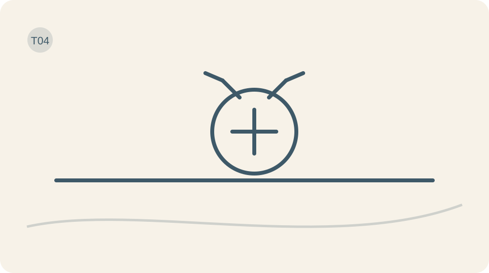

**□ Transformar clareza em responsabilidade, limite e ação possível.**

> **Salvaguarda desta travessia:** Limite não é confronto obrigatório. Em contexto de ameaça, coerção ou dependência de risco, proteção e apoio vêm antes da conversa direta.

# Dia 16 — Sua parte não é tudo

> **Mapa Posicione-se™ — Dia 16:** Estrutura · **Limite Sagrado** · Árvore: **Tronco** · Ciclo: **Nomear**.

<!-- V07 -->
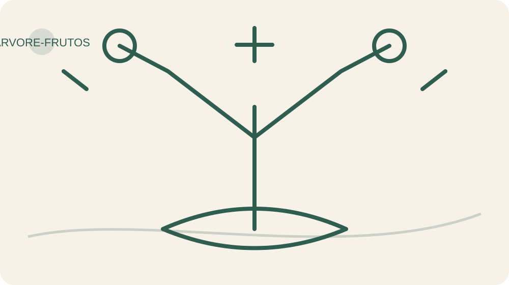

> **Escolha sua rota de hoje**
> **Mínima:** objetivo + 1 pergunta + ação mínima + Fruto/obstáculo.  
> **Completa:** leitura + Caderno + experiência segura + revisão.  
> **Aprofundada:** ferramenta opcional ou apoio, somente se acrescentar clareza.

**Objetivo do Dia:** Distribuir responsabilidade entre própria parte, parte alheia, contexto e desconhecido.

**Ferramenta principal:** Árvore + responsabilidade distribuída.  
**Apoio opcional:** Filtro da Sensatez.

## A conta que não cabe inteira em você

Você pode ter participado de um problema sem ter fabricado todas as peças dele. E pode estar sofrendo as consequências de algo que não escolheu. Parece evidente. Até a culpa chegar com uma calculadora defeituosa e colocar a conta inteira no seu nome.

Ontem olhamos o pertencimento. Hoje vamos olhar a parte que lhe cabe dentro das relações e das circunstâncias. O objetivo é sair de dois extremos: “não posso fazer nada” e “se tudo não melhorou, a falha é minha”. Nenhum deles descreve, sozinho, uma vida real.

## Distribua a responsabilidade

Pense comigo: uma conversa terminou mal. Você interrompeu; a outra pessoa gritou; ambos estavam atrasados; existia uma questão antiga que ninguém tinha esclarecido. Reconhecer sua interrupção é responsabilidade. Assumir o grito alheio, o trânsito e toda a história da família é outra coisa. Nem o melhor departamento administrativo daria conta.

Use a Árvore do Discernimento para localizar o episódio. O Fruto é o resultado observável: a conversa terminou sem acordo. O Galho é a área em que isso apareceu. A Posição descreve o que você fez, aceitou, adiou ou não conseguiu fazer. Começamos pelo que aconteceu, sem inventar uma Raiz para explicar tudo.

Agora distribua a investigação em quatro espaços: minha parte, parte de outra pessoa, contexto e desconhecido. Na sua parte podem estar uma frase, um compromisso esquecido ou a decisão de buscar apoio. Na parte alheia ficam ações que não dependem da sua vontade. No contexto entram recursos, horários, desigualdades, doença, regras e condições materiais. No desconhecido, aquilo que você ainda não sabe. Incógnita não é convite para escrever uma acusação criativa.

“Sua árvore, seus Frutos” chama você para responder pela própria atuação; não torna você causa de todo resultado. Um Fruto informa, mas não sentencia valor pessoal. Uma tentativa cuidadosa pode encontrar uma barreira real. Uma atitude imprudente pode dar certo por acaso. Precisamos examinar processo e consequência, sem converter sorte em competência ou dificuldade em defeito.

Imagine que você planejou uma tarefa e não conseguiu realizá-la porque faltou um recurso necessário. Há uma diferença entre organizar o acesso a esse recurso e prometer que, amanhã, terá mais força de vontade. A primeira resposta conversa com a barreira; a segunda conversa com um personagem.

Escolha uma situação pequena e recente. Não use este exercício para revisitar sozinha uma experiência que provoque intenso sofrimento. Em situações de violência ou ameaça, o primeiro passo pode ser proteção e apoio. Nenhuma metáfora de cultivo transfere a responsabilidade da violência para quem a sofreu.

## Ciência sem jaleco

O modelo COM-B ajuda a investigar comportamento olhando capacidade, oportunidade e motivação. É uma estrutura para perguntar melhor, não uma explicação universal da sua história. A Árvore e a divisão de responsabilidades são formulações autorais do método; não são instrumentos clínicos nem testes que descubram a intenção de terceiros.

## Quatro espaços no Caderno

Descreva um episódio em duas frases observáveis. Distribua os elementos nos quatro espaços sem precisar preencher todos. Circule apenas uma resposta possível na sua esfera. A resposta deve começar com um verbo: esclarecer, pedir, recusar, organizar, procurar apoio. “Fazer a pessoa entender” ainda depende da pessoa. “Explicar meu pedido em uma frase” já tem dono.

**Qual foi o Fruto observável?**

**O que é minha parte, parte alheia, contexto e desconhecido?**

**Qual resposta concreta cabe a mim?**

## Teste uma resposta com dono

Realize essa resposta em uma situação de baixo risco. Se a ação depender de recurso indisponível, faça a preparação possível ou registre a barreira. Não é necessário resolver a relação inteira: hoje você testa uma posição.

## O que a resposta produziu

O que você efetivamente fez? O que aconteceu depois? Separe sua ação da reação alheia e não complete a intenção do outro. Se não realizou, registre o obstáculo e a próxima ação segura. Essa distinção é o Fruto que interessa hoje.

**Minha ação e o que observei — ou obstáculo e próxima ação segura**

## Seu próximo movimento

Se eu começar a assumir a conta inteira, então voltarei aos quatro espaços antes de decidir. Ação mínima: escrever uma frase que comece com “minha parte agora é”.

**Meu SE → ENTÃO, se eu quiser adaptar o exemplo**

## Uma responsabilidade de cada vez

Releia sua escolha: ela exige que você aja ou que outra pessoa obedeça? Ajuste até que a resposta esteja ao seu alcance. Amanhã vamos dar linguagem a essa posição: um limite precisa de uma frase possível de sustentar.

# Dia 17 — Um limite precisa de uma frase

> **Mapa Posicione-se™ — Dia 17:** Estrutura · **Limite Sagrado** · Árvore: **Tronco** · Ciclo: **Escolher**.

> **Escolha sua rota de hoje**
> **Mínima:** objetivo + 1 pergunta + ação mínima + Fruto/obstáculo.  
> **Completa:** leitura + Caderno + experiência segura + revisão.  
> **Aprofundada:** ferramenta opcional ou apoio, somente se acrescentar clareza.

**Objetivo do Dia:** Transformar um limite em frase clara, segura e proporcional.

**Ferramenta principal:** Frase de limite.  
**Apoio opcional:** Role-play privado.

## O limite antes do discurso

“Ela deveria perceber.” Pode ser. Mas a sua vida não precisa ficar hospedada no setor de adivinhação. Há acordos que nunca foram ditos e cobranças que chegam como se todos tivessem assinado contrato.

Ontem você separou responsabilidades. Hoje vamos transformar sua parte em linguagem: o que está acontecendo, do que você precisa e o que pode fazer. Um limite não é um discurso perfeito. É uma posição compreensível que você consegue sustentar.

## Pedido, acordo e limite não são a mesma coisa

Pense comigo: “você não me respeita” fala de uma conclusão ampla. “Quando combinamos um horário e ele muda, preciso ser avisada” descreve uma situação e um pedido. Talvez o problema seja maior que o horário; mesmo assim, começar pelo observável dá à conversa um objeto. A pessoa pode concordar, discordar ou negociar. Você pode avaliar a resposta pelos Frutos.

Separe pedido, acordo e limite. Pedido: “Você consegue avisar quando houver atraso?”. Acordo: ambos definem como vão fazer isso. Limite: “Posso esperar até este horário; depois vou seguir meu compromisso”. O pedido depende de uma resposta. O acordo depende de consentimento. O limite organiza sua própria conduta. Misturar os três costuma produzir ameaça com legenda de autocuidado.

Um limite também precisa ser proporcional. “Se discordar de mim, nunca mais me verá” não vira sensato porque foi falado com voz calma. Considere direitos, deveres, dependências, poder e consequência. Não use o método para escapar de uma responsabilidade que assumiu nem para governar a agenda inteira de alguém. O território do outro continua existindo.

A frase pode seguir uma forma simples: “Quando acontece X, preciso de Y. Posso fazer Z. Podemos combinar W?”. Use somente o que couber. Não é uma fórmula capaz de produzir aceitação automática. Às vezes o resultado é descobrir que o acordo não existe. Essa informação também ajuda a escolher o próximo passo.

Imagine uma pessoa que recebe pedidos de trabalho fora do horário. Uma resposta possível é informar quando poderá atender e verificar quais urgências realmente fazem parte do acordo. Se existe risco de perder renda, a decisão pede estratégia, registro e orientação adequada, não uma cena heroica montada por um capítulo.

Também há relações em que falar diretamente aumenta o risco. Quando há ameaça, coerção ou violência, não transforme confronto em missão. Buscar uma pessoa de confiança, atendimento especializado ou um plano de segurança pode ser a ação mais responsável. Silêncio de proteção não é ausência de posicionamento.

Antes de ensaiar, pergunte: quero ser compreendida ou quero produzir uma reação específica? O primeiro objetivo orienta sua fala. O segundo promete um controle que você não tem. Você pode falar com firmeza, escutar uma proposta e rever detalhes sem abandonar o princípio.

## Ciência sem jaleco

Neste Dia não apresentamos um roteiro de limites como tratamento validado. Ele é uma aplicação autoral dos pilares Limite Sagrado e Acordo Consciente. A qualidade será examinada pela clareza, pela segurança e pelo que você conseguiu fazer, sem medir sucesso pela obediência alheia.

## Escreva o que realmente precisa ser dito

Escolha uma conversa pequena. Escreva o fato, o pedido e a conduta que depende de você. Leia em voz baixa: há insulto, leitura de mente ou punição escondida? Retire. Se a frase ficou longa, preserve a informação necessária e deixe o processo inteiro fora da primeira mensagem.

**Qual fato e qual pedido quero comunicar?**

**O que eu farei dentro da minha esfera?**

**É seguro conversar agora? Que apoio ou adaptação preciso?**

## Uma frase suficientemente clara

Comunique a frase em um contexto seguro ou ensaie com alguém de confiança. Se conversar não for seguro, escolha uma medida de preparação ou apoio. Não envie mensagens por impulso nem exponha dados íntimos para comprovar que realizou.

## A resposta do outro é dado, não autorização

Registre a frase efetivamente usada e o resultado observável, sem atribuir intenção. Houve acordo, contraproposta ou ausência de resposta? Se só ensaiou, isso é o registro real. Se não realizou, anote obstáculo e próxima ação segura.

**Minha ação e o que observei — ou obstáculo e próxima ação segura**

## O limite que cabe hoje

Se eu começar a justificar meu limite sem parar, então retomarei a frase central e ouvirei a resposta. Ação mínima: escrever o pedido em uma linha, sem enviá-lo ainda.

**Meu SE → ENTÃO, se eu quiser adaptar o exemplo**

## Clareza sem tribunal

Um limite pode precisar de revisão e repetição. Não transforme isso em uma disputa infinita para obter reconhecimento. Amanhã vamos examinar o que interromper e o que colocar no espaço aberto: Poda pede Nova Semente.

# Dia 18 — O espaço que a Poda abre

> **Mapa Posicione-se™ — Dia 18:** Estrutura · **Ação com Visão de Futuro** · Árvore: **Poda** · Ciclo: **Praticar**.

> **Escolha sua rota de hoje**
> **Mínima:** objetivo + 1 pergunta + ação mínima + Fruto/obstáculo.  
> **Completa:** leitura + Caderno + experiência segura + revisão.  
> **Aprofundada:** ferramenta opcional ou apoio, somente se acrescentar clareza.

**Objetivo do Dia:** Interromper um comportamento específico e escolher a prática que ocupará seu lugar.

**Ferramenta principal:** Poda + Nova Semente.  
**Apoio opcional:** Arquitetura da Escolha.

## O vazio que aparece depois do não

Você tirou uma coisa da agenda. Ótimo. O espaço ficou vazio por oito minutos e apareceu outra obrigação usando o crachá da anterior. A Poda não termina quando você diz “chega”; ela pede atenção ao que vai ocupar o lugar.

Ontem você ensaiou uma frase de limite. Hoje a pergunta é prática: qual comportamento será interrompido e qual Nova Semente será colocada no espaço? Não vamos podar a personalidade de ninguém. Vamos escolher um objeto específico.

## Poda precisa de objeto

Poda, no Método Posicione-se, é interrupção responsável. Pode envolver uma rotina, um acesso, uma permissão, um prazo, uma interpretação ou uma forma de vínculo. Não exige romper relações nem transformar cada incômodo numa despedida cinematográfica. Às vezes a Poda mais útil é retirar uma notificação de um horário em que você precisa trabalhar.

Pense comigo: “vou parar de me abandonar” expressa uma direção importante, mas ainda não diz o que muda às quatro da tarde. “Antes de aceitar mais uma tarefa, vou conferir minha agenda” descreve uma posição observável. Quanto mais preciso o objeto, mais possível observar se a mudança aconteceu.

O comportamento antigo costuma cumprir alguma função, mesmo quando custa caro. Responder imediatamente pode reduzir o medo de desagradar. Abrir a rede social pode oferecer descanso, companhia ou fuga de uma tarefa confusa. Nomear essa função não é desculpar tudo; é evitar uma substituição que não conversa com a necessidade.

A Nova Semente deve ser pequena, contextual e revisável. Se você retira a pausa digital, precisa considerar como vai descansar. Se recusa uma tarefa, talvez precise combinar prioridades. Se limita uma conversa desgastante, pode buscar companhia em outro lugar. Poda sem alternativa pode virar apenas uma ordem severa esperando ser descumprida.

Um exemplo: a pessoa pega o celular sempre que não sabe como começar um trabalho. A Poda é deixar o aparelho fora do alcance por um intervalo escolhido. A Nova Semente é escrever a primeira ação do trabalho antes de começar. Se a dificuldade persistir, investigue instrução, ajuda ou tamanho da tarefa. Não conclua que o telefone era a causa única.

Também existem custos. Silenciar um canal usado para emergências pode não ser adequado. Cancelar algo contratado pode ter consequências financeiras. Reduzir contato com alguém de quem você depende pede cuidado. A ação deve caber nos seus deveres e nas suas condições, com apoio quando necessário. Antes de executar, verifique se a mudança cria algum custo que outra pessoa precisará conhecer e negociar com você.

Hoje escolha um teste reversível. Uma prática não precisa ganhar nome novo para funcionar. Poda Ambiental, limite e Arquitetura da Escolha podem trabalhar juntos. O objetivo não é colecionar ferramentas; é usar a menor combinação que ajude sua vida.

## Ciência sem jaleco

O modelo COM-B convida a olhar habilidade, oportunidade e motivação. Aqui ele ajuda a perguntar se a alternativa está realmente disponível. A Poda e a Nova Semente são linguagem autoral; não correspondem a uma cirurgia mental nem garantem que o comportamento antigo desapareça.

## O que sai e o que entra

Complete três linhas: “vou interromper”, “isso costumava me oferecer” e “no lugar, vou testar”. Defina quando começa e quando será revisto. Escolha algo pequeno o suficiente para testar hoje. Se sua proposta exigir mudar cinco áreas da vida, reduza para uma situação.

**Qual comportamento ou acesso específico vou interromper?**

**Que função ele cumpria e que custo tinha?**

**Qual alternativa concreta vou testar e quando revisar?**

## Um teste reversível

Faça a mudança no ambiente ou na rotina e use a alternativa uma vez. Observe se ela estava acessível no momento necessário. Se faltou recurso, registre isso; não transforme indisponibilidade em defeito pessoal.

## A nova semente encontrou espaço?

O padrão antigo apareceu? A Nova Semente pôde ser usada? Que ajuste tornaria a próxima tentativa mais viável? Registre um episódio, ou obstáculo e próxima ação segura. Não é necessário provar que abandonou o comportamento para sempre.

**Minha ação e o que observei — ou obstáculo e próxima ação segura**

## A menor substituição útil

Se eu buscar o padrão antigo, então tentarei a alternativa preparada antes de decidir o próximo passo. Ação mínima: deixar a Nova Semente pronta, mesmo que o gatilho não apareça hoje.

**Meu SE → ENTÃO, se eu quiser adaptar o exemplo**

## Não deixe o espaço chamar o hábito antigo

Mantenha a alternativa que fez sentido e revise a que não serviu. Amanhã vamos ensaiar uma cena futura com seus obstáculos reais. O futuro não precisa de propaganda; precisa de um caminho que comece no presente.

# Dia 19 — O futuro precisa de uma cena

> **Mapa Posicione-se™ — Dia 19:** Estrutura · **Ação com Visão de Futuro** · Árvore: **Mirante** · Ciclo: **Escolher**.

> **Escolha sua rota de hoje**
> **Mínima:** objetivo + 1 pergunta + ação mínima + Fruto/obstáculo.  
> **Completa:** leitura + Caderno + experiência segura + revisão.  
> **Aprofundada:** ferramenta opcional ou apoio, somente se acrescentar clareza.

**Objetivo do Dia:** Usar visualização de processo, obstáculo e plano para preparar uma ação concreta.

**Ferramenta principal:** Futuro Telefona + Filme do Processo.  
**Apoio opcional:** Contraste Real + SE → ENTÃO.

## O futuro não aceita pedido genérico

A imagem do resultado pode ser linda. A pergunta inconveniente é: quem vai fazer a parte de terça-feira? Visualizar uma vida mais leve sem imaginar a ação necessária deixa o futuro com ótima fotografia e péssima logística.

Ontem você escolheu uma Nova Semente. Hoje vamos colocá-la dentro de uma cena. Futuro Telefona, Filme do Processo e Contraste Real são recursos de um mesmo planejamento, não três tarefas a mais.

## Veja a cena, depois veja o obstáculo

Comece pelo Futuro Telefona: imagine um momento específico em que gostaria de estar vivendo de modo mais coerente. Pode ser encerrar o trabalho no horário combinado, participar de uma atividade com conforto ou conversar sem aceitar automaticamente tudo. Escolha uma cena possível, com lugar e circunstância. Não precisa enxergar imagens nítidas; descrever em palavras também serve.

Agora pergunte o que a pessoa dessa cena fez antes. Essa é a passagem para o Filme do Processo. Se o futuro é uma manhã menos atropelada, o processo talvez inclua separar algo na noite anterior, rever um compromisso ou pedir ajuda. Observe a sequência executável, não apenas a sensação desejada no final.

O Contraste Real traz a parte que as montagens motivacionais costumam cortar: o obstáculo. Qual dificuldade provavelmente aparecerá? Uma mensagem urgente, cansaço, falta de transporte, vontade de agradar, instrução confusa? Não escolha o obstáculo mais dramático; escolha o mais relevante para a ação de hoje.

Então escreva SE → ENTÃO. “Se eu chegar cansada, então farei a versão mínima que já defini.” “Se aparecer um novo pedido, então conferirei a agenda antes de responder.” Um plano útil nomeia um gatilho reconhecível e uma resposta que depende de você. “Se houver dificuldade, vou ser forte” é bonito, mas força ainda não tem endereço.

Imagine uma pessoa que quer aproveitar uma manhã livre. Ela se vê sentada lendo por alguns minutos. No Filme do Processo, separa o livro e combina o horário com quem divide a casa. No Contraste Real, percebe que abre mensagens ao acordar. Seu plano é abrir o livro antes do aplicativo. A cena futura não produziu o resultado; ajudou a especificar uma escolha que será testada.

Também é legítimo revisar a meta. Ao desenhar o processo, você pode descobrir um custo que não deseja assumir ou uma condição que precisa mudar primeiro. Isso é discernimento, não falta de fé no futuro. Objetivos não ganham imunidade à realidade porque foram escritos num caderno bonito.

Não use visualização para ensaiar catástrofes repetidamente. Se imaginar uma cena aumentar muito a ansiedade, mantenha os olhos abertos, escreva somente a ação presente ou interrompa. O exercício deve ajudar a sair do pensamento para um passo possível.

## Ciência sem jaleco

Pesquisas sobre contraste mental com planos SE → ENTÃO mostram benefícios médios para alcançar metas, com limitações e sem garantia individual. Estudos de futuro episódico sugerem apoio a decisões que consideram consequências distantes; parte da evidência envolve escolhas alimentares de pessoas com maior peso. Isso não demonstra materialização nem emagrecimento mantido.

## Escreva um filme possível

Escreva uma cena desejada, uma ação de processo, um obstáculo provável e sua resposta. Use a Nova Semente do Dia 18 para evitar acrescentar outra obrigação. Confira se existe algum recurso que você precisa preparar antes do teste.

**Qual cena futura concreta quero favorecer?**

**Qual ação de hoje participa dessa cena?**

**Qual obstáculo provável e qual resposta SE → ENTÃO?**

## Ensaiar antes de precisar

Execute uma parte do Filme do Processo. A cena final pode estar distante; a evidência de hoje é uma ação feita no presente. Se o obstáculo previsto não aparecer, observe o que facilitou e não crie um problema para testar o plano.

## O plano ajudou ou virou fantasia?

O que saiu da imaginação e chegou à prática? O plano ajudou, precisou mudar ou não foi usado? Registre o que aconteceu, ou obstáculo e próxima ação segura. Evite avaliar o futuro inteiro por um único ensaio.

**Minha ação e o que observei — ou obstáculo e próxima ação segura**

## Uma cena, um obstáculo, uma resposta

Se minha cena ficar grandiosa e vaga, então voltarei ao primeiro gesto observável. Ação mínima: preparar um objeto, uma frase ou um horário necessário para a ação escolhida.

**Meu SE → ENTÃO, se eu quiser adaptar o exemplo**

## Futuro com endereço

Guarde o plano perto do contexto em que será usado. Não precisa repetir uma visualização todos os dias. Amanhã vamos testar uma hipótese na vida real e revisar a travessia antes de avançar.

# Dia 20 — Desça da Árvore e teste

> **Mapa Posicione-se™ — Dia 20:** Discernimento · **Ação com Visão de Futuro** · Árvore: **Mirante** · Ciclo: **Praticar**.

> **Escolha sua rota de hoje**
> **Mínima:** objetivo + 1 pergunta + ação mínima + Fruto/obstáculo.  
> **Completa:** leitura + Caderno + experiência segura + revisão.  
> **Aprofundada:** ferramenta opcional ou apoio, somente se acrescentar clareza.

**Objetivo do Dia:** Descer da reflexão para um teste comportamental pequeno e observável.

**Ferramenta principal:** Desça da Árvore + teste.  
**Apoio opcional:** Auditoria do obstáculo.

## Pensar não é a última etapa

Há uma hora em que pensar mais deixa de esclarecer e começa a adiar. Você já separou fatos, investigou narrativas, escolheu uma posição e ensaiou uma resposta. Agora: desça da Árvore e vá viver. A realidade tem informações que o pensamento sozinho não consegue entregar.

Hoje encerra a travessia Reposicionar. Não vamos celebrar quantidade de páginas lidas. Vamos localizar uma diferença entre a sua intenção e o que conseguiu fazer, para escolher o próximo ajuste.

## Desça da Árvore

Um experimento é uma tentativa delimitada para aprender algo. Ele começa com uma hipótese, não com uma sentença. “Se eu avisar meu horário antes, talvez a organização melhore.” “Se eu deixar a alternativa pronta, talvez consiga usá-la.” O talvez preserva o espaço de revisão. Sem ele, qualquer resultado vira torcida.

Escolha uma situação de baixo risco ligada aos últimos quatro Dias. Defina a ação e a observação. Se você testar um pedido, a evidência pode ser o pedido comunicado e a resposta recebida. Se testar uma Poda, pode ser a alternativa utilizada quando o gatilho apareceu. Evite metas como “ficar totalmente tranquila”: você pode agir com clareza e ainda sentir desconforto.

Pense comigo: uma pessoa decide conferir a agenda antes de aceitar uma tarefa. Sua hipótese é que isso ajudará a evitar sobrecarga. Ela consulta a agenda, mas aceita mesmo assim porque teme desagradar. O teste não é inútil. Ele mostrou que a barreira não era apenas lembrar de conferir. O próximo ajuste pode ser ensaiar uma frase ou negociar prazo.

Também pode acontecer o contrário: o teste parece funcionar uma vez. Isso é um dado promissor, não uma lei da natureza. Talvez o dia estivesse mais fácil ou alguém tenha ajudado. Pergunte o que participou do resultado. Reconhecer apoio e contexto torna sua conclusão mais precisa e seu plano menos frágil.

Escolha antecipadamente quando revisar. Sem isso, o experimento pode virar uma prova interminável em que você nunca se autoriza a concluir nada. Para hoje, um episódio basta. Em decisões maiores, será necessário mais tempo, mais dados ou orientação adequada. O tamanho da evidência deve conversar com o tamanho da decisão.

A revisão desta travessia cabe em três perguntas: qual responsabilidade ficou mais bem distribuída; qual posição chegou à linguagem ou à ação; qual ajuste será levado adiante? Não refaça todos os exercícios. Consulte o registro que responde à pergunta e mantenha somente o que precisa continuar.

Se você não conseguiu testar, descreva a barreira sem enfeitar nem se acusar. “Não encontrei um momento seguro” é diferente de “eu nunca consigo”. A primeira frase permite decidir um próximo passo. A segunda fecha a investigação com uma condenação que os fatos não sustentam.

## Ciência sem jaleco

Registrar ações e revisar progresso pode apoiar metas, segundo uma meta-análise de estudos experimentais. Isso sustenta monitoramento com propósito; não exige registrar cada pensamento ou expor resultados publicamente. O experimento deste Dia é educativo, não uma avaliação clínica nem prova de eficácia do protocolo inteiro.

## Transforme hipótese em teste

Escolha uma hipótese dos Dias 16–19. Escreva: ação, contexto, observação e momento de revisão. Defina também o que faria você rever a hipótese. Uma contraprova pode ser simples: a alternativa estava disponível, mas não respondeu à dificuldade real.

**Que hipótese pequena vou testar?**

**Qual ação, contexto e observação combinados?**

**O que faria eu manter, ajustar ou abandonar a hipótese?**

## Faça pequeno o suficiente para acontecer

Faça o teste uma vez em situação segura. Observe o episódio sem produzir exposição desnecessária nem provocar conflito para obter dados. Se as condições mudarem, adapte ou adie conscientemente e registre a razão.

## Resultado não é sentença

Descreva a ação, o resultado e uma conclusão proporcional. O que você sabe agora e o que continua desconhecido? Se não fez, registre obstáculo e próxima ação segura. Termine escolhendo apenas uma prática para carregar à travessia seguinte.

**Minha ação e o que observei — ou obstáculo e próxima ação segura**

## Próximo teste seguro

Se eu transformar um resultado em sentença sobre mim, então voltarei ao episódio concreto e ao contexto. Ação mínima: testar um único gesto da ação planejada, ou preparar a condição que falta.

**Meu SE → ENTÃO, se eu quiser adaptar o exemplo**

## Da análise ao cotidiano

Você não precisa morar no Mirante. Ele serve para enxergar e voltar à vida. Amanhã o corpo entra em primeiro plano como lugar de cuidado e participação, sem se tornar um boletim de desempenho.

# Travessia V — Habitar

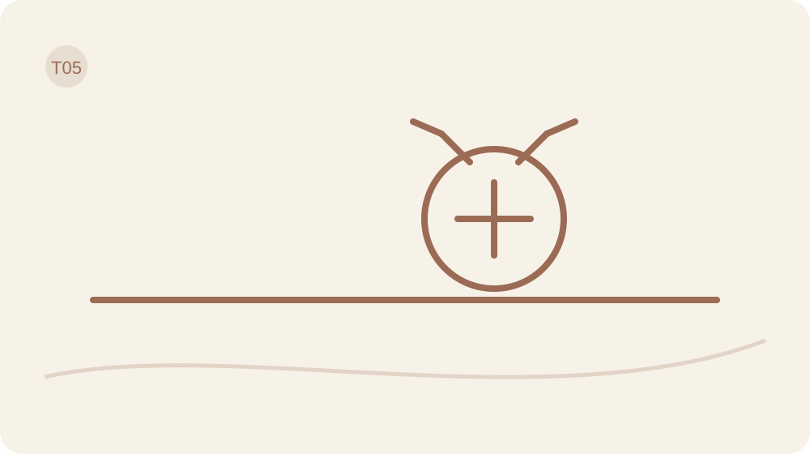

**⬡ Levar autoria para corpo, alimentação, movimento, descanso e cuidado.**

> **Salvaguarda desta travessia:** Corpo e alimentação são opcionais. Não conte calorias, pese, fotografe ou restrinja alimentos para cumprir o livro. Se houver histórico de transtorno alimentar ou condição clínica, adapte com apoio profissional.

# Dia 21 — Seu corpo não é uma prestação atrasada

> **Mapa Posicione-se™ — Dia 21:** Sustentação · **Limite Sagrado** · Árvore: **Tronco** · Ciclo: **Praticar**.

> **Escolha sua rota de hoje**
> **Mínima:** objetivo + 1 pergunta + ação mínima + Fruto/obstáculo.  
> **Completa:** leitura + Caderno + experiência segura + revisão.  
> **Aprofundada:** ferramenta opcional ou apoio, somente se acrescentar clareza.

> **Cuidado:** corpo, alimentação e movimento não são provas de valor. Adapte, pule ou procure orientação quando necessário.

**Objetivo do Dia:** Escolher cuidado corporal sem transformar corpo em tribunal.

**Ferramenta principal:** MMI 2.0 + cuidado.  
**Apoio opcional:** Diário Vivo opcional.

## Corpo não chega devendo

Seu corpo não é uma prestação atrasada que você precisa quitar antes de viver. Há experiências sendo adiadas para depois de um número, uma roupa, uma aprovação. Enquanto isso, a vida não suspende o calendário.

Na travessia anterior você testou uma posição. Agora vamos aplicar essa autoria ao cuidado. O MMI 2.0 volta como pergunta aberta: como quero viver dentro deste corpo? Aparência pode fazer parte da resposta; não precisa ocupar a sala inteira.

## Cuidado sem inspeção permanente

Pense comigo: o que você gostaria de conseguir fazer com mais conforto? Sentar para conversar, vestir algo adequado ao clima, encontrar uma posição menos incômoda, participar de uma atividade, descansar, pedir atendimento? A resposta não precisa impressionar ninguém. Ela precisa ter relação com a sua vida.

Olhar a funcionalidade do corpo amplia a conversa além da imagem. Mas função também não pode virar uma nova competição. Um corpo com deficiência, dor ou limitação não vale menos. Cuidado inclui adaptações, assistência, acessibilidade e o direito de receber ajuda. Você não precisa agradecer por uma dificuldade para merecer acolhimento.

Volte ao MMI do Dia 13 e escolha uma dimensão: conforto, energia percebida, descanso, mobilidade, participação, postura ou autocuidado. Sexualidade e vitalidade podem ser consideradas em privacidade, se fizer sentido; não são obrigações. Peso, medidas, manequim e fotografia permanecem opcionais. Não são senha para concluir a travessia.

Diferencie desejo, comportamento e resultado. “Quero me sentir mais confortável” é uma direção. “Vou separar uma roupa que não me aperte para a atividade de amanhã” é comportamento. “Participei com menos incômodo” é um resultado observado. Uma ação de cuidado não permite prever peso, composição corporal ou resposta clínica.

Imagine uma pessoa que evita um encontro porque sua roupa não serve como antes. Ela pode decidir buscar uma peça confortável, pedir emprestado ou adaptar o plano ao que tem. Isso não resolve toda a relação com a imagem, mas deixa de condicionar a presença a uma transformação imediata. O corpo não precisa passar por uma banca examinadora para acompanhar você.

O cuidado também pode ser buscar avaliação para um sintoma persistente ou retomar um acompanhamento já indicado. O protocolo não explica cansaço, dor ou mudança de peso como falha de mentalidade. Não altere medicação, alimentação terapêutica ou tratamento com base nestas páginas. Escreva a pergunta que deseja levar ao profissional.

Se observar o corpo ou preencher o MMI aumentar vergonha, comparação ou checagem repetitiva, pule o registro corporal. Você pode trabalhar hoje com um cuidado de ambiente, como preparar um lugar confortável de leitura, sem informar dado de saúde. Autoria inclui escolher o que não deseja medir. Você pode mudar essa preferência depois; não precisa justificar sua privacidade nem oferecer informações íntimas para demonstrar compromisso com o cuidado.

## Ciência sem jaleco

Estudos sobre escrita focada na funcionalidade corporal sugerem benefícios para a imagem corporal em populações específicas. Eles não validam o MMI como instrumento clínico e não autorizam transformar capacidade física em valor pessoal. Peso corporal tem múltiplos determinantes; não é medida de caráter ou simples reflexo de vontade.

## Escolha uma dimensão do MMI

Se optar pela trilha corporal, escolha uma dimensão do MMI e traduza-a em cuidado observável. Anote o recurso necessário e um limite de segurança. Se preferir não trabalhar corpo, escolha uma adaptação do ambiente que torne uma atividade cotidiana mais confortável.

**Opcional: qual dimensão do MMI e qual cuidado quero experimentar?**

**Que recurso, adaptação ou apoio tornaria a ação possível?**

## Um cuidado observável

Realize um cuidado pequeno ou prepare o acesso a ele. Pode ser adaptar um objeto, reservar um horário ou formular uma pergunta para atendimento. A missão não exige pesagem, fotografia, exercício ou mudança alimentar.

## O corpo virou aliado ou novo fiscal?

Registre o cuidado realizado e o que percebeu, sem precisar informar medidas ou sintomas. Se não fez, escreva o obstáculo e a próxima ação segura. Um cuidado que respeitou um limite também merece ser reconhecido.

**Minha ação e o que observei — ou obstáculo e próxima ação segura**

## A menor forma de cuidado

Se eu condicionar minha participação à aparência perfeita, então procurarei uma adaptação possível para a situação de hoje. Ação mínima: escolher uma necessidade concreta de cuidado, sem tentar resolver todas.

**Meu SE → ENTÃO, se eu quiser adaptar o exemplo**

## Habitar não é vigiar

Observe se a proposta trouxe apoio ou mais cobrança. Ajuste a dose. Amanhã vamos olhar a alimentação com curiosidade e informação, preservando a opção de não registrar dados alimentares.

# Dia 22 — O prato traduzido, sem tribunal

> **Mapa Posicione-se™ — Dia 22:** Sustentação · **Ação com Visão de Futuro** · Árvore: **Frutos** · Ciclo: **Observar**.

<!-- V06 -->
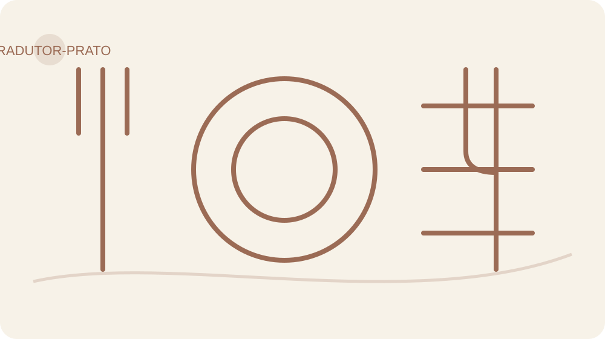

> **Escolha sua rota de hoje**
> **Mínima:** objetivo + 1 pergunta + ação mínima + Fruto/obstáculo.  
> **Completa:** leitura + Caderno + experiência segura + revisão.  
> **Aprofundada:** ferramenta opcional ou apoio, somente se acrescentar clareza.

> **Cuidado:** corpo, alimentação e movimento não são provas de valor. Adapte, pule ou procure orientação quando necessário.

**Objetivo do Dia:** Ler o prato com informação e contexto, sem equivalências falsas ou moralização.

**Ferramenta principal:** Tradutor do Prato + Tradução Visual Honesta.  
**Apoio opcional:** Pausa do Prato.

## Comida não precisa de tribunal

O prato já tem comida suficiente; não precisa receber também um tribunal. Hoje a proposta é enxergar uma escolha com mais precisão. Nenhum alimento será interrogado por crimes contra a sua dignidade.

Ontem você escolheu um cuidado. Se desejar incluir alimentação, vamos usar a Pausa do Prato e o Tradutor do Prato como uma única prática breve. Se esse tema aumentar sofrimento ou vigilância, use a alternativa: observar uma compra cotidiana sem registrar comida.

## Informação antes de equivalência

A Pausa do Prato é um instante para notar a situação: estou comendo com pressa, acompanhada, distraída, com fome, seguindo uma orientação específica? Não é uma prova de autocontrole. Não exige adiar a refeição, mastigar um número fixo de vezes ou produzir uma sensação correta. Você pode simplesmente perceber um sabor, uma textura ou o ambiente e continuar comendo.

O Tradutor do Prato acrescenta perguntas: quais alimentos estão presentes? Onde há fontes de proteína, carboidratos, vegetais ou fibras? Existem fontes repetidas, e isso foi escolha ou automático? Como o conjunto conversa com minhas necessidades, recursos, preferências e orientações individuais? Uma repetição não torna o prato errado; a pergunta serve para enxergar o conjunto.

Arroz, batata, mandioca e massas contêm amidos que são digeridos em açúcares menores. Isso não faz deles açúcar de mesa. Alimentos diferem em composição, preparo e contexto de consumo. Não vamos trocar explicação por susto, nem ensinar a olhar uma refeição como se fosse um amontoado de culpa.

A Tradução Visual Honesta exige rótulo e quantidade real. Se uma bebida informa determinada quantidade de açúcar por porção, a representação precisa respeitar essa porção e o volume consumido. Açúcares totais e adicionados são informações diferentes: identifique qual está usando. Um copo cheio de açúcar não pode representar qualquer copo de refrigerante. Impacto visual não recebe licença para inventar dados.

Exemplo apenas matemático, sem representar uma marca: se o rótulo informar 10 gramas por 100 mililitros, 200 mililitros correspondem a 20 gramas dessa informação. Para uma comparação visual exata, use massa medida, não colheres de tamanho indefinido. Você não precisa fazer essa conta diariamente; ela ensina a conferir uma equivalência antes de acreditar nela.

A associação visual com comida de bebê misturada a líquido pertence à origem autoral indicada por Sol. O aprendizado que preservamos é a força que uma imagem pode ter numa escolha. Não a transformamos em exercício de nojo: provocar repulsa à comida não é a meta deste protocolo.

Planejar também pode aliviar improvisos. Observar o que já existe em casa, combinar uma compra possível ou preparar uma opção conhecida pode ser mais útil que construir um cardápio ideal inacessível. Se já recebe orientação nutricional, use essa orientação como referência. Aqui não há porcentagem universal de prato, dieta cetogênica, jejum ou substituição obrigatória.

## Ciência sem jaleco

Pesquisas sobre intervenções de atenção ao comer sugerem ajuda para perceber padrões, com resultados variáveis. Prestar atenção não é um botão que desliga fome nem garante perda de peso. A explicação de carboidratos e a comparação do açúcar seguem informação nutricional, não metáfora.

## Um prato, várias perguntas

Localize as fontes de nutrientes e o contexto da escolha. O desenho não define porções nem uma refeição universal.

## Traduzir sem assustar

Escolha apenas uma opção: observar uma refeição sem julgá-la; conferir uma informação de rótulo; ou, fora da trilha alimentar, observar como decidiu uma compra. Registre uma informação e uma possível escolha. Não transforme o exercício em contabilidade permanente.

**Opcional: o que observei no prato e no contexto?**

**Opcional: qual informação, porção e volume conferi?**

**Alternativa sem alimentação: como decidi uma compra cotidiana?**

## Leia um prato, não um caráter

Faça a observação escolhida uma vez. Nenhuma mudança de refeição é exigida. Se houver orientação clínica, preserve-a. Interrompa se o exercício intensificar medo de comer, culpa ou restrição e procure apoio adequado.

## O que a informação mudou?

Qual informação concreta você percebeu e o que decidiu fazer com ela? Pode responder sem descrever alimentos. Se não realizou, registre obstáculo e próxima ação segura. O Fruto é clareza, não comer menos a qualquer custo.

**Minha ação e o que observei — ou obstáculo e próxima ação segura**

## Uma escolha informada

Se uma imagem alimentar me assustar, então verificarei a fonte e a quantidade antes de concluir. Ação mínima: identificar a porção de um rótulo, ou o critério de uma compra não alimentar.

**Meu SE → ENTÃO, se eu quiser adaptar o exemplo**

## Prato não é boletim moral

Guarde a precisão, dispense o tribunal. Amanhã vamos aproximar movimento da vida possível, sem transformá-lo em compensação pelo que foi comido.

# Dia 23 — Movimento que cabe na vida

> **Mapa Posicione-se™ — Dia 23:** Sustentação · **Ação com Visão de Futuro** · Árvore: **Tronco + Frutos** · Ciclo: **Praticar**.

> **Escolha sua rota de hoje**
> **Mínima:** objetivo + 1 pergunta + ação mínima + Fruto/obstáculo.  
> **Completa:** leitura + Caderno + experiência segura + revisão.  
> **Aprofundada:** ferramenta opcional ou apoio, somente se acrescentar clareza.

> **Cuidado:** corpo, alimentação e movimento não são provas de valor. Adapte, pule ou procure orientação quando necessário.

**Objetivo do Dia:** Encontrar uma versão possível de movimento compatível com condição, recursos e prazer.

**Ferramenta principal:** Movimento Possível.  
**Apoio opcional:** Unir o Útil ao Agradável.

## Movimento precisa caber

O melhor movimento do mundo, se não cabe na sua realidade, vira mais uma propaganda pendurada na consciência. A proposta de hoje começa menor: qual possibilidade existe, com o corpo, o tempo e os recursos que você tem?

Ontem trabalhamos uma escolha sem tribunal. Movimento também não será castigo nem moeda para pagar comida. Ele entra como cuidado e participação na vida, com adaptação quando necessária.

## Possível vence perfeito inexistente

Na origem do protocolo, Sol aproxima duas coisas: gostar de música e precisar se movimentar. Dançar ouvindo música aparece como exemplo de unir o útil ao agradável. O que preservamos é essa pergunta prática: existe uma maneira de tornar uma ação desejada mais compatível com algo de que você gosta?

Isso não significa que toda atividade precisa ser divertida. Também não exige dançar. Pode haver prazer em companhia, ar livre, ritmo, aprendizagem ou na sensação de terminar uma tarefa possível. Algumas pessoas preferem silêncio. Outras precisam de orientação, apoio físico ou um ambiente acessível. Seu movimento não precisa parecer com o vídeo de ninguém.

Pense comigo: “preciso mudar minha vida” não define o que fazer hoje. “Quero verificar uma oportunidade segura de movimento na minha rotina” já abre uma investigação. Pode ser uma caminhada que você já sabe tolerar, uma atividade orientada que deseja retomar ou uma adaptação que precisa conhecer com um profissional. O protocolo não determina intensidade, carga, duração ou exercício para a sua condição.

O Princípio do Movimento Possível troca a comparação pela viabilidade. Você escolhe uma versão compatível e observa. Se está inativa, tem sintomas, limitações ou dúvidas de segurança, preparar uma conversa com profissional pode ser a missão adequada. Não é preciso se testar até o limite para merecer o registro do Dia.

Força também interessa como capacidade de participar da vida. Acompanhamento adequado pode ajudar a escolher práticas, mas não usaremos a promessa de “substituir gordura por músculo” como troca literal nem a ideia de músculo como fornalha mágica. Objetivos de composição corporal pedem avaliação própria e não são critério obrigatório desta jornada.

Veja um exemplo: alguém decide participar de uma atividade com outra pessoa, mas o horário não cabe. Em vez de concluir “não tenho disciplina”, verifica outra oportunidade ou um apoio necessário. O dado útil é o conflito de agenda. Se a experiência acontece e não agrada, pode testar outra forma. Gostar de uma modalidade não é dever moral.

Há ainda o descanso necessário. Dor nova importante, mal-estar ou sinais incomuns não são obstáculos a vencer com pensamento positivo. Pare e procure avaliação adequada. Não aumente esforço para compensar uma refeição ou um dia parado. A ação precisa cuidar da pessoa que a executa, inclusive quando a escolha responsável é interromper.

## Ciência sem jaleco

As diretrizes de atividade física reconhecem que algum movimento pode ser melhor que nenhum e que começar pequeno é válido. Isso é orientação geral de saúde pública, não prescrição individual. A dose e as adaptações dependem das condições da pessoa; o protocolo não oferece liberação clínica para exercício.

## Escolha uma versão viável

Escolha uma oportunidade já segura para você, ou uma preparação para obter orientação. Identifique horário possível, recurso e uma forma de tornar a experiência mais agradável. Não acrescente metas de calorias, peso ou desempenho.

**Opcional: qual movimento possível ou preparação escolhi?**

**Qual horário, adaptação ou apoio torna minha escolha viável?**

## Mexa-se sem pagar dívida

Experimente a oportunidade escolhida dentro das suas condições habituais ou prepare o acesso ao apoio necessário. Se não optar pela trilha corporal, organize uma condição prática de participação, como horário ou companhia, sem realizar exercício.

## Energia, dor, prazer e contexto

O que foi possível? O que facilitou e o que precisa mudar? Registre a ação ou o obstáculo e a próxima ação segura. Não é necessário informar duração, peso ou desempenho físico para concluir.

**Minha ação e o que observei — ou obstáculo e próxima ação segura**

## A versão mínima útil

Se o plano ficar grande demais para o dia, então reduzirei a exigência ou prepararei a condição que falta. Ação mínima: escolher uma oportunidade real e verificar se ela é segura e acessível.

**Meu SE → ENTÃO, se eu quiser adaptar o exemplo**

## Movimento possível

Mantenha somente uma combinação que faça sentido. O agradável pode ajudar a começar; o ajuste ajuda a continuar. Amanhã vamos olhar o descanso, sem tratá-lo como prêmio por ter produzido bastante.

# Dia 24 — Descansar também é cuidado

> **Mapa Posicione-se™ — Dia 24:** Sustentação · **Ação com Visão de Futuro** · Árvore: **Tronco** · Ciclo: **Praticar**.

> **Escolha sua rota de hoje**
> **Mínima:** objetivo + 1 pergunta + ação mínima + Fruto/obstáculo.  
> **Completa:** leitura + Caderno + experiência segura + revisão.  
> **Aprofundada:** ferramenta opcional ou apoio, somente se acrescentar clareza.

> **Cuidado:** corpo, alimentação e movimento não são provas de valor. Adapte, pule ou procure orientação quando necessário.

**Objetivo do Dia:** Tratar descanso e sono como condição de cuidado, não como prêmio por produtividade.

**Ferramenta principal:** Plano de Descanso.  
**Apoio opcional:** Poda Ambiental digital.

## Descanso não é prêmio

Você deita. O corpo chegou à cama, mas a cabeça ainda está atendendo clientes, respondendo parentes e revisando uma conversa de três anos atrás. O expediente acabou no relógio; dentro, ninguém recebeu o comunicado.

Hoje vamos cuidar de uma condição de descanso. Não controlar o sono à força. Depois do movimento possível, precisamos reconhecer que repouso também participa do cuidado, sem precisar ser comprado com exaustão.

## Sono não obedece à bronca

Pense comigo: que parte da sua rotina dificulta encerrar o dia? Pode ser um compromisso tardio, um ambiente inadequado, responsabilidades de cuidado, trabalho em turnos ou acesso contínuo a mensagens. Nem tudo é escolha individual. Comece pela condição que você consegue influenciar e reconheça o que depende de apoio, negociação ou avaliação.

Uma transição pode ajudar a organizar esse encerramento: anotar a primeira tarefa de amanhã, guardar o que será usado, avisar um horário de disponibilidade ou reduzir uma fonte evitável de interrupção. Use o Estacionamento Mental do Dia 2 se uma pendência estiver ocupando espaço. Registre o próximo passo; não abra uma audiência noturna para todos os problemas.

Descanso não se resume a sono. Uma pausa pode envolver silêncio, mudança de atividade, redução de estímulo ou apoio para sair de uma demanda. Também não precisa virar mais uma tarefa impecável. Se você tem poucos recursos, escolha uma adaptação pequena e possível. Um quarto de revista não é requisito para começar a observar o que interfere.

Imagine uma pessoa que pretende se deitar em determinado horário, mas segue respondendo mensagens sem urgência. Ela combina um horário de retorno e prepara o aparelho conforme suas necessidades reais de contato. O teste não é “dormir perfeitamente”; é verificar se conseguiu encerrar as respostas e como ficou a transição. Emergências e deveres de cuidado precisam ser considerados.

Evite fiscalizar cada minuto da noite como se estivesse administrando uma empresa de travesseiros. Se monitorar o sono intensificar preocupação, reduza o registro. Você pode observar apenas se realizou o ajuste escolhido. Não precisa entregar números para comprovar que descansou.

Há dificuldades que ultrapassam a organização da rotina. Problemas persistentes de sono, sonolência importante ou sinais que preocupam merecem avaliação profissional. Estas páginas não explicam tudo por estresse e não orientam iniciar, suspender ou ajustar medicamentos. Anotar perguntas para atendimento pode ser mais útil que tentar mais um ritual caseiro.

Também não prometemos corrigir cortisol, limpar toxinas ou produzir uma fase específica do sono com uma técnica. O cuidado de hoje tem um tamanho honesto: criar uma condição mais favorável e observar. A noite não precisa obedecer imediatamente para que o gesto tenha sentido. Se você trabalha à noite, adapte a transição ao seu período de descanso, sem usar o horário alheio como régua.

## Ciência sem jaleco

O consenso AASM/SRS recomenda que adultos saudáveis de 18 a 60 anos durmam sete horas ou mais regularmente, considerando necessidades individuais. Essa referência não funciona como teste diário de competência. Dificuldades persistentes precisam de avaliação; uma transição organizada não substitui investigação ou tratamento.

## Mapeie condições de descanso

Escolha um obstáculo modificável e uma adaptação para o período de descanso. Use algo dos Dias anteriores: Poda de uma interrupção, pedido de ajuda ou Estacionamento Mental. Defina uma ação, não uma promessa sobre a qualidade do sono.

**Opcional: qual condição de descanso quero ajustar?**

**Qual ação possível farei e que deveres preciso preservar?**

## Proteja uma condição, não uma performance

Faça o ajuste uma vez antes do seu período de descanso. Se não houver margem para executá-lo, identifique o recurso ou a negociação necessária. A missão pode ser preparar apoio, sem informar dados pessoais de saúde.

## O que ajudou a desacelerar?

Você realizou a adaptação? O que ela mudou na transição, se algo mudou? Registre somente o que observou. Se não fez, anote obstáculo e próxima ação segura. Evite concluir que uma única noite confirma ou invalida tudo.

**Minha ação e o que observei — ou obstáculo e próxima ação segura**

## Uma condição de descanso

Se uma pendência reaparecer no encerramento do dia, então anotarei sua próxima ação em vez de resolvê-la inteira naquele momento, quando puder esperar. Ação mínima: escolher uma condição de descanso que mereça cuidado.

**Meu SE → ENTÃO, se eu quiser adaptar o exemplo**

## Cuidar também é parar

Amanhã vamos trabalhar os dias que saem do previsto. Um cuidado pode continuar mesmo depois de uma noite difícil, uma refeição diferente ou uma agenda quebrada. A próxima escolha não precisa ser punição.

# Dia 25 — Próxima escolha, não punição

> **Mapa Posicione-se™ — Dia 25:** Sustentação · **Ação com Visão de Futuro** · Árvore: **Poda** · Ciclo: **Praticar**.

> **Escolha sua rota de hoje**
> **Mínima:** objetivo + 1 pergunta + ação mínima + Fruto/obstáculo.  
> **Completa:** leitura + Caderno + experiência segura + revisão.  
> **Aprofundada:** ferramenta opcional ou apoio, somente se acrescentar clareza.

> **Cuidado:** corpo, alimentação e movimento não são provas de valor. Adapte, pule ou procure orientação quando necessário.

**Objetivo do Dia:** Retomar depois de uma escolha difícil sem compensação ou punição.

**Ferramenta principal:** Próxima Escolha, Não Punição.  
**Apoio opcional:** Autocompaixão aplicada.

## A próxima escolha não cobra pedágio

“Já estraguei tudo.” Curiosa essa capacidade de transformar um episódio num contrato vitalício. Um plano saiu do previsto e, de repente, a mente quer cancelar o restante da semana.

Hoje fechamos Habitar olhando a próxima escolha. Não vamos negar consequências nem fingir que todo comportamento ajuda. Vamos separar reparo de punição, para que a resposta ao desvio não crie um problema maior.

## Compensação parece controle, mas cobra caro

Pense comigo: você deixou de fazer uma ação que havia planejado. Pode investigar por quê, ajustar o contexto e retomar uma versão possível. Ou pode aumentar a exigência, se insultar e prometer uma disciplina que depende de não sentir cansaço nunca mais. A segunda opção parece intensa. Intensidade não é sinônimo de utilidade.

Na alimentação, essa distinção pede cuidado especial. Uma refeição diferente não exige jejum punitivo, exercício compensatório ou eliminação radical de alimentos. Se você segue um plano individual com profissional, mantenha essa referência e leve dúvidas ao acompanhamento. O protocolo não usa culpa para tentar administrar o corpo.

“Próxima Escolha, Não Punição” preserva uma ideia importante do material histórico: depois de um episódio, ainda existe a próxima decisão. A versão atual amplia isso para agenda, vínculos, descanso, movimento e cuidado. Você não precisa merecer uma retomada por meio de sofrimento.

Reparo responde a uma consequência específica. Se atrasou uma entrega, comunicar o atraso e combinar uma alternativa pode ser reparo. Se falou de modo ofensivo, reconhecer o ato e buscar corrigir seu impacto pode ser reparo. Punição sem função acrescenta dor e chama isso de responsabilidade. Pergunte: esta medida melhora a situação ou apenas me faz pagar?

Imagine alguém que perdeu o horário de uma prática e resolve dobrar a tarefa amanhã. Antes de aceitar, examine se a dose original já estava difícil. Talvez o ajuste seja reduzir, mudar o gatilho ou pedir apoio. Recuperar o que se perdeu nem sempre é possível ou necessário. Há compromissos que precisam ser renegociados, não acumulados como dívida.

Também existem padrões que pedem ajuda. Episódios de perda de controle alimentar, restrição intensa, medo de comer ou exercício usado como castigo não devem ser tratados como simples falta de organização. Reduza a autoobservação que agrava o sofrimento e busque acompanhamento apropriado. Este é um espaço educativo, não uma substituição de cuidado clínico.

Para revisar a travessia, escolha um único registro entre os Dias 21 e 24. O cuidado proposto ficou mais viável? O tema corporal ou alimentar trouxe clareza ou cobrança? Você pode manter, adaptar ou retirar uma prática opcional. O corpo continua presente mesmo quando você decide não pesá-lo, fotografá-lo ou descrevê-lo.

Leve adiante uma resposta respeitosa ao erro. Respeitosa não significa vaga: nomeia o que aconteceu, considera consequência e escolhe uma ação. Não precisa acrescentar uma biografia de fracasso ao rodapé.

## Ciência sem jaleco

Intervenções de autocompaixão têm resultados promissores para lidar com sofrimento, com diferenças entre estudos e formatos. Uma frase deste livro não equivale a um tratamento. Aqui usamos o princípio de responder ao erro sem humilhação, para preservar espaço de decisão e reparo.

## Registre sem punição

Escolha um episódio pequeno fora do previsto. Escreva fato, consequência real e próxima escolha. Veja se sua proposta contém castigo, compensação ou uma exigência desproporcional. Retire o excesso e mantenha o reparo que tiver função.

**Que episódio concreto saiu do previsto, sem julgamento de identidade?**

**Qual consequência pede reparo e qual próxima escolha é proporcional?**

**Qual cuidado da travessia manter, adaptar ou retirar?**

## Retome na próxima oportunidade

Faça a próxima escolha possível ou prepare o reparo adequado. Pode ser retomar uma rotina habitual, comunicar uma mudança ou procurar apoio. Não precisa relatar comida, medidas ou sintomas para realizar esta missão.

## A retomada ficou mais rápida?

O que você fez depois do desvio? A resposta reduziu o problema ou acrescentou cobrança? Registre a ação, ou obstáculo e próxima ação segura. Um ajuste pequeno e honesto vale mais que uma promessa de nunca mais errar.

**Minha ação e o que observei — ou obstáculo e próxima ação segura**

## Próxima escolha possível

Se eu pensar “já estraguei tudo”, então nomearei o episódio e escolherei uma resposta para ele, sem condenar o restante do dia. Ação mínima: escrever uma próxima escolha sem punição.

**Meu SE → ENTÃO, se eu quiser adaptar o exemplo**

## Sem segunda-feira imaginária

A travessia seguinte começa com o que pode continuar na vida real. Amanhã vamos distinguir consistência de perfeição e selecionar o que merece permanecer, sem carregar vinte e cinco tarefas nas costas.

# Travessia VI — Sustentar

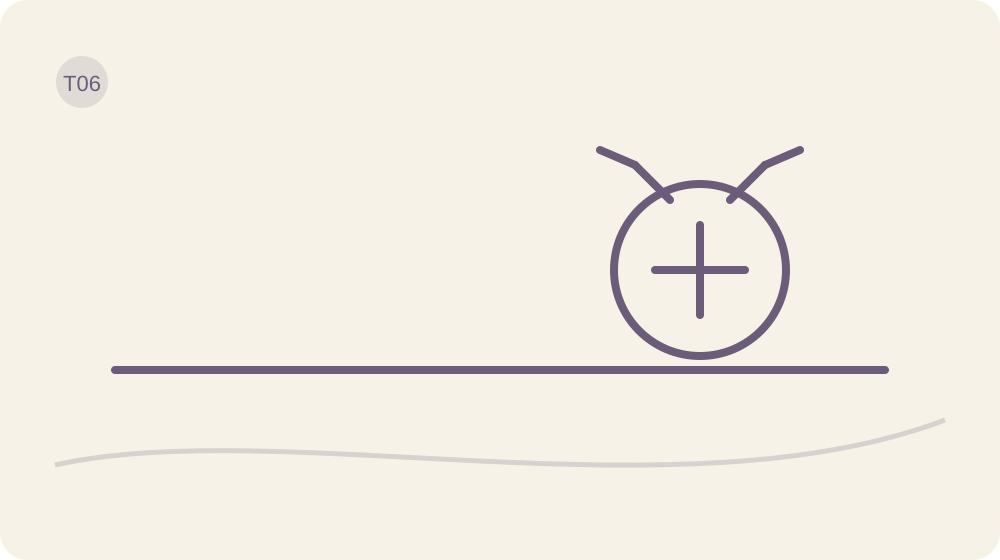

**✦ Revisar Frutos, retomar sem punição e cuidar do que precisa continuar vivo.**

> **Salvaguarda desta travessia:** Manutenção não é fiscalização. Sustentar significa escolher poucas práticas úteis e saber retomar quando a vida mudar.

# Dia 26 — Consistência não é perfeição

> **Mapa Posicione-se™ — Dia 26:** Sustentação · **Ação com Visão de Futuro** · Árvore: **Frutos** · Ciclo: **Sustentar**.

> **Escolha sua rota de hoje**
> **Mínima:** objetivo + 1 pergunta + ação mínima + Fruto/obstáculo.  
> **Completa:** leitura + Caderno + experiência segura + revisão.  
> **Aprofundada:** ferramenta opcional ou apoio, somente se acrescentar clareza.

**Objetivo do Dia:** Escolher poucas práticas sustentáveis em vez de tentar manter tudo.

**Ferramenta principal:** Prática Essencial.  
**Apoio opcional:** Mapa de Ferramentas.

## O que merece ficar?

Se a rotina só funciona no dia em que você dormiu bem, ninguém pediu nada e todos os semáforos abriram, talvez ela seja uma homenagem ao impossível. A vida comum merece um plano que a reconheça.

Ontem você praticou a próxima escolha sem punição. Hoje começa Sustentar. O trabalho é decidir o que continua e em qual frequência. Aprender trinta Dias não significa carregar trinta tarefas diárias.

## Consistência não é coleção de tarefas

Pense comigo: qual prática produziu alguma utilidade observável? Não escolha a mais bonita no papel. Escolha a que ajudou você a perceber, decidir ou agir numa situação real. Pode ser conferir a agenda antes de responder, fazer uma pergunta de precisão ou preparar uma alternativa no ambiente.

Defina a função dessa prática. Algumas são diárias, porque participam de uma rotina escolhida. Outras só fazem sentido sob gatilho, como Fato × História quando surge uma conclusão precipitada. Outras são semanais, como revisar Frutos. Uma ferramenta profunda pode ficar disponível sem ser aberta todos os dias. Caixa de ferramentas não é lista de obrigações.

O efeito cumulativo consiste em integrar habilidades, não empilhar formulários. Você aprende a distinguir fato e interpretação e leva essa habilidade para um pedido, uma refeição ou um plano. Não precisa preencher novamente toda a Sala de Controle cada vez que toma uma decisão. O modo rápido existe para a vida caber entre as perguntas.

Para a prática selecionada, escolha um gatilho reconhecível: depois de um evento habitual, antes de uma decisão ou em um horário viável. Evite depender apenas de “quando eu lembrar”. Prepare o recurso necessário e defina uma versão mínima. Ela não serve para fazer tudo de qualquer jeito; serve para preservar um gesto útil quando as condições estiverem reduzidas.

A frase “antes o mal feito que o não feito” precisa de precisão. Em tarefas de baixo risco, uma versão pequena e imperfeita pode ser um começo. Em saúde, segurança, contratos ou decisões importantes, mal feito pode trazer dano. Nossa formulação é: antes um passo pequeno, seguro e revisável que um plano tão grande que nunca começa.

Imagine uma pessoa que pretende escrever uma página por noite. Descobre que uma linha sobre ação e obstáculo já permite revisar a semana. A página continua disponível quando ajuda; a linha vira a versão mínima. Se nem a linha está útil, vale rever o propósito. Consistência não exige conservar uma prática que deixou de servir.

Também não vamos declarar que seu comportamento entrou no DNA ou que o cérebro foi reprogramado definitivamente. A repetição depende de contexto e pode perder força quando a vida muda. Por isso haverá revisão, adaptação e apoio. Manter não é congelar.

Escolha uma prática para cada frequência somente se necessário. Para hoje basta definir uma prática principal e deixar as outras como ferramentas sob demanda. Leveza também é retirar do protocolo o excesso que você não precisa carregar.

## Ciência sem jaleco

Uma revisão sobre formação de hábitos encontrou grande variação no tempo necessário, com limitações nos estudos disponíveis. Repetição em contexto ajuda a desenvolver hábitos; trinta dias não garantem automatização. O nosso calendário organiza a aprendizagem, não estabelece um prazo biológico universal.

## Escolha poucas práticas

Selecione uma prática e escreva: para que serve, quando usar, versão mínima e data de revisão. Classifique as demais como sob gatilho, semanais ou dispensáveis por enquanto. Não acrescente uma prática nova para compensar as que decidiu guardar.

**Qual prática principal quero manter e para que ela serve?**

**Qual gatilho ou frequência é adequado?**

**Qual versão mínima segura e quando vou revisar?**

## Sustente o essencial

Use a versão escolhida uma vez ou prepare o contexto em que será usada. Observe se o gatilho é fácil de reconhecer. A missão é testar a sustentabilidade, não aumentar a quantidade de tarefas.

## Menos pode produzir mais continuidade

A prática coube nas condições reais? Qual parte ajudou e qual ficou excessiva? Registre a ação ou obstáculo e próxima ação segura. Não precisa apresentar uma sequência sem falhas para concluir.

**Minha ação e o que observei — ou obstáculo e próxima ação segura**

## Sua prática essencial

Se o dia ficar apertado, então usarei a versão mínima segura ou replanejarei conscientemente. Ação mínima: definir o gatilho e deixar o recurso necessário pronto.

**Meu SE → ENTÃO, se eu quiser adaptar o exemplo**

## Manter sem carregar tudo

Deixe seu plano visível onde faz sentido, sem encher a casa de cobranças. Amanhã vamos preparar a retomada para quando o contexto mudar. Consistência inclui saber voltar sem recomeçar a própria identidade.

# Dia 27 — Quando a rotina sair do eixo

> **Mapa Posicione-se™ — Dia 27:** Sustentação · **Ação com Visão de Futuro** · Árvore: **Poda** · Ciclo: **Revisar**.

> **Escolha sua rota de hoje**
> **Mínima:** objetivo + 1 pergunta + ação mínima + Fruto/obstáculo.  
> **Completa:** leitura + Caderno + experiência segura + revisão.  
> **Aprofundada:** ferramenta opcional ou apoio, somente se acrescentar clareza.

**Objetivo do Dia:** Aplicar um protocolo de retomada quando a rotina sair do eixo.

**Ferramenta principal:** Protocolo de Retomada.  
**Apoio opcional:** Sala de Controle.

## Quando a vida bagunçar o calendário

Uma viagem, uma doença, um prazo, um cuidado inesperado. A rotina muda e o plano fica sem chão. Isso não apaga o que você aprendeu. Só mostra que ele estava apoiado em condições que agora são outras.

Ontem você escolheu uma prática sustentável. Hoje vamos construir a forma de retomá-la. A pergunta será “qual componente saiu do eixo?”, em vez de “por que eu sou assim?”. A primeira pode produzir uma resposta útil. A segunda costuma convocar um júri.

## Retomar por componente

Comece pelo episódio. O gatilho deixou de existir? O recurso estava indisponível? A ação ficou grande demais? Você não sabia como fazer? A meta perdeu sentido? Surgiu uma necessidade mais urgente? São problemas diferentes e pedem respostas diferentes. Chamar todos de falta de disciplina economiza palavras e desperdiça informação.

Use a investigação de capacidade, oportunidade e motivação. Capacidade inclui saber e conseguir realizar a ação. Oportunidade envolve ambiente, tempo, apoio e acesso. Motivação inclui razões, prioridades e respostas automáticas. Você pode encontrar mais de um componente, mas escolha o ajuste com maior utilidade agora.

Imagine alguém que registrava o Fruto depois do trabalho e passou a trabalhar em outro horário. O gatilho antigo desapareceu. A resposta pode ser escolher outro momento, e não comprar um caderno novo para celebrar um recomeço. Às vezes o que falta é uma mudança de cinco minutos; a mente já queria uma cerimônia de reconstrução nacional.

Outro exemplo: a pessoa não pratica porque o exercício ativa sofrimento. Nesse caso, insistir numa versão menor pode não resolver. A retomada pode significar pausar, trocar a ferramenta e buscar apoio. A continuidade é da sua capacidade de cuidar e escolher, não de obedecer ao material a qualquer custo.

Defina sinais de retorno. “Quando eu notar que aceitei compromissos sem olhar a agenda, retomarei a conferência antes do próximo pedido.” “Quando a análise se repetir sem ação, voltarei a Fato × História e escolherei um passo.” São sinais de funcionamento, não alarmes sobre o seu valor.

Defina também quem pode ajudar. Uma pessoa de confiança pode lembrar um acordo ou participar de uma preparação. Um profissional pode avaliar um problema persistente. LÚCIDA, quando disponível, pode ajudar a organizar a observação, mas não deve virar autorização obrigatória para cada decisão. A autoria precisa continuar com você.

Não volte ao Dia 1 por castigo. Retome o componente necessário: pausa, precisão, ambiente, limite, plano ou revisão. Se quiser reler um Dia, faça isso com uma pergunta concreta. Depois volte à prática. Releitura infinita pode parecer trabalho enquanto adia justamente o teste que traria informação.

O objetivo não é impedir todo contratempo. É reduzir o tamanho da confusão quando ele chegar e conservar um caminho de volta. Um plano de retomada pode ser breve o suficiente para você realmente encontrá-lo num dia difícil.

## Ciência sem jaleco

COM-B é uma estrutura para investigar condições do comportamento, não um diagnóstico de personalidade. Planos com obstáculo e resposta definida têm apoio em pesquisas de metas, com efeitos médios e limitações. O plano de retomada deste protocolo combina esses recursos de modo educativo e precisa ser testado na sua realidade.

## Descubra o que saiu do eixo

Escolha um contratempo provável e localize o componente mais vulnerável. Escreva o sinal de retorno, a menor intervenção e um apoio possível. Não tente antecipar todas as crises da vida; prepare um caminho para a situação mais comum.

**Qual componente costuma sair do eixo e em que situação?**

**Qual sinal reconhecer e qual menor intervenção retomar?**

**Que apoio posso procurar sem entregar minha decisão a outra pessoa?**

## Reabra a menor porta útil

Deixe o plano de retomada acessível e teste uma preparação concreta: mudar um lembrete, ajustar o recurso ou combinar apoio. Se o contratempo já ocorreu, execute somente o passo seguro que couber agora.

## Quanto tempo levou para voltar?

O que ficou mais fácil de retomar? O plano responde à barreira real ou precisa mudar? Registre a ação, ou obstáculo e próxima ação segura. Uma pausa fundamentada pode ser a decisão adequada.

**Minha ação e o que observei — ou obstáculo e próxima ação segura**

## Um passo de retorno

Se eu concluir que preciso começar tudo do zero, então identificarei primeiro o componente que falhou. Ação mínima: escrever o nome de uma ferramenta que posso retomar e a situação em que ela ajuda.

**Meu SE → ENTÃO, se eu quiser adaptar o exemplo**

## Retomar não é recomeçar do zero

Você já tem um caminho de volta. Amanhã vamos olhar os registros da jornada com honestidade: o que mudou, o que não mudou e o que ainda não sabemos. A Auditoria dos Frutos não pede um final feliz ensaiado.

# Dia 28 — Auditoria dos Frutos

> **Mapa Posicione-se™ — Dia 28:** Sustentação · **Ação com Visão de Futuro** · Árvore: **Frutos + Mirante** · Ciclo: **Revisar**.

<!-- V07 -->

> **Escolha sua rota de hoje**
> **Mínima:** objetivo + 1 pergunta + ação mínima + Fruto/obstáculo.  
> **Completa:** leitura + Caderno + experiência segura + revisão.  
> **Aprofundada:** ferramenta opcional ou apoio, somente se acrescentar clareza.

**Objetivo do Dia:** Comparar registros e Frutos com contexto, sem converter mudança em prova de valor ou eficácia.

**Ferramenta principal:** Auditoria dos Frutos.  
**Apoio opcional:** Árvore do Discernimento.

## Auditoria não é julgamento

Chegou a hora de olhar os Frutos. Não os que ficariam bonitos numa postagem: os que existem. Pode haver avanço, estabilidade, dificuldade, surpresa e pergunta sem resposta. A auditoria aceita a vida inteira, não só a parte que rende depoimento.

Ontem você preparou uma retomada. Hoje vai usar o Caderno como evidência para decidir o que manter. O trabalho não é convencer você de que o protocolo funcionou. É ajudar você a enxergar o que aconteceu.

## Compare episódios, não personagens

Volte ao compromisso inicial e à avaliação de partida. Compare perguntas equivalentes, preservando o significado original. Se você registrou um excesso específico, veja como ele aparece agora. Se não tem registro inicial, diga isso e use uma descrição retrospectiva com cautela. Memória ajuda a pensar, mas não substitui uma medição que não foi feita.

Escolha dois ou três episódios do Caderno. Um em que a prática ajudou, outro em que não coube ou não produziu o esperado e, se houver, um que trouxe dúvida. Isso evita selecionar apenas confirmações. Você não precisa reler todas as páginas nem transformar a revisão em trabalho de conclusão de curso.

Separe processo, resultado e contexto. Processo: você fez um pedido mais claro. Resultado: houve um acordo. Contexto: a outra pessoa estava disponível para conversar. O resultado não prova que qualquer pessoa aceitará esse pedido em qualquer circunstância. Também não permite atribuir toda a mudança ao protocolo. Apoio, tratamento, tempo e outras experiências podem ter participado.

Pense comigo: alguém percebe mais rapidez para reconhecer uma interpretação precipitada, mas continua sentindo ansiedade. Isso pode ser uma habilidade adquirida sem mudança equivalente no sofrimento. As duas informações cabem juntas. Se o sofrimento é importante ou persistente, merece cuidado adequado, não uma cobrança para que a ferramenta resolva tudo.

Olhe também o custo. Uma prática ajudou a organizar ou aumentou vigilância? O registro ficou útil ou tomou tempo demais? A trilha corporal ampliou cuidado ou intensificou comparação? Você pode reduzir, adaptar ou suspender uma proposta. Não chame aumento de cobrança de progresso só porque ele veio acompanhado de muitas anotações.

Corpo, peso, medidas, alimentação e sono continuam opcionais. Caso tenha registros, não use variações isoladas para diagnosticar causas ou declarar sucesso clínico. O foco geral é autoria observável: escolhas mais claras, apoio procurado, limites comunicados, práticas possíveis, revisões feitas. Não há nota de pessoa boa.

Reconheça limites externos que continuam presentes. Talvez você tenha encontrado uma resposta mais cuidadosa numa condição difícil, sem conseguir mudar a condição. Isso não torna o contexto aceitável nem elimina a necessidade de recursos, direitos ou apoio. Responsabilidade distribuída permanece valendo no encerramento.

Conclua com três destinos: manter o que ajuda, ajustar o que pede mudança e deixar de lado o que não serve agora. Essa é a Auditoria dos Frutos. Uma revisão que autoriza mudar de ideia vale mais que um certificado de entusiasmo.

## Ciência sem jaleco

Pesquisas sobre monitoramento de metas apoiam registrar e revisar progresso. O registro deve servir à decisão; não exige exposição pública nem autoriza inferir mudança cerebral pelo diário. Esta auditoria é educativa, não escala diagnóstica, ensaio clínico ou demonstração de eficácia do produto.

## Três destinos: manter, ajustar, deixar

Abra um registro inicial e dois episódios recentes. Escreva uma mudança observável, uma dificuldade que continua e um fator de contexto. Depois escolha uma prática para manter, uma para ajustar ou retirar. Se não houver evidência suficiente, registre a incerteza.

**O que mudou entre o registro inicial e agora, com exemplos?**

**O que continua difícil e quais fatores de contexto participaram?**

**O que vou manter, ajustar ou deixar de lado?**

## Leve uma decisão para o cotidiano

Aplique um ajuste derivado da auditoria: simplifique um registro, reposicione um recurso ou retire uma exigência desnecessária. A revisão precisa mudar alguma coisa na sua prática, ainda que a decisão seja manter conscientemente o que já funciona.

## Fruto é dado em contexto

Qual conclusão os registros sustentam e qual conclusão seria exagerada? Registre a decisão aplicada, ou obstáculo e próxima ação segura. Você não precisa apresentar melhora para concluir o Dia.

**Minha ação e o que observei — ou obstáculo e próxima ação segura**

## Uma revisão aplicável

Se eu escolher apenas evidências favoráveis, então procurarei também um episódio que desafie minha conclusão. Ação mínima: comparar uma intenção inicial com uma ação realmente registrada.

**Meu SE → ENTÃO, se eu quiser adaptar o exemplo**

## O método também presta contas

Guarde essa síntese para a carta de amanhã. Ela dará ao seu futuro um retrato honesto do presente, com continuidade possível e sem promessa de transformação permanente.

# Dia 29 — Uma carta com data e compromisso

> **Mapa Posicione-se™ — Dia 29:** Sustentação · **Ação com Visão de Futuro** · Árvore: **Mirante** · Ciclo: **Sustentar**.

> **Escolha sua rota de hoje**
> **Mínima:** objetivo + 1 pergunta + ação mínima + Fruto/obstáculo.  
> **Completa:** leitura + Caderno + experiência segura + revisão.  
> **Aprofundada:** ferramenta opcional ou apoio, somente se acrescentar clareza.

**Objetivo do Dia:** Escrever um compromisso de processo e programar revisões D+30/D+60/D+90.

**Ferramenta principal:** Carta ao Futuro + D+30/60/90.  
**Apoio opcional:** Futuro episódico.

## Carta sem heroísmo

Uma carta para o futuro pode virar uma cobrança com envelope bonito. “Espero que você finalmente tenha virado outra pessoa.” Vamos dispensar esse remetente. A carta de hoje levará fatos, cuidado e um compromisso que pode ser revisto.

Ontem você auditou os Frutos. Agora vamos transformar essa leitura num plano de continuidade. O futuro precisa saber o que funcionou, onde você teve dificuldade e como deseja responder quando a vida mudar.

## O futuro precisa de processo

Comece pela data e pela situação atual. Escreva para você como escreveria a alguém que merece respeito e informação: “Hoje percebo isto; consegui fazer aquilo; ainda preciso de apoio aqui”. Não monte uma versão heroica do presente. A pessoa que vai abrir a carta precisa de um ponto de partida verdadeiro.

Inclua uma evidência concreta da jornada. Um pedido comunicado, uma hipótese revista, um cuidado possível ou uma retomada já realizada. Depois nomeie algo que continua difícil. As duas partes protegem a carta de virar propaganda ou acusação. Você pode reconhecer uma escolha sem negar que o contexto segue exigente.

Escolha um compromisso de processo. “Vou revisar minha agenda antes de assumir novos pedidos.” “Vou consultar meu plano de retomada quando a rotina mudar.” Evite comprometer-se com resultados que não dependem apenas de você, como uma reação alheia, um peso específico ou a ausência definitiva de sofrimento.

O material histórico já trazia uma carta para três meses. Preservamos essa direção e organizamos três revisões: D+30, D+60 e D+90, contadas a partir do término do protocolo. Portanto, D+30 é trinta dias depois de concluir o Dia 30. Não é outra forma de chamar o último Dia da jornada.

Em D+30, observe a prática principal: ela continuou acessível e útil? Em D+60, reveja contexto e apoio: algo mudou na rotina, nos recursos ou nas prioridades? Em D+90, reabra a carta e faça nova Auditoria dos Frutos: o que manter, ajustar, encerrar ou escolher agora? Essas perguntas são orientações, não prazos clínicos.

Você não precisa esperar as datas se houver uma dificuldade importante. O plano de retomada fica disponível sob gatilho; ajuda profissional não depende do calendário do produto. As revisões servem para criar encontros deliberados com suas escolhas, sem fiscalizar cada dia.

Pense também no impacto além de você. Uma rotina mais coerente pode abrir espaço para cuidar de um vínculo ou cumprir melhor um compromisso coletivo. Escolha algo proporcional e consentido. Propósito não obriga a se sacrificar, converter outras pessoas ao método nem oferecer disponibilidade ilimitada.

Se desejar, registre gratidão por um apoio real recebido e uma forma concreta de reconhecê-lo. Essa prática é opcional. Gratidão não exige agradecer pela dor, perdoar imediatamente ou negar injustiça; tampouco cura sintomas por vibração. Uma mensagem simples pode bastar, e você decide se quer enviá-la.

Por fim, escolha onde guardar a carta. Ela pode permanecer privada. Publicar não torna a decisão mais legítima. Sua continuidade não precisa de plateia para existir.

## Ciência sem jaleco

A evidência sobre formação de hábitos aponta variação de tempo e importância de repetição contextual. Por isso a manutenção ultrapassa o calendário inicial. As datas D+30/60/90 são uma escolha pedagógica deste produto; não representam etapas universais do cérebro.

## Uma carta com fatos e cuidado

Escreva uma carta curta com situação atual, uma evidência, uma dificuldade, compromisso de processo e frase de retomada. Registre a data real de conclusão quando chegar ao Dia 30 e, a partir dela, marque as três revisões. Se terminar mais tarde, ajuste as datas.

**Minha carta: fatos, cuidado, compromisso e retomada**

**Quais datas de D+30, D+60 e D+90 após a conclusão real?**

**Que apoio ou contribuição proporcional quero preservar?**

## Marque D+30, D+60 e D+90

Guarde a carta em um lugar que possa reencontrar e prepare o lembrete das revisões, quando souber a data de conclusão. Esta ação não envia mensagens a outras pessoas nem compartilha o Caderno automaticamente.

## O compromisso continua realista?

A carta contém um compromisso realizável e uma forma respeitosa de retomar? Registre onde ficará acessível, sem expor seu conteúdo se não quiser. Se não fez, anote obstáculo e próxima ação segura.

**Minha ação e o que observei — ou obstáculo e próxima ação segura**

## Uma promessa de processo

Se eu abrir a carta e encontrar uma vida diferente da prevista, então revisarei o plano a partir da realidade, sem usar o passado para me condenar. Ação mínima: escrever uma frase de compromisso de processo.

**Meu SE → ENTÃO, se eu quiser adaptar o exemplo**

## Data para revisar, não para se cobrar

Amanhã vamos plantar uma escolha de verdade. Separe, se puder, uma planta ou semente adequada ao seu ambiente, um recipiente e os cuidados necessários. O ritual será simples; o sentido está na continuidade que você decidiu cultivar.

# Dia 30 — Uma escolha viva precisa de cuidado

> **Mapa Posicione-se™ — Dia 30:** Sustentação · **Ação com Visão de Futuro** · Árvore: **Poda + Mirante** · Ciclo: **Revisar**.

<!-- V08 -->
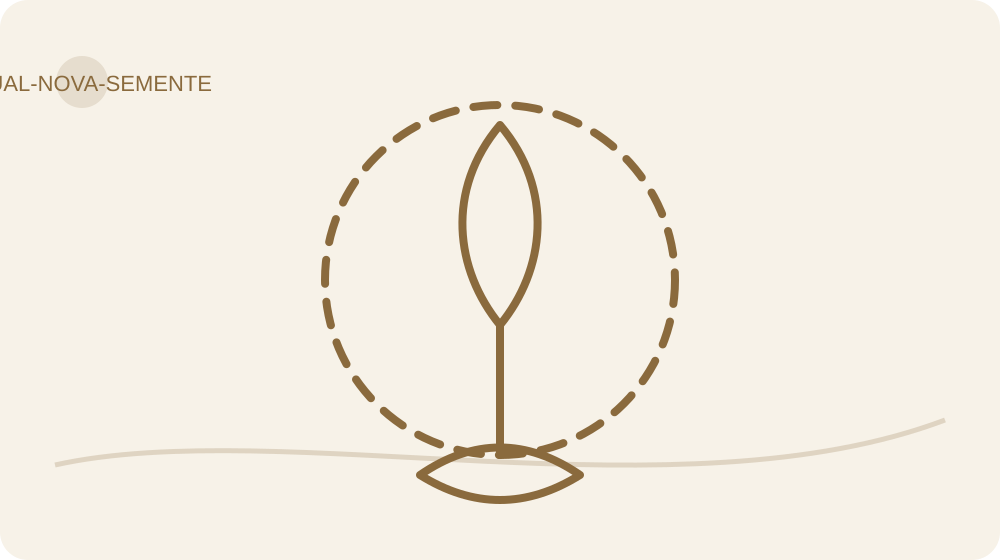

> **Escolha sua rota de hoje**
> **Mínima:** objetivo + 1 pergunta + ação mínima + Fruto/obstáculo.  
> **Completa:** leitura + Caderno + experiência segura + revisão.  
> **Aprofundada:** ferramenta opcional ou apoio, somente se acrescentar clareza.

> **Cuidado:** corpo, alimentação e movimento não são provas de valor. Adapte, pule ou procure orientação quando necessário.

**Objetivo do Dia:** Encerrar com Poda, Nova Semente, plantio real e plano de cuidado continuado.

**Ferramenta principal:** Ritual da Nova Semente.  
**Apoio opcional:** Carta + oração/reflexão opcional.

## Terra, água e realidade

Uma escolha viva precisa de cuidado. Essa é a frase que quero deixar na sua mão hoje, junto da terra e da água. Você não chegou ao ponto em que nunca mais terá dificuldade. Chegou a um ponto em que pode reconhecer mais cedo o que está acontecendo e escolher como responder.

A planta real permanece neste encerramento porque o símbolo tem uma tarefa: lembrar uma prática que continuará precisando de atenção. Ela não absorve sua dor, não garante resultados e não mede seu valor.

## O que eu podo, o que eu planto

Comece pela Auditoria dos Frutos do Dia 28. Leia sua síntese e escolha uma evidência: algo que você fez, compreendeu ou reviu. Se não encontrou melhora, reconheça isso com honestidade. O ritual também pode marcar a decisão de buscar outro recurso ou apoio. Encerrar o protocolo não exige fabricar um depoimento.

Agora percorra, em poucas palavras, o que carregava, o que entendeu, o que devolve e o que assume. Devolver significa deixar de tomar para si uma responsabilidade que pertence a outro ou ao contexto. Não é transferir a alguém a conta de uma escolha sua. Assumir significa reconhecer a resposta possível na sua esfera, com limites e recursos reais.

Nomeie o que precisa reparar. Pode ser um compromisso não cumprido ou uma ação que afetou alguém. Escolha um reparo proporcional, seguro e possível. Nem tudo pode ser corrigido completamente. Reconhecer esse limite evita prometer o que você não consegue entregar. Se houver risco, busque orientação antes de agir.

Em seguida, diga o que vai podar e qual Nova Semente escolhe. A Poda precisa ter objeto: uma permissão, uma rotina, um acesso, uma interpretação. A Nova Semente precisa ter verbo: conferir, pedir, preparar, pausar, procurar apoio. Use a prática principal definida no Dia 26. Hoje não é o dia de inventar dez obrigações para comemorar que aprendeu a reduzir excessos.

Faça o plantio real quando houver condições. Pode ser uma semente, uma muda ou o replantio cuidadoso de uma planta que já tenha. Escolha algo adequado à luz, ao espaço e à sua rotina; se houver crianças ou animais, confirme que a espécie e o local são seguros. Não há espécie obrigatória. Se precisa de ajuda física, convide alguém sem entregar a essa pessoa o significado da escolha.

Prepare recipiente e terra conforme a necessidade da planta. Plante ou replante com cuidado. Ofereça água na quantidade adequada à espécie e combine como aprenderá a observar suas necessidades. Água não é uma ordem para regar diariamente. Cuidado exige perceber; excesso também pode atrapalhar.

Ao terminar, diga ou escreva: “Esta escolha precisa continuar sendo cuidada”. Se desejar incluir uma oração, um agradecimento ou um momento de silêncio, faça isso como expressão simbólica pessoal. Não é requisito, não altera sua avaliação e não funciona como mecanismo científico. Você pode celebrar discretamente, com música ou companhia, sem publicar.

Se não puder plantar hoje, registre o que falta e uma data viável. Não substitua a realidade por uma fotografia de planta nem trate a barreira como fracasso. O plantio continua como compromisso concreto a realizar. Um registro honesto permite concluir o Dia e acompanhar essa pendência depois.

A planta pode crescer, adoecer ou não se adaptar. Isso não profetiza sua vida. Observe as condições e procure orientação de cultivo quando necessário. O símbolo convida ao cuidado, não à superstição. Seus Frutos serão observados nas escolhas e nos acontecimentos, com contexto e responsabilidade distribuída.

## Ciência sem jaleco

Este ritual é uma criação simbólica e pedagógica autoral. Não há alegação de que plantar valide ou fixe uma transformação psicológica. A continuidade usa práticas de planejamento e revisão; o pacote MINDSETmagro não foi demonstrado como tratamento clínico. O encerramento abre manutenção, não uma promessa de permanência.

## Compromisso final revisável

Complete seu compromisso final: carrego menos isto; entendi isto; devolvo esta responsabilidade; assumo esta resposta; reparo isto; podo isto; cultivo esta Nova Semente. Defina o cuidado da planta e confirme as revisões D+30, D+60 e D+90 após a conclusão real.

**O que carregava, entendi, devolvo e assumo?**

**O que reparo e o que podo, de forma segura e proporcional?**

**Qual Nova Semente concreta escolho cultivar?**

**Qual plantio real fiz ou quando farei? Como cuidarei?**

**Qual prática principal, plano de retomada e datas D+30/60/90?**

## Plantio real, quando houver condição

Realize o plantio e deixe o compromisso acessível perto dele, se isso fizer sentido. Se ainda não for possível, prepare uma condição e marque uma data. Sua missão inclui observar o cuidado que a planta realmente precisa.

## Símbolo não é profecia

Registre o gesto realizado, a escolha que ele representa e o próximo cuidado. Se o plantio ficou pendente, anote a barreira e a próxima ação segura. Nenhuma promessa de transformação definitiva é necessária.

**Minha ação e o que observei — ou obstáculo e próxima ação segura**

## Plano de cuidado da Nova Semente

Se eu perder o ritmo, então identificarei o componente que saiu do eixo e retomarei o menor cuidado possível. Ação mínima: escrever a Nova Semente e preparar uma condição do plantio real.

**Meu SE → ENTÃO, se eu quiser adaptar o exemplo**

## Uma escolha viva precisa de cuidado

Você termina a sequência, não a possibilidade de aprender. Guarde a carta, confirme suas revisões e use as ferramentas quando ajudarem. Sua próxima escolha não precisa ser perfeita. Precisa poder ser observada, cuidada e revista. Agora a continuidade pertence à vida que você vai viver.

# A vida continua depois da travessia

## Depois do Dia 30: menos reinício, mais cuidado

A planta fica. O calendário também. Ao terminar, marque três encontros com os seus registros: 30, 60 e 90 dias depois da conclusão. Não são promessas de resultado em três prazos. São ocasiões escolhidas para enxergar o que continuou vivo, o que perdeu espaço e o que precisa de outra condição.

Em D+30, examine uma prática e uma situação: tive oportunidade de repetir? Qual apoio tornou a ação possível? Onde o plano dependia de um dia perfeito? Em D+60, observe mudanças de contexto e ajuste ambiente, apoio ou gatilho. Em D+90, decida o que integra à rotina, o que fica sob demanda e o que deixa de fazer sentido.

Escolha poucos indicadores: uma ação repetida, um acordo mais claro, um tempo protegido ou uma retomada mais rápida depois de um contratempo. Indicadores corporais, se desejados, podem ser discutidos com profissionais. Não precisam existir para que a revisão seja legítima.

Você pode descobrir que algo não ajudou. Isso merece registro. Revisão não é uma cerimônia para confirmar que o método estava certo; é a oportunidade de verificar se a prática serve à sua vida.

**D+30: data, prática e Fruto a observar**

**D+60: data, contexto e ajuste**

**D+90: data, continuidade e apoio**

## O protocolo de retomada

Escolha o componente que saiu do eixo. Atenção? Ambiente? Apoio? Um plano amplo demais? Um problema de saúde? Uma situação insegura? Não atribua tudo à disciplina. Identificar a dificuldade define a intervenção possível.

Retome a menor peça útil: se há confusão entre fato e interpretação, volte ao Dia 6. Se a ação nunca encontra ocasião, ao Dia 5 ou 19. Se o cuidado virou punição, ao Dia 25. Se o obstáculo pede atendimento, o próximo passo é buscar apoio, não preencher mais um formulário.

Depois do primeiro teste, registre o que ocorreu. Uma retomada não exige recuperar tarefas perdidas. Exige uma ação presente suficientemente pequena para começar e suficientemente relevante para merecer continuidade.

**Qual componente precisa de atenção?**

**Qual menor intervenção vou testar, quando e com que apoio?**

**Quando vou olhar o resultado?**

## Ferramentas: escolha pelo problema

Você não precisa decorar o vocabulário inteiro. Comece com **Diário Vivo**, **Fato × História × Incógnita** e **Próxima Escolha**. As outras ferramentas entram quando um problema específico pede.

| Quando o problema parece ser... | Ferramenta principal | Apoio opcional | Pare/ajuste se... |
|---|---|---|---|
| “Minha cabeça está com abas demais” | Estacionamento Mental | Poda Ambiental | a lista virar nova fonte de vigilância |
| “Estou presa num impulso” | P.A.R.A. | Sala de Controle rápida | a pausa aumentar agitação ou risco |
| “Estou ruminando a mesma preocupação” | Janela do Caos | Estacionamento Mental | ampliar sofrimento ou repetição |
| “Não sei o que aconteceu e o que imaginei” | Fato × História × Incógnita | Filtro da Sensatez | virar investigação infinita |
| “Minha conclusão parece absoluta” | Filtro da Sensatez | Metamodelo de linguagem | perguntas virarem interrogatório |
| “Isso se repete em várias cenas” | Três Cenas, Uma Estrutura | Árvore do Discernimento | um padrão virar rótulo de identidade |
| “Estou vivendo para o olhar de fora” | Banco de Evidências da Identidade | Antifuga Identitária | auto-observação virar policiamento |
| “Preciso entender uma decisão maior” | Sala de Controle | Árvore do Discernimento | você usar dez painéis para uma escolha simples |
| “Quero preparar uma resposta futura” | Contraste Real + SE → ENTÃO | Futuro Telefona | visualização virar fantasia sem ação |
| “Quero mexer no ambiente, não só na vontade” | Poda Ambiental | Arquitetura da Escolha | a mudança gerar custo ou risco não considerado |
| “O corpo virou cobrança” | MMI 2.0 | Próxima Escolha, Não Punição | números/fotos aumentarem vergonha ou compensação |
| “Quero olhar uma refeição com mais clareza” | Tradutor do Prato | Pausa do Prato | observação aumentar restrição ou compulsão |
| “Quero me mover, mas o plano não cabe” | Movimento Possível | Unir o Útil ao Agradável | houver dor, sintomas ou dúvida de segurança |
| “Saí do eixo” | Protocolo de Retomada | Auditoria dos Frutos | retomada virar punição ou recuperação de tarefas atrasadas |

### Taxonomia simples

**Ferramentas-mãe:** Diário Vivo, Sala de Controle, Árvore do Discernimento, Filtro da Sensatez.  
**Subferramentas:** Fato × História × Incógnita, P.A.R.A., SE → ENTÃO, MMI 2.0, Banco de Evidências.  
**Microtécnicas:** Estacionamento Mental, Janela do Caos, Poda Ambiental, Tradutor do Prato, Movimento Possível, Próxima Escolha.  
**Rituais/revisões:** Auditoria dos Frutos, Futuro Telefona, Ritual da Nova Semente, D+30/60/90.

## Vocabulário para continuar

Autoria: participar conscientemente das próprias escolhas, reconhecendo influência, dependência, recursos e limites. Autonomia não significa viver sem ninguém.

Fruto: resultado observável em contexto e período. Não é identidade, mérito ou prova de uma causa única. Evidência: registro que ajuda a examinar uma hipótese; pode contrariar sua expectativa. Incógnita: informação ainda desconhecida, que não deve ser preenchida por convicção.

Valor: princípio escolhido que orienta ação. Meta: resultado pretendido. Comportamento: ação identificável. Um valor pode orientar várias metas; uma meta pode precisar de revisão sem que o valor desapareça.

Instalação: organização de uma prática para repetição. Hábito: comportamento que pode ganhar automaticidade em contextos aprendidos. Flexibilidade: adaptar o caminho sem precisar abandonar o cuidado.

Poda: interrupção responsável e específica. Nova Semente: ação que ocupa o espaço aberto. Manutenção: cuidado continuado com práticas e condições; não um estado invulnerável.

## O que a ciência sustenta — e o que este livro não afirma

| O que é evidência | O que é autoria | O que não foi testado |
|---|---|---|
| Estudos sobre mecanismos como monitoramento, hábitos, mindfulness, comportamento, sono e movimento | Sala de Controle, MMI 2.0, Árvore, Poda/Nova Semente, Janela do Caos e organização das seis travessias | O pacote MINDSETmagro™ como tratamento ou causa direta de perda de peso, melhora de depressão, metabolismo, hormônios ou outra condição |
| Diretrizes populacionais de alimentação, movimento e sono | Tradução Visual Honesta, Tradutor do Prato e forma específica dos exercícios | Uma ferramenta autoral isolada como equivalente a terapia, prescrição clínica ou intervenção validada |
| Pesquisas de identidade, flexibilidade, autocompaixão e autorregulação | Aplicação editorial desses princípios à linguagem e ao Caderno Vivo | Que 30 dias produzam mudança permanente ou que 24 horas seja janela neurobiológica obrigatória |

A pesquisa consultada inclui revisões, meta-análises, ensaios, documentos oficiais e modelos de mudança comportamental. A busca foi dirigida, não uma revisão sistemática original. As classificações A–D são critérios editoriais internos, não avaliação GRADE formal.

A: evidência mais robusta para a alegação delimitada. B: apoio moderado com limitações. C: achados preliminares, mistos ou indiretos. D: autoria, metáfora, estrutura descritiva ou decisão de produto. Um grau A para um mecanismo não se transfere ao protocolo completo.

Estudos clínicos sobre ruminação ou flexibilidade não demonstram que ler este material trate um transtorno. Estudos sobre alimentação não garantem emagrecimento. Pesquisas com estudantes não provam mudança de hábitos em qualquer adulto. Cada referência está ligada a uma afirmação específica no registro de evidências.

Sala de Controle, MMI ampliado, Árvore, metáfora do excesso e ritual da planta são ferramentas autorais ou pedagógicas. A duração de 30 dias e o intervalo de 24 horas são decisões de organização. PNL fornece aqui repertório de perguntas, não fundamento de eficácia clínica.

Houve revisão de explicações históricas: retiraram-se detox/alcalinização inespecíficos, jejum compensatório, metas universais de peso, cetose obrigatória, suplementos para todos, garantias de permanência e cristais como mecanismo. As fontes antigas permanecem documentadas, sem reger as recomendações atuais.

## Aprofundamentos opcionais: escolha uma pergunta útil

Se a espiritualidade faz parte da sua vida, você pode associar a gratidão e o cuidado da planta a uma oração ou leitura que tenha sentido para você. Isso é prática de significado, não explicação fisiológica. Filipenses 4:8 e Jeremias 29:11–13 aparecem no acervo histórico; leia no contexto da sua fé, sem usar o texto para negar sofrimento ou obrigar otimismo.

Aplicativos de meditação podem ser recursos opcionais. Headspace e Calm aparecem no histórico, mas não são necessários para completar a jornada. Antes de contratar um serviço, confira o conteúdo disponível, o custo, os dados solicitados e se ele ajuda sua prática. Ter um aplicativo instalado não é uma prática realizada.

Se você acompanha mudanças corporais e percebe um período sem a evolução esperada, descreva o período e as condições antes de chamar isso de fracasso. Leve o registro ao profissional que acompanha você. O livro não usa o chamado platô para mandar restringir mais, jejuar ou aumentar exercício. Medidas e peso não são exigidos pelo percurso.

Suplementos, jejum e medicamentos não compõem tarefas desta edição. Uma decisão individual requer avaliação de necessidades e riscos por profissional habilitado. Se o assunto for pertinente ao seu cuidado, anote a pergunta para a consulta em vez de testar uma dose ou compensação sugerida no acervo antigo.

Os anexos históricos de afirmações, avaliação e alimentação permanecem no inventário. Eles não são prescrições vigentes nem atividades obrigatórias. Você já encontra nesta edição avaliação inicial, revisão dos Frutos e perguntas de cuidado; não precisa acumular ferramentas para provar comprometimento.

## Quando o próximo recurso é uma pessoa

Nutricionista: adequação alimentar individual, relação com comida e necessidades específicas. Profissional de medicina: sintomas, condições clínicas, medicamentos e investigação. Psicólogo: sofrimento persistente, padrões difíceis de modificar, relação corporal e apoio ao processo. Profissional habilitado de educação física e, quando indicado, fisioterapia: adaptação segura de movimento.

Você pode levar uma página do Caderno: situação, comportamento, contexto, o que tentou e o que aconteceu. Não precisa chegar com um diagnóstico feito pela internet. Um registro claro já ajuda a formular uma boa pergunta.

Agradeço a quem escolhe investigar a própria vida com honestidade. Não prometo que você nunca mais carregará excesso. Espero que reconheça mais cedo quando uma carga já não precisa viajar com você. Sua escolha precisa continuar sendo cuidada.

# Referências

C01. Singh B; Murphy A; Maher C; Smith AE. Time to Form a Habit: A Systematic Review and Meta-Analysis of Health Behaviour Habit Formation and Its Determinants. 2024. https://doi.org/10.3390/healthcare12232488

C02. Wang G; Wang Y; Gai X. A Meta-Analysis of the Effects of Mental Contrasting With Implementation Intentions on Goal Attainment. 2021. https://pmc.ncbi.nlm.nih.gov/articles/PMC8149892/

C03. Harkin B; Webb TL; Chang BPI; Prestwich A; Conner M; Kellar I; Benn Y; Sheeran P. Does monitoring goal progress promote goal attainment? A meta-analysis of the experimental evidence. 2016. https://doi.org/10.1037/bul0000025

C04. Colton E; Connors M; Mahlberg J; Verdejo-Garcia A. Episodic future thinking improves intertemporal choice and food choice in individuals with higher weight: A systematic review and meta-analysis. 2024. https://doi.org/10.1111/obr.13801

C05. Risko EF; Gilbert SJ. Cognitive Offloading. 2016. https://doi.org/10.1016/j.tics.2016.07.002

C06. Stenzel KL; Keller J; Kirchner L; Rief W; Berg M. Efficacy of cognitive behavioral therapy in treating repetitive negative thinking, rumination, and worry – a transdiagnostic meta-analysis. 2025. https://pmc.ncbi.nlm.nih.gov/articles/PMC12017360/

C07. Macrynikola N; Mir Z; Gopal T; Rodriguez E; Li S; Cox M; Yeh G; Torous J. The impact of mindfulness apps on psychological processes of change: a systematic review. 2024. https://www.nature.com/articles/s44184-023-00048-5

C08. Zou Y; Wang R; Xiong X; Bian C; Yan S; Zhang Y. Effects of acceptance and commitment therapy on negative emotions, automatic thoughts and psychological flexibility for depression and its acceptability: a meta-analysis. 2025. https://pmc.ncbi.nlm.nih.gov/articles/PMC12210942/

C09. Han A; Kim TH. Effects of Self-Compassion Interventions on Reducing Depressive Symptoms, Anxiety, and Stress: A Meta-Analysis. 2023. https://doi.org/10.1007/s12671-023-02148-x

C10. Alleva JM; Diedrichs PC; Halliwell E; Martijn C; Stuijfzand BG; Treneman-Evans G; Rumsey N. A randomised-controlled trial investigating potential underlying mechanisms of a functionality-based approach to improving women’s body image. 2018. https://pubmed.ncbi.nlm.nih.gov/29522927/

C11. Kao TSA; Ling J; Alanazi M; Atwa A; Liu S. Effects of mindfulness-based interventions on obesogenic eating behaviors: A systematic review and meta-analysis. 2025. https://doi.org/10.1111/obr.13860

C12. Ahmadyar K; Zhang Q; Ferriday D; Hinton EC; Robinson E; Jones A; Bogosian A; Chen G; Tapper K. Effects of mindfulness and mindful eating on food intake and appetite: a systematic review and meta-analysis. 2026. https://www.sciencedirect.com/science/article/pii/S0272735826000899

C13. Sheeran P; Wright CE; Avishai A; Villegas ME; Lindemans JW; Klein WMP; Rothman AJ; Miles E; Ntoumanis N. Self-determination theory interventions for health behavior change: Meta-analysis and meta-analytic structural equation modeling of randomized controlled trials. 2020. https://doi.org/10.1037/ccp0000501

C14. Zhu L; Tao Y; Guo Y; Zhang X; Wang T; Zhou B; Li G; Zhang L. The relationship between habit and identity in health behaviors: A systematic review and three-level meta-analysis. 2025. https://doi.org/10.1111/aphw.70017

C15. Michie S; van Stralen MM; West R. The behaviour change wheel: A new method for characterising and designing behaviour change interventions. 2011. https://doi.org/10.1186/1748-5908-6-42

C16. Marques MM; Wright AJ; Corker E; Johnston M; West R; Hastings J; Zhang L; Michie S. The Behaviour Change Technique Ontology: Transforming the Behaviour Change Technique Taxonomy v1. 2024. https://wellcomeopenresearch.org/articles/8-308

C17. von Lützow U; Neuendorf NL; Scherr S. Effectiveness of just-in-time adaptive interventions for improving mental health and psychological well-being: a systematic review and meta-analysis. 2025. https://doi.org/10.1136/bmjment-2025-301641

C18. Agarwal PK; Nunes LD; Blunt JR. Retrieval Practice Consistently Benefits Student Learning: a Systematic Review of Applied Research in Schools and Classrooms. 2021. https://doi.org/10.1007/s10648-021-09595-9

C19. World Health Organization. WHO Guidelines on Physical Activity and Sedentary Behaviour. 2020. https://www.ncbi.nlm.nih.gov/books/NBK566046/

C20. Consensus Conference Panel; Watson NF; Badr MS; Belenky G; Bliwise DL; Buxton OM; Buysse D; Dinges DF; Gangwisch J; Grandner MA; Kushida C; Malhotra RK; Martin JL; Patel SR; Quan SF; Tasali E. Recommended Amount of Sleep for a Healthy Adult. 2015. https://pmc.ncbi.nlm.nih.gov/articles/PMC4434546/

C21. World Health Organization. Healthy diet. 2026. https://www.who.int/news-room/fact-sheets/detail/healthy-diet

C22. National Library of Medicine. Carbohydrates. 2024. https://medlineplus.gov/carbohydrates.html

C23. National Center for Complementary and Integrative Health. Detoxes and Cleanses: What You Need To Know. None. https://www.nccih.nih.gov/health/detoxes-and-cleanses-what-you-need-to-know

C24. Sturt J; Ali S; Robertson W; Metcalfe D; Grove A; Bourne C; Bridle C. Neurolinguistic programming: a systematic review of the effects on health outcomes. 2012. https://doi.org/10.3399/bjgp12X658287

C25. World Health Organization. Obesity and overweight. 2025. https://www.who.int/news-room/fact-sheets/detail/obesity-and-overweight

C26. McCarrick D; Prestwich A; Ferguson E; O’Connor DB. Effects of worry postponement on daily worry and sleep: a randomised controlled trial. 2025. https://doi.org/10.1080/08870446.2025.2590072

C27. Castelo N; Kushlev K; Ward AF; Esterman M; Reiner PB. Blocking mobile internet on smartphones improves sustained attention, mental health, and subjective well-being. 2025. https://doi.org/10.1093/pnasnexus/pgaf017

C28. Turk F; Waller G. Is self-compassion relevant to the pathology and treatment of eating and body image concerns? A systematic review and meta-analysis. 2020. https://doi.org/10.1016/j.cpr.2020.101856

C29. Zhu S; Sinha D; Kirk M; Michalopoulou M; Hajizadeh A; Wren G; Doody P; Mackillop L; Smith R; Jebb SA; Astbury NM. Effectiveness of behavioural interventions with motivational interviewing on physical activity outcomes in adults: systematic review and meta-analysis. 2024. https://doi.org/10.1136/bmj-2023-078713

C30. Manchiraju S. Self-concept clarity: a comprehensive and integrative review. Frontiers in Psychology. 2026;17:1822881. https://doi.org/10.3389/fpsyg.2026.1822881
